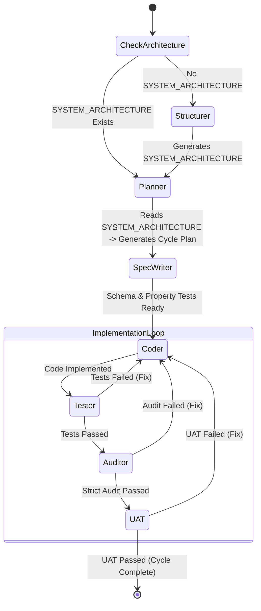

# AI-Native Cycle-Based Contract-Driven Development (AC-CDD) Architecture
Version: 1.0.0 Status: Active Author: Architect (User) & AI Orchestrator

## 1. Philosophy & Objectives
This project adopts a next-generation development framework designed to maximize the capabilities of Large Language Models (LLMs) while structurally eliminating their weaknesses (hallucinations, loss of context, variability in quality).

### 1.1 Core Principles (The Iron Triangle)
*   **Contract is King**
    Natural language specifications are ambiguous. Only the input/output structures (Contracts) defined by Pydantic schemas are considered the "executable Single Source of Truth," and all implementations must strictly adhere to this contract.
*   **Separation of Powers**
    The "Creator AI (Jules)" and the "Auditor AI (Gemini CLI)" are clearly separated to create an adversarial structure that prevents lax code or bugs from slipping through.
*   **Cyclic Self-Healing**
    Development is divided into manageable small cycles. Within each cycle, the loop of "Implementation -> Test -> Audit -> Fix" runs autonomously, limiting human intervention to the approval process only.

## 2. Roles & Responsibilities

| Role | Agent | Responsibilities |
| :--- | :--- | :--- |
| **Chief Architect** | User (You) | Decides project direction, defines `ALL_SPEC.md`, and triggers final approval for each cycle. |
| **System Designer** | Gemini Pro / Antigravity | Requirements definition, grand design, drafting detailed specifications (`SPEC.md`) and contracts (`schema.py`) for each cycle. |
| **Lead Developer** | Jules (via API) | Implementation based on contracts, creation of unit tests, generation of UAT code, creation of PRs. |
| **The Auditor** | Gemini CLI | "The World's Strictest Code Auditor." Critiques code from the perspectives of security, readability, and design principles, with the authority to reject it. |
| **Orchestrator** | Python Script (manage.py) | Directs all agents, monitors CI status, executes automatic merges, and handles errors. |

## 3. Directory Structure & Artifacts
The project strictly adheres to the following directory structure:

```text
project/
├── manage.py                   # [User Entrypoint] Cycle Control CLI (Typer)
├── pyproject.toml              # [Config] uv management, Ruff/Mypy/Pytest settings
├── ac_cdd_config.py            # [Config] User-editable configuration (Models, Paths)
├── documents/                  # [Documentation] Context source for AI
│   ├── ALL_SPEC.md             # [Constitution] Overall specification & Grand Design
│   ├── SYSTEM_ARCHITECTURE.md  # [Structured] Structured Architecture (Generated by Structurer)
│   ├── CYCLE01/                # [Cycle Context] Independent workspace per cycle
│   │   ├── SPEC.md             # [Spec] Detailed specification
│   │   ├── UAT.md              # [Requirement] User Acceptance Criteria (Natural Language)
│   │   ├── schema.py           # [Contract] Pydantic definition for this cycle (Draft)
│   │   ├── IMPLEMENTATION.md   # [Log] Jules's implementation thought log (Auto-generated)
│   │   └── AUDIT_LOG.md        # [Log] Gemini Auditor's feedback log (Auto-generated)
│   └── CYCLE02/...
├── src/
│   ├── contracts/              # [System Contract] Contracts enabled system-wide
│   │   └── __init__.py         # Models here are absolute truth
│   └── ...                     # Implementation code
├── tests/
│   ├── property/               # [PBT] Auto-generated tests using Hypothesis
│   └── e2e/                    # [UAT] E2E tests using Playwright
└── scripts/
    └── ai_orchestrator.py      # [Engine] Automation logic body (Graph)
```

## 4. Detailed Workflow
The development process proceeds in the following 4 phases.

### Phase 1: Design Automation
**Actors**: User, Gemini Pro, Antigravity

1.  **Constitution**: User creates `documents/ALL_SPEC.md` defining the system overview.
2.  **Structuring**: The **Structurer Agent** analyzes `ALL_SPEC.md` and generates `SYSTEM_ARCHITECTURE.md`.
3.  **Cycle Planning**: The **Planner Agent** reads the architecture and splits development into `CYCLE01`, `CYCLE02`...
4.  **Detailed Design**: Generates the following files in each cycle folder:
    *   `SPEC.md`: Implementation-level detailed specification.
    *   `UAT.md`: Scenarios defining "Definition of Done".
    *   `schema.py`: Pydantic models defining inputs/outputs. This is the most critical part.
5.  **User Approval**: User reviews the generated documents and issues correction instructions if necessary.

### Phase 2: Cycle Trigger
**Actor**: User

Once the design is solidified, the User starts the "Implementation and Audit Automation" with the following command:

```bash
uv run manage.py start-cycle 01
```

From here on, humans basically do not intervene until Phase 4 (except when errors occur).

### Phase 3: Autonomous Implementation & Audit Loop
**Actors**: Orchestrator, Jules, Gemini CLI

The Orchestrator executes the following steps sequentially.

#### Step 3.1: Contract Alignment
Reads `documents/CYCLE{N}/schema.py` and checks consistency with existing code in `src/contracts/`.
If there are no issues, it merges into `src/contracts/` and commits it as the "New Truth" of the system.

#### Step 3.2: Test-First Generation
*   **Action**: Orchestrator passes `src/contracts/` to Jules.
*   **Prompt**: "Create property-based tests using Hypothesis based ONLY on the contract (Pydantic), without seeing the implementation."
*   **Output**: `tests/property/test_cycle{N}.py`
*   **Benefit**: Generates pure specification-based tests without implementation bias.

#### Step 3.3: Implementation & Self-Healing Loop
This step repeats up to N times until CI passes.

1.  **Coding**: Jules reads `SPEC.md` and `src/contracts/` and performs implementation. Thought process is recorded in `IMPLEMENTATION.md`.
2.  **Commit**: Commits code and creates (or updates) a PR.
3.  **CI Watch**: Orchestrator polls the status of GitHub Actions/Sandbox.
    *   🔴 **Failure**: Retrieves error logs and feeds back to Jules. "Tests failed. Fix it."
    *   🟢 **Success**: Proceeds to "Strict Audit".

#### Step 3.4: The Strictest Audit
**Role**: Gemini CLI (Auditor)

*   **Review**: Reviews code that passed CI from the following perspectives:
    *   **Pydantic Compliance**: Is `model_validate` etc. used correctly?
    *   **Security**: Injection, hardcoded secrets, etc.
    *   **Design**: Duplicate code, overly complex logic.
*   **Judgment**:
    *   🔴 **Reject**: Records feedback in `AUDIT_LOG.md`. Orchestrator presents this to Jules and forces a return to Step 3.3.
    *   🟢 **Approve**: "Audit Passed". Proceeds to UAT.

#### Step 3.5: UAT Generation & Execution (UAT Automation)
*   **Gen**: Jules reads `UAT.md` (natural language scenarios) and generates Playwright (Python) E2E test code in `tests/e2e/`.
*   **Run**: Orchestrator executes the tests.
    *   🔴 **Failure**: Not working according to scenario. Instructions to Jules to fix (Jules decides whether to fix test code or implementation).
    *   🟢 **Success**: Cycle completion requirements met.

### Phase 4: Auto-Merge & Completion
**Actor**: Orchestrator (via gh CLI)

Code that passes all gates up to UAT is defined as shippable quality.

1.  **Auto-Merge**: Orchestrator executes the merge command.
2.  **Report**: Notifies User "CYCLE{N} Complete. PR #XX merged".
3.  **Next**: User reviews artifacts and prepares for `start-cycle {N+1}`.

## 5. Graph Architecture

The core orchestration is handled by `LangGraph`.



## 6. Technical Stack & Requirements
*   **Language**: Python 3.12+
*   **Package Manager**: `uv` (Used for all dependency resolution)
*   **Version Control**: Git & GitHub CLI (`gh`)
*   **AI Models**:
    *   Thinking/Planning: Gemini 2.5 Flash / Pro
    *   Coding: Jules (via API)
*   **Testing Frameworks**:
    *   Unit/Prop: `pytest`, `hypothesis`
    *   E2E/UAT: `playwright`
    *   Mocking: `vcrpy`
*   **Linting/Formatting**: `ruff` (Strict mode)

## 7. Operations & Disclaimers
*   **AI Loop Limit**: To prevent infinite costs, the Orchestrator strictly enforces the number of attempts (MAX_RETRIES) for each cycle.
*   **Conflict Resolution**: If a conflict occurs during `schema.py` merge, Orchestrator stops and requests User intervention.
*   **Secret Management**: API keys etc. are managed in `.env` and never committed to Git. If Jules generates code with hardcodes, the Auditor will reject it.
