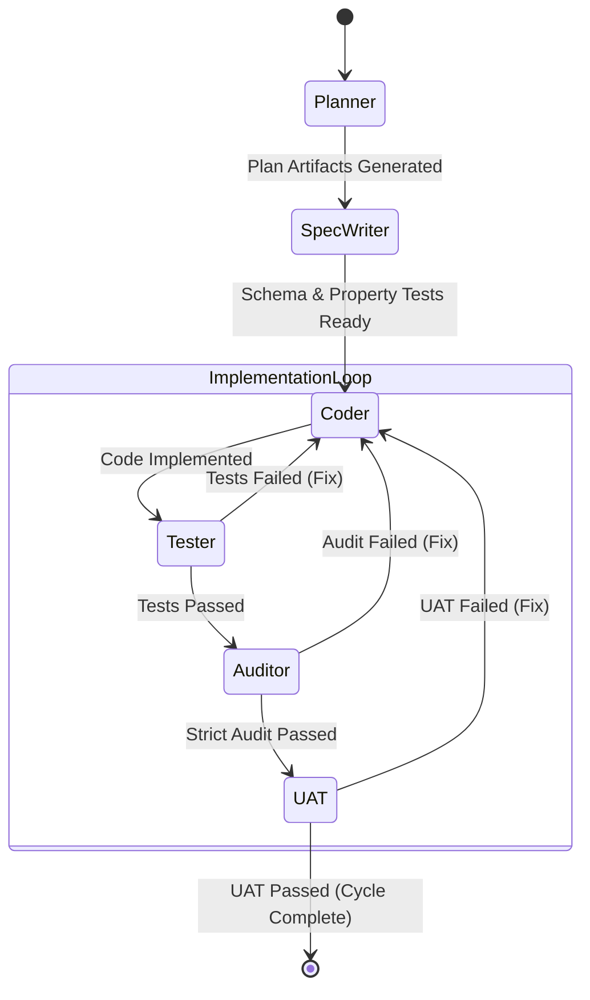

# Development Flow (AC-CDD)

## Graph Architecture

The core orchestration is handled by `LangGraph`.

## Data Flow

1. **CycleState**: Passed between nodes, containing `cycle_id`, `plan`, `audit_result`, `sandbox_id`.
2. **Sandbox**:
   - `SandboxRunner` syncs `src/` and `tests/` to E2B.
   - Executes `pytest`, `ruff`, `mypy`.
   - Returns logs/exit codes to Graph.
3. **Local FS**:
   - Agents read/write source files locally.
   - "Source of Truth" is always local Git repo.

## Agents

- **Planner**: Architect (Gemini 2.5 Pro)
- **Coder**: Senior Engineer (Gemini 2.5 Flash)
- **QA Analyst**: Test Engineer (Gemini 2.5 Flash)
- **Auditor**: Security Specialist (Gemini 2.5 Pro)
