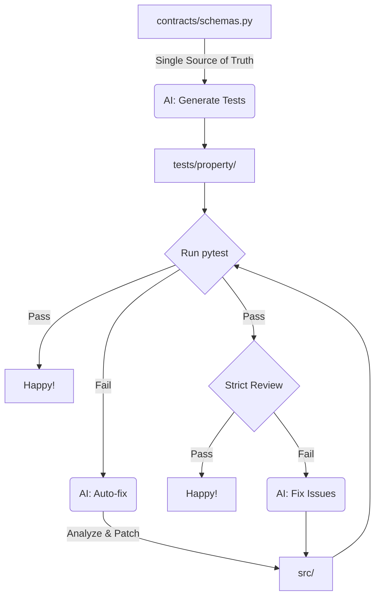

# 🚀 Autonomous Development Template

> **AI-Native Development Framework**: Contracts first, fully automated by Agents.


このテンプレートは、**`uv` による超高速パッケージ管理** と **`Jules CLI` によるAI自律開発フロー** を統合した、次世代のPythonプロジェクト雛形です。
「**契約駆動開発 (Contract-Driven Development)**」を採用し、データ構造（スキーマ）を定義するだけで、テストの生成から実装、そしてバグ修正までをAIエージェントが自律的に行います。

---

## 🌊 開発フロー (The Flow)



## 🛠️ セットアップ (Setup)

### 前提条件
- **Python**: 3.12+
- **uv**: [インストール手順](https://github.com/astral-sh/uv)
- **Jules CLI**: `jules login` で認証済みであること。
- **Gemini CLI**: `gemini` コマンドがパスに通っていること。


### インストール
```bash
# 依存関係の同期
uv sync
```

---

## 📖 使い方 (Workflow Guide)

### 1. 契約の定義 (Define Contracts)
すべての開発は `contracts/schemas.py` から始まります。これがこのプロジェクトの **憲法** です。
Pydanticモデルでデータ構造と制約を定義してください。

```python
# contracts/schemas.py
class User(BaseModel):
    name: str = Field(..., min_length=1)
    age: int = Field(..., gt=0)
```

### 1.5. 契約の自動生成 (Auto-generate Contracts)
Pydanticモデルをゼロから書くのが面倒な場合、自然言語で指示して生成させることができます。

```bash
./scripts/ai_gen_contract.sh "ブログ記事のモデル。タイトル、本文、公開日、タグ（文字列のリスト）を持つ"
```
これにより、`contracts/schemas.py` に適切なPydanticモデルが自動的に追記されます。

### 2. AIによるテスト生成 (Generate Tests)
契約に基づき、AIがエッジケースを網羅するプロパティベーステストを自動生成します。

```bash
./scripts/ai_gen_test.sh
```
これにより、`tests/property/` にHypothesisを用いた堅牢なテストが生成されます。

### 3. 実装と自律修正 (Implement & Auto-fix)
テストを実行し、失敗した場合はAIに修正を依頼します。

```bash
# テスト実行
uv run pytest

# テスト失敗時にAIに修正させる
./scripts/ai_fix.sh
```
`ai_fix.sh` はテストの失敗理由を分析し、`src/` 内のコードを自律的に修正して再テストを行います。

### 4. 厳格なAIレビュー (Strict AI Review)
テストが通っても、コード品質が悪ければ意味がありません。
`gemini` APIを使って、差分に対する厳格なコードレビューを行い、修正が必要ならJulesにタスクを投げます。

```bash
./scripts/ai_review.sh
```
このスクリプトは `git diff HEAD` の内容を分析し、潜在的なバグや可読性の問題を指摘、修正案を提示します。


---

## 🧪 Quick Start Scenario: "Product" モデルの追加

実際に新しい機能を追加してみましょう。

**Step 1: スキーマの定義**
`contracts/schemas.py` に `Product` クラスを追加します。
```python
class Product(BaseModel):
    id: str = Field(..., pattern=r'^[A-Z]{3}-\d{4}$') # 例: ABC-1234
    price: int = Field(..., gt=0)
    name: str
```

**Step 2: テスト生成**
```bash
./scripts/ai_gen_test.sh
```
AIが `test_schemas_pbt.py` を更新し、`Product` のIDフォーマットや価格の制約を守っているかチェックするテストを追加します。

**Step 3: 実装 (最初は空でOK)**
最初は実装がない、または間違っているため、テストは失敗するかもしれません。

**Step 4: AI修正**
```bash
./scripts/ai_fix.sh
```
AIはPydanticのバリデーションエラーやロジックミスを修正し、正しいモデル定義や関連ロジックを導き出します。

**Step 5: 厳格なレビュー**
テストが通ったら、最後に品質チェックを行います。
```bash
./scripts/ai_review.sh
```
「変数名が不明瞭」「エッジケースの考慮不足」などが指摘されれば、AIがさらに修正を行います。


---

## 📂 ディレクトリ構造 (Structure)

| ディレクトリ | 説明 |
| --- | --- |
| **`contracts/`** | **Single Source of Truth**. Pydanticモデル定義。 |
| **`documents/`** | AIへのコンテキスト提供用 (PRD, Architecture, Rules)。 |
| **`scripts/`** | AI連携用スクリプト (`gen_test`, `fix`)。 |
| **`src/`** | アプリケーションロジック。AIが主に編集する場所。 |
| **`tests/property/`** | 自動生成されるプロパティベーステスト。 |

---

Happy Coding with AI Agents! 🤖
