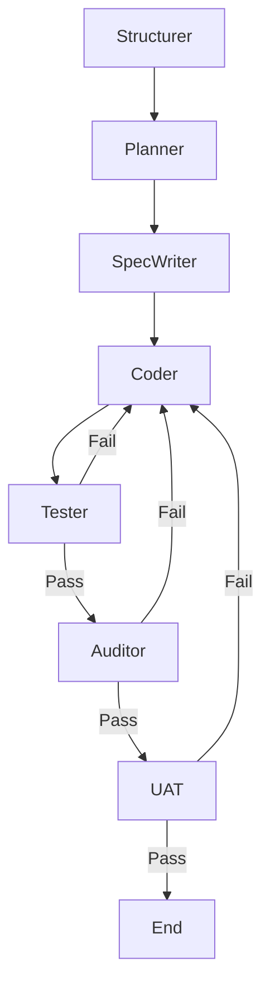

# Autonomous Development Environment (AC-CDD)

An AI-native development environment implementing **Cycle-based Contract-Driven Development**.
Powered by **LangGraph** and **E2B Code Interpreter**.

## Architecture

This project uses a State Graph to orchestrate AI agents for planning, coding, testing, and auditing.



### Components

- **LangGraph**: Manages state and flow control (`src/ac_cdd/graph.py`, `src/ac_cdd/state.py`).
- **E2B Code Interpreter**: Safely executes tests and audits in a cloud sandbox (`src/ac_cdd/sandbox.py`).
- **Pydantic AI**: Provides structured agent outputs (`src/ac_cdd/agents.py`).

## Setup

1. **Install uv**:
   ```bash
   curl -LsSf https://astral.sh/uv/install.sh | sh
   ```

2. **Install dependencies**:
   ```bash
   uv sync
   ```

3. **Configure Environment**:
   Copy `.env.example` to `.env` and set your API keys.
   ```bash
   cp dev_documents/templates/.env.example .env
   ```

   **Required Keys:**
   - `GEMINI_API_KEY`: For AI Agents.
   - `E2B_API_KEY`: For Sandbox execution (Get one at [e2b.dev](https://e2b.dev)).
   - `LOGFIRE_TOKEN`: (Optional) For observability.

4. **Configuration (Optional)**:
   You can customize agent models and paths in `ac_cdd_config.py` in the root directory.

## Usage

### 0. Define Grand Design (Critical)
Before running any automation, you must define **what** you are building.
The agents use `dev_documents/ALL_SPEC.md` as the "Constitution" of your project.

1. **Initialize the Spec**:
   Copy the template if it doesn't exist:
   ```bash
   cp dev_documents/templates/ALL_SPEC.md dev_documents/ALL_SPEC.md
   ```
2. **Write your Requirements**:
   Edit `dev_documents/ALL_SPEC.md`. Describe the project goal, architecture, and feature backlog.
   *The Structurer Agent will read this to generate the System Architecture.*

### 1. Start Development Cycle
```bash
uv run manage.py start-cycle 01
```

**What happens:**
1. **Structurer Phase**: If `dev_documents/SYSTEM_ARCHITECTURE.md` does not exist, the **Structurer Agent** reads `ALL_SPEC.md` and generates a comprehensive architecture design.
2. **Planning Phase**: The **Planner Agent** reads the architecture and generates artifacts for the current cycle (`SPEC.md`, `schema.py`, `UAT.md`).
3. **Implementation Loop**:
   - Generate property tests.
   - Implement code.
   - Run tests in E2B Sandbox.
   - Audit code (Static Analysis + LLM).
   - Run UAT in E2B Sandbox.

### Create a New Cycle
```bash
uv run manage.py new-cycle 02
```

### Ad-hoc Commands
- **Audit**: `uv run manage.py audit` (Review git diffs)
- **Fix**: `uv run manage.py fix` (Fix failed tests)
- **Refine Spec**: `uv run manage.py refine-spec` (Manually trigger structured spec generation)
- **Check Env**: `uv run manage.py doctor`

## Development Flow

See [DEV_FLOW.md](./DEV_FLOW.md) for detailed architecture diagrams and the philosophical "Constitution" of the project.
