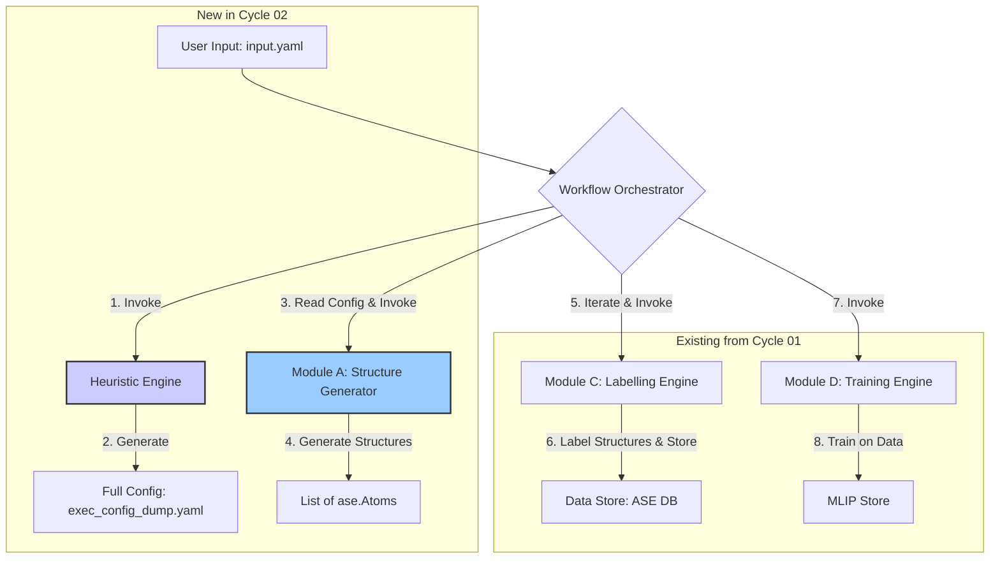

# Cycle 02: Automation Kickstart - Specification Document

**Version:** 1.0.0
**Status:** Final
**Cycle:** 02
**Title:** Initial Structure and Configuration Automation

## 1. Summary

This document details the technical specifications for the second development cycle of the MLIP-AutoPipe project. Having established the Core Engine in Cycle 01, Cycle 02 marks a pivotal transition from a manually-operated tool to a truly automated system. The central theme of this cycle is the elimination of manual inputs for atomic structures and computational parameters, directly addressing the project's core philosophy of "removing the human expert from the loop." This will be achieved by implementing two critical components: the **Structure Generator (Module A)** and the **Heuristic Engine**, which is the core of our "Two-Tier Configuration Strategy." By the end of this cycle, a user will no longer need to provide explicit structure files or a detailed configuration. Instead, they will interact with the system via a minimal `input.yaml` file, specifying only their high-level scientific goal, such as the chemical composition of the material they wish to model.

The first major component, the Structure Generator (Module A), is responsible for creating a diverse and physically relevant set of initial atomic configurations for training. This module is the first step in the data generation pipeline and is crucial for building a robust MLIP. Instead of relying on a single, user-provided structure, the system will programmatically generate a variety of configurations designed to explore the material's potential energy surface. The implementation will be context-aware; the module will first determine the likely bonding character of the material (e.g., metallic alloy, ionic crystal, molecule) and then apply the most appropriate generation algorithm. For instance, it will use Special Quasirandom Structures (SQS) for alloys, Normal Mode Sampling (NMS) for molecules, and Ab Initio Random Structure Searching (AIRSS)-like techniques for ionic crystals. This intelligent, automated seeding ensures the initial dataset is rich with varied local environments, a key prerequisite for a generalizable potential.

The second, and arguably more transformative, component is the Heuristic Engine. This engine is the brain that drives the automation. It ingests the user's high-level, minimal `input.yaml` and expands it into a comprehensive, detailed `exec_config_dump.yaml` file that specifies every single parameter required for the entire workflow. This process involves embedding significant domain expertise into the code. The engine will analyze the composition to select the appropriate structure generation algorithm for Module A. It will automatically determine the correct DFT parameters (like pseudopotentials, plane-wave cutoffs, and k-point densities) by consulting standardized protocols like SSSP. It will even estimate physical properties like melting points to set reasonable temperature ranges for later simulations. This two-tier configuration strategy is the cornerstone of our user-centric design. It drastically lowers the barrier to entry for non-expert users while simultaneously enforcing best practices, ensuring that all calculations are robust, reproducible, and scientifically sound. Upon completion of Cycle 02, the MLIP-AutoPipe will have evolved from a basic tool into an intelligent, automated assistant.

## 2. System Architecture

Cycle 02 introduces two new major components into the system architecture established in Cycle 01, fundamentally changing the workflow's entry point and control flow. The new components, the **Heuristic Engine** and the **Structure Generator (Module A)**, are placed at the very beginning of the pipeline, abstracting the complexity of setup and configuration away from the user.

The new data flow is as follows:
1.  **User Input:** The process now begins with a minimal `input.yaml` file, which is the user's sole point of interaction.
2.  **Heuristic Engine:** The `WorkflowOrchestrator`'s first action is to invoke the Heuristic Engine. This engine parses `input.yaml`, applies a series of physics-based rules and heuristics, and generates the complete `exec_config_dump.yaml`. This new file is the single source of truth for all subsequent modules.
3.  **Structure Generator (Module A):** The Orchestrator, now using the parameters from `exec_config_dump.yaml`, calls Module A. Module A reads the specified composition and the determined structure type (e.g., 'alloy') and programmatically generates a list of `ase.Atoms` objects.
4.  **Labelling and Training:** The list of generated structures is then passed to the existing **Labelling Engine (Module C)** from Cycle 01. The orchestrator iterates through each structure, submitting it for DFT calculation. The results are stored in the ASE database. Finally, the collected data is passed to the **Training Engine (Module D)** to generate the first-pass MLIP.

This revised architecture places the Heuristic Engine as a crucial "gatekeeper" and configuration hub. All other modules are now consumers of the configuration it produces. This enforces consistency and centralizes the "expert knowledge" of the system into one place. Module A acts as the new head of the data-generation pipeline, replacing the manual provision of structure files.

**Architectural Placement:**



The `WorkflowOrchestrator` gains significant new responsibilities. It is no longer a simple linear script but must now manage the initial configuration expansion and then loop over a dynamically generated set of structures. The ASE Database remains the central data store, but it will now be populated with a much richer and more diverse set of initial configurations, all linked by a common run ID, ensuring the entire set from a single `input.yaml` can be traced and analyzed together.

## 3. Design Architecture

The design for Cycle 02 introduces new classes and modules at the beginning of the project's logical flow, focusing on configuration management and structure generation.

**File and Class Structure:**

```
mlip_autopipec/
├── main_cycle02.py            # New CLI entry point for Cycle 02
├── orchestrator_cycle02.py    # Updated orchestrator
├── config/
│   ├── models.py              # Pydantic models for config files
│   └── expander.py            # HeuristicEngine class
├── modules/
│   ├── a_structure_generator.py # StructureGenerator class
│   ├── c_labelling_engine.py      # (from Cycle 01)
│   └── d_training_engine.py      # (from Cycle 01)
├── data/
│   └── ...                   # (from Cycle 01)
└── utils/
    ├── ...                   # (from Cycle 01)
    └── material_analysis.py  # Helpers for bond type determination
```

**Class and API Definitions:**

1.  **`config/models.py`**: This new file will define the Pydantic models for both configuration tiers, creating a strict schema for our settings.
    ```python
    from pydantic import BaseModel, Field
    from typing import List, Dict

    class MinimalInput(BaseModel):
        elements: List[str]
        composition: str | None = None
        # ... other high-level goals ...

    class FullConfig(BaseModel):
        system: Dict
        simulation: Dict
        dft_compute: Dict
        mlip_training: Dict

    # Example of a nested model for clarity
    class DFTComputeConfig(BaseModel):
        code: str
        command: str
        pseudopotentials: str
        ecutwfc: float
        # ... etc ...
    ```

2.  **`config/expander.py`**: This will house the `HeuristicEngine`, the core of the automation logic.
    ```python
    from .models import MinimalInput, FullConfig
    from ..utils import material_analysis

    class HeuristicEngine:
        def __init__(self, user_input: MinimalInput):
            self._input = user_input
            self._bond_type = material_analysis.determine_bond_type(self._input.elements)

        def expand(self) -> FullConfig:
            """Generates the full configuration from the minimal user input."""
            dft_params = self._get_dft_params()
            # ... other logic ...
            return FullConfig(...)

        def _get_dft_params(self) -> Dict:
            """Determines cutoffs, k-points etc. based on SSSP and element list."""
            # ... logic to look up SSSP recommendations ...
    ```

3.  **`modules/a_structure_generator.py`**: The `StructureGenerator` class will encapsulate the different generation algorithms.
    ```python
    from typing import List
    from ase import Atoms

    class StructureGenerator:
        def __init__(self, config: FullConfig):
            self._config = config

        def execute(self) -> List[Atoms]:
            """Selects and runs the appropriate structure generation algorithm."""
            structure_type = self._config.system['structure_type']
            if structure_type == "alloy":
                return self._generate_sqs()
            elif structure_type == "molecule":
                return self._generate_nms()
            # ... other types ...

        def _generate_sqs(self) -> List[Atoms]:
            # ... logic to call a library like `icet` or a custom implementation ...

        def _generate_nms(self) -> List[Atoms]:
            # ... logic for Normal Mode Sampling ...
    ```

4.  **`orchestrator_cycle02.py`**: The orchestrator's logic will be updated to reflect the new workflow.
    ```python
    # Simplified example
    def run_cycle02_workflow(config_path: str):
        user_config = MinimalInput.parse_file(config_path)
        engine = HeuristicEngine(user_config)
        full_config = engine.expand()
        full_config.write_to_file('exec_config_dump.yaml') # For reproducibility

        generator = StructureGenerator(full_config)
        initial_structures = generator.execute()

        labeller = LabellingEngine(...)
        trainer = TrainingEngine(...)
        db_ids = []
        for structure in initial_structures:
            db_id = labeller.execute(structure)
            db_ids.append(db_id)

        trainer.execute(ids=db_ids)
        print("Cycle 02 workflow complete.")
    ```
This design clearly separates the new responsibilities. The `HeuristicEngine` is solely responsible for configuration, while the `StructureGenerator` is solely responsible for creating `ase.Atoms` objects. The orchestrator coordinates these new modules with the existing ones from Cycle 01 in a clean, logical sequence.

## 4. Implementation Approach

The implementation for Cycle 02 will proceed in a logical order, building the configuration system first, then the structure generation, and finally integrating them into the main workflow.

**Step 1: Implement the Two-Tier Configuration System**
1.  **Pydantic Models:** The first task is to create the `config/models.py` file and define the `MinimalInput` and `FullConfig` Pydantic models. This establishes the data contract for the entire system's configuration. The `FullConfig` model will be detailed and comprehensive, covering every potential parameter.
2.  **Heuristic Engine Scaffolding:** Create the `HeuristicEngine` class in `config/expander.py`. Initially, it will perform a simple, hardcoded expansion.
3.  **Bond Type Determination:** Implement the `utils/material_analysis.py` module. This will contain the function `determine_bond_type` which takes a list of elements and uses `pymatgen` or a similar library to classify the system as 'alloy', 'ionic', etc., based on electronegativity differences. This will be thoroughly unit-tested.
4.  **DFT Parameter Logic:** Implement the core logic within the `HeuristicEngine` to determine DFT parameters. This involves creating a data file (e.g., a JSON or YAML file) that contains SSSP protocol recommendations (cutoffs, pseudopotentials) for various elements. The engine will read this file, find the maximum required cutoff for the elements in the user's input, and populate the `DFTComputeConfig` part of the `FullConfig`.

**Step 2: Implement the Structure Generator (Module A)**
1.  **Class Structure:** Create the `StructureGenerator` class in `modules/a_structure_generator.py`. The `execute` method will act as a dispatcher, calling private methods based on the `structure_type` from the configuration.
2.  **SQS Implementation:** Implement the `_generate_sqs` method. This will likely involve using an external, well-tested library like `icet`. The implementation will focus on correctly calling `icet` with the composition and cell size specified in the `FullConfig` and converting the output back into a list of `ase.Atoms` objects. We will also add logic to apply random strains and perturbations to the generated SQS cells to increase diversity.
3.  **NMS and AIRSS Implementation:** Implement the other generation methods (`_generate_nms`, `_generate_airss`). Similar to SQS, this will likely involve integrating with existing libraries or implementing well-known algorithms. For NMS, this would involve a preliminary geometry optimization and Hessian calculation using a cheap calculator before sampling along the normal modes.

**Step 3: Integration and Workflow Update**
1.  **Update Orchestrator:** Modify the main workflow orchestrator (`orchestrator_cycle02.py`). The new logic will replace the manual loading of a structure file. It will now:
    *   Load the `input.yaml`.
    *   Instantiate and run the `HeuristicEngine` to get the `FullConfig`.
    *   Save the `exec_config_dump.yaml` for logging and reproducibility.
    *   Instantiate and run the `StructureGenerator`.
    *   Loop through the returned list of structures, calling the `LabellingEngine` for each one.
    *   Collect all the database IDs from the labelling step.
    *   Call the `TrainingEngine` once with the complete list of IDs.
2.  **Update CLI:** Create a new command-line entry point (`main_cycle02.py`) that takes the path to the minimal `input.yaml` as its primary argument.

**Step 4: Testing**
Throughout this process, testing will be paramount. Unit tests will be written for the `HeuristicEngine`'s decision logic (e.g., "given elements X and Y, the bond type should be Z"). The structure generation algorithms will be tested to ensure they produce valid `ase.Atoms` objects. Finally, new integration tests will be created to test the entire updated workflow, from a minimal `input.yaml` to a final trained MLIP, for a couple of different material types (e.g., an alloy and a molecule).

## 5. Test Strategy

The testing for Cycle 02 must rigorously validate the new automation capabilities. The strategy will expand on Cycle 01's foundation, adding new unit tests for the heuristic logic and structure generation algorithms, and creating new, more comprehensive integration tests.

**Unit Testing:**

*   **`HeuristicEngine`:**
    *   **Bond Type Logic:** A series of tests will be created to verify the `determine_bond_type` function. We will provide it with various lists of elements and assert that the correct type is returned (e.g., `['Fe', 'Pt']` -> `'alloy'`, `['Na', 'Cl']` -> `'ionic'`, `['H', 'O']` -> `'molecule'`).
    *   **DFT Parameter Selection:** The logic for selecting DFT parameters will be tested. For a given list of elements, we will assert that the engine correctly identifies the maximum required `ecutwfc` from its SSSP data file.
    *   **Configuration Expansion:** We will test the main `expand` method by providing a `MinimalInput` object and asserting that the resulting `FullConfig` object is fully populated with plausible, non-null values in all required fields.

*   **`StructureGenerator` (Module A):**
    *   **Algorithm Dispatching:** We will test the `execute` method's dispatching logic. By providing a `FullConfig` with `structure_type` set to 'alloy', we will use `pytest-mock` to assert that the `_generate_sqs` method was called, and not the other generation methods.
    *   **Structure Validity:** For each generation method (`_generate_sqs`, `_generate_nms`, etc.), we will run the function and assert that it returns a non-empty list, and that every item in the list is a valid `ase.Atoms` object with the correct chemical elements and non-zero cell volume. We will not test the physical correctness of the algorithm itself (as that is the job of libraries like `icet`), but rather that our integration with it is working.

**Integration Testing:**

*   **Test 1: Full Workflow from `input.yaml` (Alloy):**
    *   **Objective:** Verify the entire end-to-end workflow for a metallic alloy system.
    *   **Setup:** Create a minimal `input.yaml` for a binary alloy like CuAu: `{elements: ['Cu', 'Au'], composition: 'CuAu'}`.
    *   **Execution:** Run the main Cycle 02 workflow from this input file.
    *   **Verification:**
        1.  Assert that an `exec_config_dump.yaml` file is created and that its `system.structure_type` is 'alloy'.
        2.  Assert that the ASE database is populated with multiple structures (e.g., > 5).
        3.  Assert that a final trained model file is created.
        4.  This test validates the SQS path through the system.

*   **Test 2: Full Workflow from `input.yaml` (Molecule):**
    *   **Objective:** Verify the entire end-to-end workflow for a molecular system.
    *   **Setup:** Create a minimal `input.yaml` for a simple molecule like water: `{elements: ['H', 'O'], composition: 'H2O'}`.
    *   **Execution:** Run the main Cycle 02 workflow.
    *   **Verification:**
        1.  Assert that the `exec_config_dump.yaml` correctly identifies the system as 'molecule'.
        2.  Assert that the database contains multiple molecular configurations.
        3.  Assert that a final model is trained.
        4.  This test validates the Normal Mode Sampling path.

*   **Test 3: Invalid User Input Handling:**
    *   **Objective:** Ensure the system provides a clear error for invalid user input.
    *   **Setup:** Create an `input.yaml` with a fictitious element: `{elements: ['Xx', 'Yy']}`.
    *   **Execution:** Run the main workflow.
    *   **Verification:** The system should not crash with an unhandled exception. It should exit gracefully and print an informative error message to the user, such as "Error: Element 'Xx' not recognized or not supported by the current DFT protocol." This tests the input validation within the `HeuristicEngine`.
