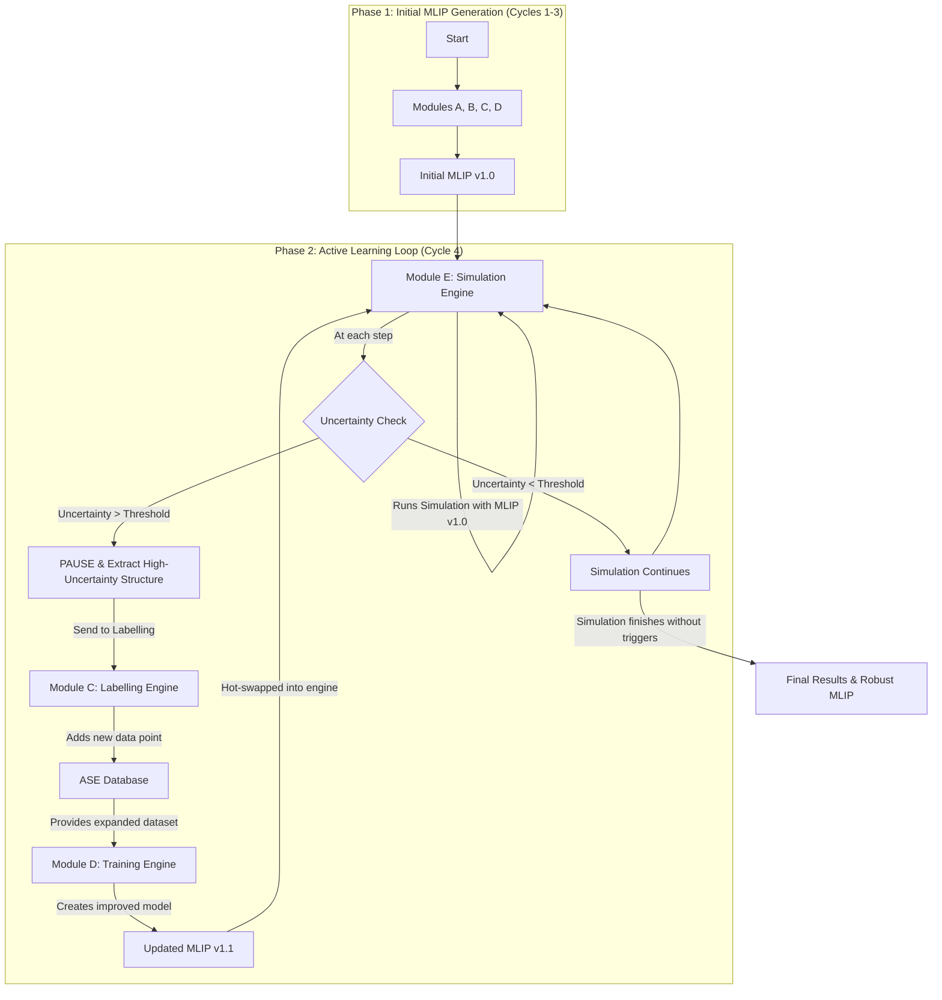

# Cycle 4 Specification: Active Learning and Advanced Simulation

**Version:** 1.0.0
**Status:** Final

## 1. Summary

This document provides the detailed technical specification for Cycle 4 of the MLIP-AutoPipe project. This cycle marks the project's transition from a highly efficient, but linear, data processing pipeline into a truly autonomous, intelligent, and self-correcting scientific discovery tool. It delivers the capstone feature of the system: a dynamic **active learning** loop. The primary objective is the implementation of **Module E (Simulation Engine)**, a component that not only utilizes the generated MLIP for its intended purpose—running large-scale atomistic simulations—but also critically evaluates the model's performance in real-time. This module closes the loop on the entire process, transforming the pipeline from a static generator of potentials into a dynamic system that can identify and patch weaknesses in its own knowledge, embodying the project's core philosophy of "removing the expert from the loop" at the most profound level.

The "on-the-fly" (OTF) active learning loop is the centerpiece of this cycle. The system will no longer rely on the hope that the initial, intelligently selected training set from Cycle 3 was "good enough" for a given simulation. Instead, it will proactively test the limits of its potential. The `SimulationEngine` will run a user-defined molecular dynamics (MD) simulation while continuously monitoring the uncertainty of the MLIP's predictions for every single atom at every step. If the simulation ventures into a region of the configurational space that the model has not seen before, the uncertainty will rise. When this uncertainty surpasses a user-defined threshold, the engine will automatically pause the simulation, precisely extract the novel atomic configuration that caused the issue, and dispatch it back to the `LabellingEngine` (Module C) for a high-fidelity DFT calculation. The newly acquired data point is then added to the training set, the `TrainingEngine` (Module D) generates an improved, more robust MLIP, and the simulation seamlessly resumes from where it left off. This iterative process of "discover weakness, acquire data, retrain, resume" continues until the entire simulation can be completed without the model expressing any further uncertainty. This cycle will also see the integration of advanced simulation techniques, specifically **Adaptive Kinetic Monte Carlo (kMC)**, a powerful method for simulating the long-timescale evolution of materials by focusing on rare events like atomic diffusion or chemical reactions, further expanding the scientific capabilities of the platform.

## 2. System Architecture

The architecture of Cycle 4 represents a fundamental paradigm shift for the project, evolving from a linear, feed-forward pipeline to a sophisticated, closed-loop, cyclical system. While the initial MLIP is still generated using the sequence of Modules A, B, C, and D from the preceding cycles, the final output of that sequence, the "initial MLIP," is no longer the end of the process. Instead, it becomes the input for the new, persistent `SimulationEngine` (Module E). This engine becomes the new focal point of the workflow, and its primary architectural feature is the introduction of a critical **feedback loop**. This loop connects the "end" of the pipeline (the simulation) back to its "middle" (the DFT labelling stage), creating a self-correcting system that can iteratively expand its own training data and refine its own model. This architecture is explicitly designed to handle statefulness; the simulation must be able to be paused, have its core model replaced, and then be resumed without any loss of data. The ASE database remains the central hub for data, but it is now a dynamic entity, continuously growing as the active learning loop discovers and adds new, valuable data points.

**Detailed Workflow Description:**

1.  **Initial Potential Generation:** The workflow is initiated by running the full pipeline as developed in Cycles 1-3. This produces an `initial.model`, which is considered the first version of the potential, trained on a diverse but static dataset.
2.  **Simulation Initialization (Module E):** The `SimulationEngine` is invoked with this initial model. It loads the model as its ASE calculator and begins to run the user-specified, large-scale "production" simulation (e.g., a long MD run to observe a phase transition).
3.  **On-the-Fly Uncertainty Monitoring:** This is the core of the active learning logic. At every single MD step (or every Nth step, as a performance trade-off), after the forces are calculated, the engine makes a second call to the MLIP calculator to query its prediction uncertainty. Many modern MLIP frameworks, like MACE, can provide this as a built-in "extrapolation grade" or committee model disagreement metric.
4.  **Uncertainty Trigger and Pause:** The engine compares the maximum uncertainty value across all atoms in the system to a user-defined threshold. If the uncertainty is below the threshold, the simulation proceeds. However, if any atomic environment causes the uncertainty to exceed this threshold, the active learning protocol is triggered. The MD simulation is immediately and gracefully paused.
5.  **Structure Extraction:** The engine identifies the atom and its local environment that caused the high uncertainty. To create a valid, periodic training structure without introducing artificial surface effects from a simple cluster cutout, the system uses a "periodic embedding" approach. It extracts a small, fully periodic supercell from the larger simulation box, centered on the atom of interest.
6.  **Feedback to Labelling Engine:** This newly created, high-value `Atoms` object is dispatched back to the `LabellingEngine` (Module C). Module C, which is already robust and automated from Cycle 1, performs a high-precision DFT calculation on this single structure to get its true energy and forces.
7.  **Database Update and Retraining:** The new, labelled data point is appended to the central ASE database. The `TrainingEngine` (Module D) is then invoked. It reloads the *entire* dataset from the database—including all the original data plus the new point—and retrains the MLIP from scratch to produce a new, improved `updated.model`.
8.  **Model Hot-Swap and Resumption:** The `SimulationEngine`, which has been waiting, discards the old model and "hot-swaps" the new, updated model into its calculator. The simulation is then seamlessly resumed from the exact atomic state at which it was paused. This entire cycle—pause, extract, label, retrain, resume—repeats as many times as necessary until the simulation is able to complete its entire prescribed duration without any more uncertainty triggers.

## 3. Design Architecture

This cycle introduces the final core scientific module, `SimulationEngine`, and the main control loop for the active learning process. The design must be robust, stateful, and performant.

**Key Classes and Modules:**

-   **`src/mlip_autopipe/modules/simulation_engine.py`:**
    -   **`SimulationEngine` class:** This is the orchestrator for the entire active learning simulation.
        -   `__init__(self, config: dict, db_interface: DatabaseInterface, labelling_engine: LabellingEngine, training_engine: TrainingEngine)`: The constructor is now more complex, as it needs handles to the other modules (`C` and `D`) to execute the feedback loop.
        -   `run_active_learning_loop(self)`: The main public method that orchestrates the entire OTF loop. It is responsible for initializing the simulation, running the main `while` loop that propagates the dynamics, calling the uncertainty check, and managing the complex pause/retrain/resume cycle.
        -   `_run_md_block(self, atoms, calculator, steps)`: A private method to run a fixed-size block of MD steps. The main loop will call this repeatedly.
        -   `_check_uncertainty(self, atoms, calculator) -> Optional[int]`: The core of the OTF logic. It queries the MLIP calculator for its uncertainty metric (e.g., via a `calculator.get_property('extrapolation_grade', atoms)` call). The method will be designed to handle different types of uncertainty metrics. If the uncertainty exceeds the configured threshold, it returns the index of the atom that triggered it; otherwise, it returns `None`.
        -   `_extract_periodic_embedding(self, atoms: Atoms, center_atom_index: int) -> Atoms`: A crucial geometry manipulation method. It will take the large simulation cell and the index of the "uncertain" atom and implement the logic to carve out a smaller, fully periodic supercell centered on that atom, which is suitable for use as a new DFT training structure.

-   **`src/mlip_autopipe/orchestration/workflow.py`:**
    -   **`WorkflowManager` class:** The `run_pipeline` method will be significantly updated. After the initial MLIP is trained, it will no longer exit. Instead, it will instantiate the `LabellingEngine`, `TrainingEngine`, `DatabaseInterface`, and finally the `SimulationEngine`, passing the required object handles. It will then call the `simulation_engine.run_active_learning_loop()` method to kick off the final, stateful phase of the process.

-   **`src/mlip_autopipe/common/performance.py`:**
    -   **`@jit(nopython=True)` `adaptive_kmc_step(...)` function:** A new, highly-optimised kernel will be added for the Adaptive kMC algorithm. This algorithm involves a complex loop of searching for saddle points, calculating transition rates using Harmonic Transition State Theory, building a catalog of possible events, and then performing a random selection weighted by the rates. The core logic for updating the event catalog and advancing the kMC clock is a major performance bottleneck, and it will be implemented here as a JIT-compiled Numba function to achieve the performance necessary for simulating long-timescale phenomena.

## 4. Implementation Approach

The implementation will be carefully staged, focusing on building the core simulation capability first, then integrating the uncertainty-monitoring logic, followed by the complex feedback loop, and finally adding the advanced kMC functionality.

1.  **Basic Simulation Engine:**
    a.  The initial implementation of the `SimulationEngine` class will be simple. It will be capable of loading a pre-trained MLIP and running a standard, non-active-learning MD simulation using the built-in MD capabilities of the ASE library (e.g., `VelocityVerlet`). The goal is to first have a working simulation environment before adding the complexity of the loop.
2.  **Uncertainty Integration:**
    a.  The `_check_uncertainty` method will be implemented. This is a critical interface point. The implementation will be tailored to the specific uncertainty metric provided by the chosen MLIP framework (e.g., MACE). It's crucial that this call is performant and does not significantly slow down the MD simulation.
    b.  A unit test will be written with a mock ASE calculator. This mock will be programmed to return a high uncertainty value after a fixed number of steps. The test will assert that the simulation engine correctly identifies the trigger and pauses the simulation at the exact right moment.
3.  **Feedback Loop Construction:** This is the most complex software engineering task of the cycle.
    a.  The `_extract_periodic_embedding` method will be implemented, requiring careful handling of atomic indices and periodic boundary conditions.
    -   The main `run_active_learning_loop` method will be built out to manage the full cycle. This involves complex state management: upon a pause, it must save the current state of the simulation (positions, velocities, etc.), call the `_extract_periodic_embedding` method, pass the new structure to the `LabellingEngine` instance, wait for it to complete, call the `TrainingEngine` instance, wait for the new model, and then load the new model and resume the simulation from the saved state.
4.  **Adaptive kMC Integration:**
    a.  The logic for finding saddle points will be implemented, likely by wrapping the NEB (Nudged Elastic Band) or Dimer methods available in the ASE library, using the MLIP as the calculator.
    b.  The logic for calculating transition rates based on the energies of the minima and saddle points will be implemented, following Harmonic Transition State Theory.
    c.  The core kMC event selection loop, which is a major performance bottleneck, will be implemented as a Numba-jitted function in `common/performance.py`.
    d.  The `SimulationEngine` will be extended with a new public method, `run_akmc`, to use this optimised functionality.
5.  **Configuration and Integration:**
    a.  The `FullConfig` Pydantic model will be updated to include a new `active_learning` section. This will expose user-tunable parameters like the `uncertainty_threshold`, the `max_retrain_cycles`, and the simulation type (`md` or `akmc`).
    b.  The `ConfigExpander` will be taught to provide sensible, physically-grounded defaults for these new settings.
    c.  A full, end-to-end integration test for the active learning loop will be developed, as described in the test strategy. This will be the most complex test in the entire project.

## 5. Test Strategy

Testing the stateful, stochastic, and complex active learning loop in Cycle 4 requires a sophisticated strategy that relies heavily on mock objects and carefully constructed "toy problems" designed to trigger specific behaviors predictably.

**Unit Testing Approach:**
-   **Simulation Engine:** The internal logic of the `SimulationEngine` will be tested in a modular and isolated fashion. The uncertainty checking mechanism, `_check_uncertainty`, is a primary target. A unit test will be created that uses a mock MLIP calculator. This mock object will be programmed to return a low uncertainty value for the first 99 steps of a simulation and a high uncertainty value on step 100. The test will then run the simulation and assert that the engine correctly calls the calculator 100 times and then pauses, correctly identifying and returning the structure from the 100th step as the trigger. This verifies the core detection logic. The `_extract_periodic_embedding` method will be tested with a large, known supercell of a crystal. The test will specify a center atom and assert that the extracted smaller cell is correctly centered, is periodic, and contains the correct number and type of atoms, confirming the geometric manipulation logic.
-   **Adaptive kMC Kernel:** The Numba-jitted `adaptive_kmc_step` function will be unit-tested for its correctness. A test will be created with a small, predefined catalog of kinetic events with known energy barriers. The test will call the kMC kernel and assert two things: first, that it correctly calculates the transition rates for each event based on Harmonic Transition State Theory and the given temperature. Second, over many thousands of repeated calls, the test will assert that the frequency with which each event is selected by the random sampling algorithm correctly matches the probabilities derived from the calculated rates. This provides statistical validation of the correctness of this performance-critical kernel.

**Integration Testing Approach:**
-   **Full Active Learning Loop Test:** This is the capstone test for the entire project and will be the most complex to implement, but it is essential for validating the system's core promise. The test will use a carefully designed "toy problem" that is simple and fast to compute, yet is guaranteed to trigger the active learning loop in a predictable way. A classic example is the dissociation of a diatomic molecule like H2.
    1.  **Deliberate Under-training:** The test will start by creating an initial MLIP that is deliberately and severely under-trained. For instance, the training set will contain only one or two data points corresponding to the H2 molecule at its exact equilibrium bond length. A simple linear MLIP will be trained on this data, which will be accurate at the equilibrium distance but wildly inaccurate for stretched or compressed bonds.
    2.  **Initiate Simulation:** The `SimulationEngine` will be configured to run a short MD simulation that slowly and steadily pulls the two hydrogen atoms apart.
    3.  **Guaranteed Uncertainty Trigger:** Within a handful of MD steps, the bond length will deviate significantly from the training data. The MLIP, being a simple linear model, will have a massive error, and its uncertainty metric should spike. The test will assert that the simulation pauses at this precise moment.
    4.  **Verify Feedback Loop:** The test will then verify the subsequent steps of the loop. It will assert that the new, stretched-bond structure is correctly extracted and passed to a mock `LabellingEngine`. It will also assert that a mock `TrainingEngine` is subsequently called with the expanded dataset.
    5.  **Confirm Resumption and Success:** Finally, the test will assert that the simulation successfully resumes with a (mock) updated potential and is now able to proceed to longer bond lengths without triggering further uncertainty. The successful completion of this entire sequence provides a rigorous, end-to-end validation of the system's core self-improving capability.
