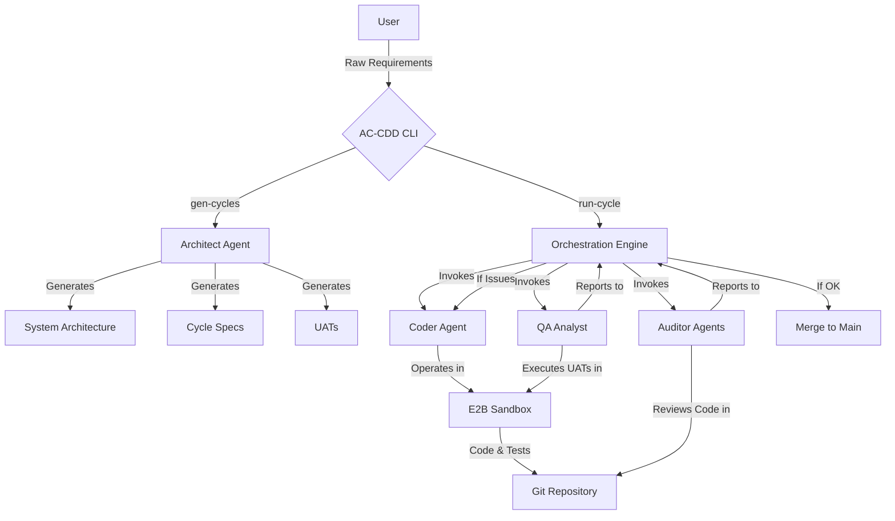

# SYSTEM_ARCHITECTURE.md

## 1. Summary

The Autonomous Development Environment (AC-CDD) is a sophisticated, AI-native framework designed to automate the software development lifecycle, from initial design to final implementation and quality assurance. Its core philosophy is to minimise human intervention by employing a committee of specialised AI agents, each responsible for a distinct phase of the development process. This system addresses the growing complexity and accelerated pace of modern software development, where traditional, manual workflows are becoming increasingly inefficient. By leveraging state-of-the-art Large Language Models (LLMs) and a secure, sandboxed execution environment, AC-CDD aims to deliver high-quality, reliable code at a velocity that is unattainable with conventional methods.

The primary objective of AC-CDD is to create a fully autonomous, self-correcting development pipeline. This is achieved through a cycle-based, contract-driven approach, where each development cycle is a self-contained unit of work with clearly defined specifications and acceptance criteria. The process begins with the Architect agent, which interprets raw, high-level requirements to generate a comprehensive system architecture, detailed technical specifications, and user acceptance tests (UATs). This initial phase ensures that there is a clear and unambiguous plan before any code is written, significantly reducing the risk of misunderstandings and costly rework later in the process.

Once the architectural blueprint is established, the Coder agent takes over, translating the specifications into functional code. All coding and testing activities are performed within a secure, ephemeral E2B sandbox, which isolates the development environment from the local machine and ensures reproducibility. This sandboxed approach is a critical feature of AC-CDD, as it provides a clean, consistent environment for every development task, eliminating the "it works on my machine" problem and enhancing security.

The quality assurance process is equally automated, with a committee of AI auditors and a QA analyst. The Auditor agents perform rigorous, multi-pass code reviews, checking for compliance with coding standards, best practices, and potential security vulnerabilities. The QA Analyst, in turn, executes the UATs to verify that the implemented features meet the behaviour defined in the acceptance criteria. This multi-layered, automated quality gate ensures that only code of the highest standard is accepted. If any issues are identified, the system enters an iterative fixing loop, where the Coder agent refines the code until it passes all checks. This self-correcting mechanism is at the heart of AC-CDD's ability to produce robust and reliable software with minimal human oversight.

The entire workflow is orchestrated by LangGraph, a powerful framework for building stateful, multi-agent applications. LangGraph manages the flow of control between the different agents, maintains the state of the development cycle, and ensures that each step is executed in the correct sequence. This robust orchestration layer is what enables the seamless integration of the various AI agents and the smooth, autonomous operation of the development pipeline. Ultimately, AC-CDD represents a paradigm shift in software development, moving away from manual, error-prone processes towards a future where intelligent agents can autonomously design, build, and maintain complex software systems.

## 2. System Design Objectives

The design of the Autonomous Development Environment (AC-CDD) is guided by a set of core objectives aimed at creating a robust, efficient, and highly automated software development framework. These objectives address the key challenges in modern software engineering, such as the need for increased development velocity, improved code quality, and enhanced security. By adhering to these principles, AC-CDD seeks to provide a reliable and scalable solution for building complex software systems with minimal human intervention.

**1. Maximise Automation:** The primary objective of AC-CDD is to automate every feasible aspect of the software development lifecycle. This includes requirements analysis, architectural design, coding, testing, code review, and quality assurance. By replacing manual tasks with autonomous AI agents, the system aims to significantly reduce the time and effort required to deliver software, while also minimising the potential for human error.

**2. Ensure High Code Quality:** AC-CDD is committed to producing code of the highest quality. This is achieved through a multi-faceted approach that includes contract-driven development, automated code auditing, and rigorous user acceptance testing. The use of predefined specifications and UATs ensures that the implemented features are aligned with the project's requirements, while the AI-powered code review process enforces strict adherence to coding standards and best practices.

**3. Enhance Security:** Security is a fundamental design consideration for AC-CDD. The use of a secure, sandboxed execution environment for all coding and testing activities is a key feature in this regard. This isolates the development process from the local machine and other sensitive resources, mitigating the risk of security breaches. Additionally, the automated code auditing process includes checks for common security vulnerabilities, helping to ensure that the generated code is secure by design.

**4. Improve Development Velocity:** By automating the most time-consuming aspects of software development, AC-CDD aims to dramatically increase the speed at which new features can be delivered. The autonomous nature of the system allows for continuous, round-the-clock development, free from the constraints of human availability. This enables rapid iteration and a faster time-to-market for new products and services.

**5. Promote Modularity and Scalability:** The AC-CDD framework is designed to be modular and scalable, allowing it to be adapted to projects of varying size and complexity. The cycle-based approach to development breaks down large, complex tasks into smaller, manageable units, making the process more organised and easier to track. The underlying architecture is also designed to be extensible, allowing for the future integration of new tools and technologies.

**6. Provide a Seamless User Experience:** Despite its complexity, AC-CDD is designed to be user-friendly and easy to operate. The command-line interface provides a simple and intuitive way to manage the development process, while the automated nature of the system abstracts away much of the underlying complexity. This allows developers to focus on defining the high-level requirements, leaving the low-level implementation details to the AI agents.

**7. Foster Reproducibility and Consistency:** The use of a sandboxed execution environment and a standardised, automated workflow ensures that the development process is both reproducible and consistent. Every development cycle is executed in a clean, isolated environment, free from the variations and inconsistencies that can arise from differences in local machine configurations. This guarantees that the behaviour of the system is predictable and reliable, which is essential for building mission-critical applications.

By focusing on these key design objectives, AC-CDD aims to create a next-generation software development platform that is not only more efficient and reliable than traditional methods but also more secure and easier to use.

## 3. System Architecture

The architecture of the Autonomous Development Environment (AC-CDD) is a modular, multi-agent system designed for orchestrating the entire software development lifecycle. It is built upon a foundation of specialised AI agents, a secure sandboxed execution environment, and a robust orchestration engine. This separation of concerns allows for a flexible and scalable system that can be adapted to a wide range of development scenarios.

**Components:**

*   **AC-CDD CLI:** The command-line interface is the primary entry point for the user. It provides commands for initiating the different phases of the development process, such as `gen-cycles` to start the architectural design phase and `run-cycle` to begin a development cycle. The CLI is responsible for parsing user input, managing the project's configuration, and interacting with the other components of the system.

*   **Architect Agent:** This agent is responsible for the initial design and planning phase. It takes the high-level, raw requirements provided by the user and transforms them into a comprehensive set of architectural documents. These include the system architecture, detailed specifications for each development cycle, and a set of user acceptance tests. The Architect agent is powered by a sophisticated LLM, such as Google's Jules, which has a long context window and strong reasoning capabilities.

*   **Orchestration Engine:** The Orchestration Engine, built on LangGraph, is the central nervous system of AC-CDD. It manages the state of the development cycle and coordinates the activities of the various agents. It is responsible for invoking the Coder, Auditor, and QA Analyst agents in the correct sequence, handling the flow of data between them, and making decisions based on the outcomes of their work.

*   **Coder Agent:** The Coder agent is responsible for writing the source code and unit tests based on the specifications provided by the Architect agent. It operates exclusively within the E2B sandbox, ensuring that all code is written and tested in a clean, isolated environment. The Coder agent is also responsible for fixing any issues identified by the Auditor or QA Analyst agents.

*   **E2B Sandbox:** The E2B sandbox is a secure, ephemeral environment where all coding and testing activities take place. It provides a fully-featured cloud development environment with access to a terminal, filesystem, and various development tools. The use of a sandbox is a critical security feature, as it isolates the development process from the local machine and ensures that the environment is consistent and reproducible.

*   **Auditor Agents:** The Auditor agents are a committee of AI-powered code reviewers that scrutinise the code produced by the Coder agent. They perform a multi-pass analysis, checking for compliance with coding standards, best practices, and potential security vulnerabilities. The auditors are typically powered by fast and efficient LLMs, such as Gemini Flash, which can provide rapid feedback on the quality of the code.

*   **QA Analyst:** The QA Analyst is responsible for verifying that the implemented features meet the user's requirements. It does this by executing the UATs, which were defined by the Architect agent, in the E2B sandbox. The QA Analyst then reports the results to the Orchestration Engine, which determines whether the development cycle has been successfully completed.

**Data Flow:**

The development process begins with the user providing a set of raw requirements to the AC-CDD CLI. The `gen-cycles` command triggers the Architect agent, which analyses these requirements and generates the architectural documents. These documents are then stored in the project's Git repository.

The `run-cycle` command initiates a development cycle, activating the Orchestration Engine. The engine first invokes the Coder agent, providing it with the relevant specifications for the current cycle. The Coder agent writes the code and unit tests within the E2B sandbox and commits them to a feature branch in the Git repository.

The Orchestration Engine then dispatches the Auditor agents to review the newly created code. The auditors report their findings back to the engine. If any issues are found, the engine re-engages the Coder agent to fix them. This iterative loop continues until the code passes all audits.

Once the code has been successfully audited, the Orchestration Engine calls upon the QA Analyst to execute the UATs. If the UATs pass, the engine merges the feature branch into the main branch, and the cycle is complete. If the UATs fail, the engine once again tasks the Coder agent with fixing the issues.

This modular, agent-based architecture, combined with a secure sandboxed execution environment and a robust orchestration engine, provides a powerful and flexible framework for autonomous software development.

## 4. Design Architecture

The design architecture of the Autonomous Development Environment (AC-CDD) is centred around a clean separation of concerns, with distinct layers for the user-facing CLI, the core agent logic, and the underlying services. This modular design promotes maintainability, extensibility, and testability.

**File Structure:**

The project is organised into the following key directories:

*   `dev_src/ac_cdd_core/`: This directory contains the core logic for the AC-CDD framework.
    *   `cli.py`: The entry point for the command-line interface, built using the Typer library.
    *   `agents/`: Contains the implementation of the various AI agents (Architect, Coder, Auditor, QA Analyst).
    *   `services/`: Provides common services used by the agents, such as interacting with the E2B sandbox, managing Git repositories, and communicating with LLM APIs.
    *   `orchestration/`: Houses the LangGraph-based orchestration logic that manages the development workflow.
    *   `config.py`: Manages the project's configuration, loading settings from `.env` and `ac_cdd_config.py`.
*   `src/`: This directory is reserved for the user's project code. The AC-CDD agents will read and write code within this directory.
*   `dev_documents/`: Stores all the documentation and artifacts generated by the AC-CDD system, including the system architecture, cycle specifications, and UATs.
*   `tests/`: Contains the unit and integration tests for the AC-CDD framework itself.

**Class/Function Definitions Overview:**

*   **`ACCDD_CLI` (in `cli.py`):** The main class for the CLI, with methods for each command (e.g., `init`, `gen_cycles`, `run_cycle`). These methods are responsible for parsing command-line arguments and delegating to the appropriate services and agents.

*   **`ArchitectAgent` (in `agents/architect.py`):** This class encapsulates the logic for the Architect agent. It has a primary method, `generate_architecture`, which takes the raw requirements as input and returns the generated architectural documents.

*   **`CoderAgent` (in `agents/coder.py`):** This class implements the Coder agent. Its main method, `implement_cycle`, receives the specifications for a development cycle and is responsible for writing the corresponding code and unit tests.

*   **`SandboxService` (in `services/sandbox.py`):** This service provides an abstraction layer for interacting with the E2B sandbox. It includes methods for starting and stopping the sandbox, executing commands, and syncing files between the local machine and the sandbox environment.

*   **`GitService` (in `services/git.py`):** This class manages all interactions with the Git repository, including creating branches, committing changes, and merging branches.

*   **`OrchestrationGraph` (in `orchestration/graph.py`):** This is the core of the orchestration engine. It defines the LangGraph graph, including the nodes for each agent and the edges that control the flow of execution.

**Data Models:**

The system uses Pydantic models to define the structure of the data that is passed between the different components. This ensures type safety and provides clear, self-documenting data contracts.

*   **`CycleSpec`:** A Pydantic model that represents the specification for a development cycle. It includes fields for the cycle's objectives, technical requirements, and acceptance criteria.

*   **`AuditResult`:** This model defines the output of the Auditor agents. It contains a list of identified issues, along with their severity and location in the code.

*   **`UATResult`:** Represents the outcome of the user acceptance tests. It includes a summary of the test run, along with details of any failures.

This well-defined, modular architecture provides a solid foundation for the AC-CDD framework, enabling it to be developed, maintained, and extended in a structured and efficient manner.

## 5. Implementation Plan

The development of the Autonomous Development Environment (AC-CDD) will be carried out in five distinct, sequential cycles. Each cycle will focus on a specific set of features, building upon the work of the previous cycles to incrementally deliver the full functionality of the system.

**Cycle 01: Core CLI and Project Initialization**
This foundational cycle will focus on creating the basic command-line interface and the project initialisation process. The primary goal is to establish the core structure of the application and provide a way for users to set up their development environment. Key deliverables will include a working CLI with an `init` command that generates the necessary configuration files, such as `.env` and `ac_cdd_config.py`. This cycle will also involve setting up the basic project structure, including the `dev_src` and `src` directories, and implementing the configuration management system.

**Cycle 02: Architect Agent and `gen-cycles` command**
In this cycle, we will implement the Architect agent and the `gen-cycles` command. This will involve integrating with the Jules API to enable the agent to analyse the raw requirements from `ALL_SPEC.md` and generate the initial set of architectural documents. The `gen-cycles` command will orchestrate this process, creating a new Git branch for the design phase and committing the generated documents to the repository. The successful completion of this cycle will result in a fully functional architectural design phase, capable of transforming high-level requirements into a detailed, actionable plan.

**Cycle 03: Coder Agent and Sandboxed Execution**
This cycle will focus on implementing the Coder agent and integrating the E2B sandbox. The `run-cycle` command will be introduced, which will be responsible for initiating a development cycle. The Coder agent will be tasked with reading the specifications for the current cycle and writing the corresponding code and unit tests. All of these activities will take place within the E2B sandbox, and this cycle will involve implementing the necessary services to manage the sandbox environment, including starting, stopping, and syncing files.

**Cycle 04: Auditor and QA Agents Integration**
With the core coding functionality in place, this cycle will focus on integrating the quality assurance agents. The Auditor agents will be implemented to perform automated code reviews, and the QA Analyst will be developed to execute the user acceptance tests. The orchestration logic will be extended to incorporate these new agents into the development workflow, ensuring that all code is thoroughly reviewed and tested before it is considered complete. This cycle will also involve implementing the reporting mechanisms for these agents, so that their findings can be used to guide the fixing process.

**Cycle 05: Iterative Fixing and Orchestration**
The final cycle will focus on implementing the iterative fixing loop and refining the orchestration logic. This will involve creating the mechanism by which the Coder agent is re-engaged to fix any issues identified by the Auditor or QA agents. The LangGraph-based orchestration engine will be fully implemented to manage the state of the development cycle and control the flow of execution between the different agents. The successful completion of this cycle will result in a fully autonomous, end-to-end development pipeline, capable of designing, implementing, and verifying software with minimal human intervention.

## 6. Test Strategy

The testing strategy for the Autonomous Development Environment (AC-CDD) is a comprehensive, multi-layered approach designed to ensure the quality, reliability, and robustness of the system. It encompasses unit testing, integration testing, and end-to-end testing, with a strong emphasis on automation.

**Unit Testing:**
Each component of the AC-CDD framework will be accompanied by a suite of unit tests. These tests will be written using the `pytest` framework and will focus on verifying the functionality of individual classes and methods in isolation. Mocks will be used extensively to isolate the code under test from its dependencies, ensuring that the tests are fast, reliable, and easy to maintain. For example, when testing the `ArchitectAgent`, the Jules API will be mocked to avoid making actual network calls, and when testing the `GitService`, the underlying Git commands will be mocked to prevent any actual changes to the repository.

**Integration Testing:**
Integration tests will be used to verify the interactions between the different components of the system. These tests will be more comprehensive than the unit tests and will involve testing the end-to-end functionality of specific features. For example, an integration test for the `gen-cycles` command would involve running the actual command and verifying that the expected architectural documents are created in the correct location. These tests will still make use of mocks for external dependencies, such as the LLM APIs and the E2B sandbox, to ensure that they can be run in a controlled and reproducible manner.

**End-to-End Testing:**
End-to-end tests will be used to validate the complete, end-to-end workflow of the AC-CDD system. These tests will simulate a real-world usage scenario, starting with a set of raw requirements and running through the entire development process to produce a fully implemented and verified feature. These tests will be run against a live, albeit controlled, environment, with actual calls to the LLM APIs and the E2B sandbox. This will allow us to verify that all the components of the system are working together correctly and that the system as a whole is behaving as expected.

**Cycle-Specific Test Strategies:**

*   **Cycle 01:** The testing for this cycle will focus on the CLI and the project initialisation process. Unit tests will be written for the `init` command and the configuration management system. Integration tests will be used to verify that the `init` command correctly generates the necessary configuration files.

*   **Cycle 02:** This cycle will involve testing the Architect agent and the `gen-cycles` command. Unit tests will be written for the `ArchitectAgent` class, with the Jules API mocked. Integration tests will be used to test the `gen-cycles` command, verifying that it correctly invokes the Architect agent and commits the generated documents to the repository.

*   **Cycle 03:** The testing for this cycle will focus on the Coder agent and the E2B sandbox integration. Unit tests will be written for the `CoderAgent` class and the `SandboxService`. Integration tests will be used to test the `run-cycle` command, verifying that it can successfully execute a development cycle in a mocked sandbox environment.

*   **Cycle 04:** This cycle will involve testing the Auditor and QA agents. Unit tests will be written for the agent classes, with the LLM APIs mocked. Integration tests will be used to verify that the agents can be correctly integrated into the development workflow and that their reports are correctly processed by the orchestration engine.

*   **Cycle 05:** The testing for the final cycle will focus on the iterative fixing loop and the end-to-end workflow. End-to-end tests will be created to simulate a complete development cycle, including the identification and fixing of issues. These tests will be run against a live environment to provide the highest level of confidence in the correctness and reliability of the system.

By employing this multi-layered, comprehensive testing strategy, we can ensure that the AC-CDD framework is a robust, reliable, and high-quality platform for autonomous software development.
