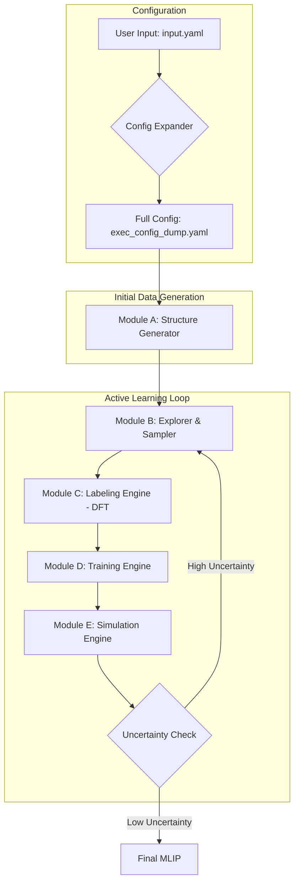

# System Architecture: MLIP-AutoPipe

**Version:** 1.0.0
**Status:** Final

## 1. Summary

The MLIP-AutoPipe (Machine Learning Interatomic Potential - Automated Pipeline) project is a transformative initiative designed to automate the entire workflow of generating and validating machine learning interatomic potentials. The core philosophy driving this project is "removing the human expert from the loop." In traditional computational materials science, the development of accurate potentials is a laborious process, heavily reliant on the intuition and expertise of seasoned researchers. This manual intervention creates a significant bottleneck, slowing down the pace of materials discovery and analysis. MLIP-AutoPipe aims to dismantle this bottleneck by introducing a fully autonomous system that requires minimal user input—essentially just the material's composition—to generate a high-precision potential ready for large-scale simulations.

The system is engineered to handle the complete end-to-end process, from initial structure generation to active learning and final deployment in advanced simulations. It intelligently generates a diverse set of initial atomic configurations using physically sound heuristics, avoiding the costly and inefficient reliance on traditional AIMD simulations for data acquisition. It then leverages a "universal" foundation model to rapidly explore the vast conformational space, identifying structures that are most informative for training a specialised potential. The labelling of these structures with accurate energy, force, and stress data is handled by an automated DFT engine, which intelligently configures and executes calculations without needing manual oversight.

A key innovation of the MLIP-AutoPipe is its implementation of an active learning loop. During simulations, the system continuously monitors the MLIP's performance and detects when it encounters atomic configurations for which its predictions are uncertain. When such an event occurs, the system automatically triggers a re-training cycle: it extracts the uncertain structure, labels it using the DFT engine, and incorporates the new data to refine the potential. This self-correcting mechanism ensures that the potential becomes progressively more robust and accurate as it is used. The final output is a highly reliable potential that can be used for long-timescale molecular dynamics or kinetic Monte Carlo simulations, enabling the study of complex phenomena like phase transitions and chemical reactions that are intractable with conventional methods. By automating this entire process, MLIP-AutoPipe will democratise the use of advanced atomistic simulations and accelerate innovation across the field of materials science. The project is not merely an automation script; it is a comprehensive framework designed to encapsulate the best practices of MLIP development, from data generation and model training to validation and deployment. It aims to be a "scientist-in-a-box," capable of making intelligent decisions at every stage of the workflow. The system will be built using a modern Python technology stack, with a strong emphasis on modularity, performance, and reproducibility. The ultimate vision is a tool that empowers researchers to focus on the scientific questions they want to answer, rather than on the technical minutiae of generating a potential.

## 2. System Design Objectives

The primary objective of MLIP-AutoPipe is to create a zero-touch, fully automated pipeline for the generation of bespoke machine learning interatomic potentials. The success of the system will be measured against several key design goals and constraints.

**Automation and Usability:** The foremost goal is to eliminate the need for expert human intervention. The user interaction is intentionally simplified to providing a minimal input file (`input.yaml`) containing only the chemical composition and the desired simulation conditions (e.g., temperature range). The system must autonomously handle every subsequent step, from DFT parameterisation to model training and validation. This objective is driven by the need to make advanced simulation techniques accessible to a broader range of scientists and engineers who may not have deep expertise in computational physics. Success will be defined by the ability of a non-expert user to successfully generate a potential for a moderately complex material system without needing to manually adjust any configuration files or scripts. This includes the automatic selection of DFT parameters, the generation of a diverse training set, the training of the model, and the validation of its accuracy. The system should provide sensible defaults for all parameters, but also allow for expert users to override them if necessary. The command-line interface will be designed to be intuitive and user-friendly, with clear and informative output.

**Accuracy and Robustness:** The generated potentials must achieve a level of accuracy comparable to the underlying DFT calculations. The system must produce potentials that are robust enough to be used in demanding, long-timescale simulations without failing or producing unphysical results. This will be achieved through a combination of delta learning, which grounds the model with physical reference potentials, and an on-the-fly active learning loop, which ensures the model can adapt to novel atomic environments encountered during simulations. The system's success in this area will be quantified by comparing the energy and force predictions of the MLIP against a hold-out set of DFT data, aiming for RMSE values within established academic benchmarks. Robustness will be assessed by the ability of the potential to run stable, long-time MD simulations without any catastrophic failures. The system will also include a suite of automated validation tests that are run on the final potential to assess its quality before it is presented to the user.

**Computational Efficiency:** While accuracy is paramount, the system must also be computationally efficient. A key constraint is to minimise the number of expensive DFT calculations required. The design addresses this by using a pre-trained universal potential for initial exploration and a sophisticated sampling strategy (DIRECT sampling) to select only the most informative structures for DFT labelling. Furthermore, the system is designed to leverage modern high-performance computing tools, including JIT compilers like Numba and GPU acceleration for model inference, to ensure that all stages of the pipeline run as quickly as possible. The efficiency will be measured by the total wall-clock time and the number of DFT calculations needed to generate a converged potential, aiming for a significant reduction compared to traditional manual workflows. The system will also be designed to be parallelizable, allowing for the concurrent execution of DFT calculations and other tasks where possible.

**Modularity and Extensibility:** The field of machine learning potentials is rapidly evolving. Therefore, the system must be designed in a modular and extensible fashion. Each component—the structure generator, the labelling engine, the training engine, and the simulation engine—is designed as a loosely coupled module with well-defined interfaces. This architecture will allow for the easy integration of new algorithms, models (e.g., swapping MACE for a newer GNN), or simulation codes in the future without requiring a complete redesign of the system. This future-proofs the software and ensures its long-term relevance. The configuration system will also be designed to be extensible, allowing for new modules and parameters to be added without breaking backward compatibility. The code will be well-documented and follow best practices for software engineering to facilitate contributions from the community.

## 3. System Architecture

The MLIP-AutoPipe system is designed as a modular, five-component pipeline orchestrated by a central workflow manager. This architecture ensures a clear separation of concerns, allowing each module to be developed, tested, and updated independently. The data flows sequentially through the pipeline, with each stage enriching the dataset and refining the potential. All data and metadata generated throughout the process are stored in a central database (e.g., ASE DB) to ensure traceability and reproducibility.



**Module Descriptions:**

1.  **Config Expander (Heuristic Engine):** This is the entry point of the system. It takes the user's minimal `input.yaml` and uses a built-in physics-based heuristic engine to generate a complete configuration file, `exec_config_dump.yaml`. It automatically determines optimal parameters for DFT calculations, simulation settings, and model training, effectively translating high-level user intent into a detailed execution plan. The heuristic engine will be designed to be extensible, allowing for new rules and materials to be added over time. It will also perform validation of the user's input, providing clear error messages if any required fields are missing or invalid.

2.  **Module A: Structure Generator:** This module is responsible for creating a diverse and physically plausible set of initial atomic structures without resorting to expensive DFT calculations. It analyses the input composition to determine the bond type (e.g., metallic, covalent) and applies the most appropriate generation algorithm (e.g., SQS for alloys, Normal Mode Sampling for molecules). The module will be designed to be highly configurable, allowing the user to specify the number and type of structures to be generated. It will also include functionality for applying various deformations (e.g., strain, rattle) to the generated structures to increase the diversity of the training set.

3.  **Module B: Explorer & Sampler:** This module uses a pre-trained, universal MLIP (a "foundation model") to perform large-scale, computationally cheap molecular dynamics simulations. From the resulting trajectories, it uses the DIRECT sampling algorithm—a combination of descriptor calculation, dimensionality reduction, and stratified sampling—to select a small subset of structures that are maximally informative for training the target potential. The module will be designed to be highly efficient, leveraging GPU acceleration and JIT compilation to process large amounts of data in a short amount of time. The sampling strategy will be configurable, allowing the user to tune the balance between exploration and exploitation.

4.  **Module C: Labeling Engine:** This module takes the structures selected by Module B and calculates their reference energies, forces, and stresses using Quantum Espresso. It fully automates the process, from generating input files with robust parameters (determined by the Config Expander) to executing the calculation and parsing the results. It also includes error-recovery logic to handle common DFT convergence issues. The module will be designed to be robust and reliable, with extensive error checking and logging to ensure that all calculations are performed correctly. It will also support parallel execution of DFT calculations to speed up the labeling process.

5.  **Module D: Training Engine:** This is the core machine learning module. It takes the DFT-labelled data and trains the MLIP. It employs a "delta learning" strategy, training the model to predict the *difference* between a simple, physical baseline potential (like ZBL or Lennard-Jones) and the true DFT values. This approach ensures the model behaves physically even in regions with sparse data. The module will support a variety of MLIP models and training algorithms, and will be designed to be easily extensible with new models as they are developed. It will also include functionality for hyperparameter optimization to ensure that the best possible model is trained for the given dataset.

6.  **Module E: Simulation Engine:** This module uses the newly trained MLIP to run production simulations (MD or kMC). Crucially, it performs on-the-fly uncertainty monitoring. If the model encounters a configuration it is not confident about, it pauses the simulation and sends the structure back to the Explorer & Sampler module, thus triggering the active learning loop to refine the potential. The module will be designed to be highly flexible, supporting a variety of simulation types and ensembles. The uncertainty quantification mechanism will be a key component of this module, and will be designed to be both accurate and efficient.

This modular, loop-based architecture allows the system to autonomously and iteratively improve the quality of the potential until it is robust enough for the user's target application. The use of a central database ensures that all data is stored in a structured and accessible manner, and that the entire workflow is reproducible.

## 4. Design Architecture

The software will be implemented in Python, leveraging modern tools and libraries to ensure performance and maintainability. The project will follow a standard structure, with all source code residing in a `src` directory and tests in a `tests` directory. Dependency management will be handled by `uv` via a `pyproject.toml` file.

**File Structure:**

```
src/mlip_autoflow/
├── __init__.py
├── main.py                # Main CLI entry point
├── config/
│   └── expander.py        # Config Expander heuristic engine
├── modules/
│   ├── a_structure_generator.py
│   ├── b_explorer_sampler.py
│   ├── c_labeling_engine.py
│   ├── d_training_engine.py
│   └── e_simulation_engine.py
├── utils/
│   ├── ase_db.py          # Database interface
│   └── dft.py             # DFT runner wrappers
└── data/
    └── models.py          # Pydantic models for data structures
```

**Class/Function Definitions Overview:**

*   **`main.py`**: Will use a CLI library like `Typer` to define the main entry point `mlip-pipe run <input_yaml>`. It will be responsible for orchestrating the overall workflow, including the active learning loop.
*   **`config/expander.py`**: The `ConfigExpander` class will have a `expand(config_path)` method that reads the minimal YAML, applies heuristics based on material type, and returns a fully populated Pydantic model representing the complete configuration.
*   **`modules/a_structure_generator.py`**: A `StructureGenerator` class with methods like `generate_alloy_sqs`, `generate_molecule_nms`, etc. It will take the system configuration and return a list of `ase.Atoms` objects.
*   **`modules/b_explorer_sampler.py`**: An `ExplorerSampler` class. A `run_exploration` method will execute MD with a universal potential. A `sample_direct` method will perform the descriptor calculation (optimized with Numba), clustering, and sampling to select the most informative structures.
*   **`modules/c_labeling_engine.py`**: A `LabelingEngine` class with a `calculate(atoms_list)` method that iterates through the structures, generates QE input files based on the full config, runs the calculations, and parses the output, storing results in the central database.
*   **`modules/d_training_engine.py`**: A `TrainingEngine` class with a `train(dataset)` method. It will implement the delta learning logic, prepare the data for the chosen MLIP framework (e.g., MACE), run the training process, and save the resulting model file.
*   **`modules/e_simulation_engine.py`**: A `SimulationEngine` class with a `run_md_otf(model)` method. It will set up and run a LAMMPS (or similar) simulation using the trained MLIP, with a callback function to perform the uncertainty check at each step.

**Data Models:**

Pydantic models will be used to ensure data integrity. A `FullConfig` model will define the entire configuration schema, including nested models for `DFTConfig`, `TrainingConfig`, etc. This provides static type checking and validation for all parameters used throughout the pipeline. All intermediate data, such as `ase.Atoms` objects with attached calculation results, will be stored and retrieved via a dedicated `AseDBManager` class in `utils/ase_db.py`. The use of Pydantic models will also allow for automatic generation of documentation for the configuration file format.

## 5. Implementation Plan

The project will be developed over five sequential cycles, each focusing on a logical subset of the system's functionality. This iterative approach allows for progressive development and testing, ensuring that a solid foundation is built before more complex features are added.

**Cycle 1: Core Engine & Automation Foundation**
This cycle focuses on building the backbone of the pipeline. The goal is to create a non-interactive workflow that can take a pre-existing set of structures, label them with DFT, and train a basic MLIP. The key achievement will be the robust automation of the DFT calculation and model training steps. This cycle will deliver a system capable of performing the core task of converting a given set of atomic structures into a trained machine learning potential without manual intervention. The central theme is automation. By the end of this cycle, we will have eliminated the most time-consuming manual steps in a typical MLIP development workflow: running DFT calculations and orchestrating the model training process. The successful completion of this cycle will yield a robust, scriptable pipeline that can be executed from a single command. The scope of this cycle is deliberately focused. We will not be addressing the generation of initial structures or the sophisticated active learning loop. Instead, the cycle assumes that a set of input structures is provided. The system will then process these structures through two main modules. First, `Module C: Labeling Engine`, will take the structures and automatically manage the execution of Quantum Espresso calculations to obtain the necessary energy, force, and stress labels. This involves programmatically generating input files with physically sound parameters, managing the execution of the DFT code, parsing the output, and storing the results in a structured database. Second, `Module D: Training Engine`, will consume the labelled data from the database and conduct the training of a delta-learning MLIP. This module will handle all aspects of the training process, from data preparation to the final serialization of the trained model. A crucial deliverable of this cycle is the implementation of the "Two-Tier Configuration" strategy. This innovative approach is key to achieving our goal of a user-friendly system. We will develop the `ConfigExpander`, a heuristic engine that takes a minimal user-provided configuration file and intelligently populates it with all the detailed parameters required for the DFT and training steps. This will abstract away the complexity of the underlying tools, allowing users to interact with the system at a high level. By the conclusion of Cycle 1, we will have a functional, albeit not yet fully autonomous, pipeline that demonstrates the viability of our automated approach and provides a solid, extensible foundation upon which the subsequent cycles will build.

**Cycle 2: Initial Structure Generation**
This cycle will focus on the start of the pipeline: generating the initial set of diverse and physically relevant structures. This removes the need for the user to provide initial data and is the first step towards a fully autonomous workflow. The primary goal of this cycle is to implement `Module A: Structure Generator`. This module will be responsible for taking the minimal user input (chemical composition) and intelligently creating a diverse, physically plausible, and computationally relevant set of initial configurations to seed the entire workflow. A key feature will be the implementation of a material type classifier. This component will analyze the provided chemical formula and, using heuristics based on fundamental chemical principles (like electronegativity), automatically classify the material as an alloy, a molecule, or an ionic/covalent crystal. This classification will then determine which specialized generation algorithm is most appropriate to use. For alloys, we will implement a Special Quasirandom Structures (SQS) generator. For molecular systems, we will use Normal Mode Sampling (NMS) to explore vibrational degrees of freedom. For ionic and covalent materials, we will implement methods like random structure searching and deep rattling to create a variety of plausible polymorphs and defect structures. By the end of this cycle, the MLIP-AutoPipe system will be capable of initiating its workflow from nothing more than a chemical formula. The user will no longer be required to have any pre-existing structural data. This enhancement not only improves usability but also contributes to the scientific rigour of the process by ensuring that the initial training data is generated in a systematic and unbiased manner. This cycle will deliver a fully integrated `StructureGenerator` that seamlessly feeds its output into the labelling and training engines developed in Cycle 1, creating a more complete and powerful automated pipeline.

**Cycle 3: Efficient Exploration & Sampling**
This cycle tackles the critical task of reducing the number of expensive DFT calculations. The focus will be on implementing the exploration and intelligent sampling module, which uses a cheap universal potential to find the most important regions of the potential energy surface. The primary objective of Cycle 3 is to rectify this inefficiency by implementing `Module B: Explorer & Sampler`. This module will act as a sophisticated filter, drastically reducing the number of DFT calculations required by intelligently selecting only the most informative atomic configurations for labeling. The core goal is to maximize the scientific value of each DFT calculation, thereby minimizing the computational cost and time-to-solution. The scope of this cycle is to build a two-stage exploration and sampling system. The first stage, "Exploration," will leverage a pre-trained, universal "foundation model" MLIP (such as MACE-MP). This model, while not perfectly accurate for our specific system, is good enough to run large-scale, computationally cheap molecular dynamics simulations. By simulating the material at various temperatures and pressures, we can generate millions of diverse atomic configurations, effectively exploring a vast region of the potential energy surface without a single DFT calculation. The second stage, "Sampling," will process the massive amount of data generated during exploration. We will implement the DIRECT sampling algorithm. This involves calculating a structural descriptor for each configuration, using dimensionality reduction techniques to visualize the coverage of the conformational space, and then applying a stratified sampling strategy to select a few hundred representative structures. This ensures that the selected structures are not redundant and provide a balanced coverage of the explored space, from stable equilibrium states to high-energy transition states. The output of this cycle will be a highly curated, information-rich dataset that will be passed to the labeling engine. The implementation of Module B will transform our pipeline from a simple automated script into an intelligent, resource-aware system.

**Cycle 4: Active Learning & Simulation**
With the core components in place, this cycle will implement the "on-the-fly" (OTF) active learning loop. This is the mechanism that allows the potential to self-improve during a simulation, making the system truly adaptive. The primary objective of this cycle is to implement the active learning loop by developing `Module E: Simulation Engine`. In the previous cycles, we built a system that could generate an initial MLIP. This cycle will give that MLIP a purpose: to be used in a real simulation. More importantly, it will build the crucial feedback mechanism that allows the potential to learn from its own mistakes. The core goal is to create a system that can start with a partially trained potential, run a simulation, detect when and where the potential is failing, and automatically trigger the re-training pipeline to fix the deficiencies. The scope of this cycle is to implement an "on-the-fly" (OTF) uncertainty monitoring and re-training workflow. We will integrate a standard simulation engine, such as LAMMPS, and configure it to use the MLIPs generated by our pipeline. The key innovation will be the development of an uncertainty quantification (UQ) mechanism. During an MD simulation, this UQ component will analyze the atomic configurations at each timestep and calculate a score representing the model's confidence in its prediction. If this uncertainty score exceeds a predefined threshold, it signifies that the model is operating in an "extrapolation" regime where its predictions are unreliable. When such an event is triggered, the simulation will be automatically paused. The high-uncertainty atomic configuration will be extracted and sent back to the beginning of the pipeline (`Module B` or `C`) to be labeled with DFT and incorporated into the training data. The MLIP will then be re-trained, and the simulation will resume with the improved potential. This "OTF" loop is the cornerstone of the active learning strategy, ensuring that computational effort is focused precisely on the areas of the potential energy surface that the model does not yet understand. By the end of this cycle, MLIP-AutoPipe will be a truly adaptive learning machine, capable of refining its own potential to achieve the robustness required for production-level scientific simulations.

**Cycle 5: Advanced Simulation & Finalisation**
The final cycle will focus on implementing advanced simulation capabilities and preparing the system for release. This includes adding support for kinetic Monte Carlo and finalising the user interface and documentation. The major technical scope of this cycle is the extension of `Module E: Simulation Engine` to support not just molecular dynamics but also more advanced sampling methods like Adaptive Kinetic Monte Carlo (akMC). While MD is excellent for studying processes that occur on nanosecond timescales, many critical material processes, such as diffusion, phase nucleation, and chemical reactions, are "rare events" that may only occur once per microsecond or longer. To address this, we will implement an akMC framework. This involves integrating saddle point search algorithms (like Nudged Elastic Band or the Dimer method) to find transition states, a rate calculator to determine event probabilities, and a KMC engine to simulate the long-timescale evolution of the system. This entire process will be accelerated by JIT-compiling the performance-critical KMC loop with Numba. The second part of the scope is finalization and polish. We will refine the CLI to be more intuitive and informative, providing clear feedback to the user about the progress of the workflow. We will write comprehensive user documentation, explaining not just how to run the software but also the underlying concepts and best practices. Finally, we will prepare a set of tutorials and example workflows for different material systems to help new users get started quickly. By the end of Cycle 5, MLIP-AutoPipe will not just be a functional proof-of-concept; it will be a powerful, production-ready tool capable of tackling a wide range of challenging problems in computational materials science.

## 6. Test Strategy

The testing strategy will be multi-layered, encompassing unit, integration, and end-to-end tests to ensure the reliability and accuracy of the system. Testing will be an integral part of each development cycle.

**Unit Testing:**
Each class and function will have corresponding unit tests written using the `pytest` framework. The focus will be on testing individual components in isolation.
*   **`ConfigExpander`**: Test that it correctly parses minimal configs and that the generated full configs have valid and physically sensible parameters for different material types.
*   **`StructureGenerator`**: For each generation method, verify that the output structures are diverse, have the correct composition, and are physically plausible (e.g., no overlapping atoms).
*   **`LabelingEngine`**: Mock the external call to Quantum Espresso. Test that the engine correctly generates input files for different calculation types (e.g., spin-polarised vs. non-spin-polarised) and correctly parses output files (both successful and failed calculations).
*   **`TrainingEngine`**: Use a small, fixed dataset to test that the training process runs to completion and that the resulting model can make predictions.
*   **`SimulationEngine`**: Mock the simulation code (e.g., LAMMPS). Test that the uncertainty monitoring logic correctly identifies and flags "uncertain" atomic configurations based on predefined criteria.

**Integration Testing:**
Integration tests will focus on verifying the interactions between the modules.
*   **Cycle 1 Test**: Create a test that pipes a fixed set of `ase.Atoms` objects from a file into the `LabelingEngine` and then uses the output to run the `TrainingEngine`. This will verify the data flow and interfaces between Modules C and D.
*   **Cycle 2 Test**: Test the flow from the `ConfigExpander` to the `StructureGenerator`. Provide a minimal input file and verify that the correct type of structures are generated with the correct parameters.
*   **Cycle 3 Test**: Test the integration of the `ExplorerSampler` with the `LabelingEngine`. Run a short exploratory simulation, sample a small number of structures, and verify that they are correctly passed to the labelling engine.
*   **Cycle 4 Test**: This will be a "mini" end-to-end test. Start with a very simple potential, run a short simulation that is designed to trigger the uncertainty mechanism, and verify that a single re-training cycle is successfully completed.

**End-to-End (E2E) Testing:**
For each cycle, a full E2E test will be run on a simple, well-understood material system (e.g., Silicon or an Fe-Pt alloy). This will involve running the entire pipeline from a minimal `input.yaml` file and verifying the final output. The correctness of the final MLIP will be validated by comparing its predictions on a hold-out dataset against DFT calculations and by checking if it can run a stable MD simulation. These tests will be crucial for ensuring that the system as a whole functions as expected and produces scientifically valid results. The E2E tests will be automated and run as part of the continuous integration pipeline to prevent regressions. The test suite will include a variety of material systems, including metals, semiconductors, and insulators, to ensure that the system is robust and generalizable. The results of the E2E tests will be automatically collected and reported, providing a clear and concise summary of the system's performance.
