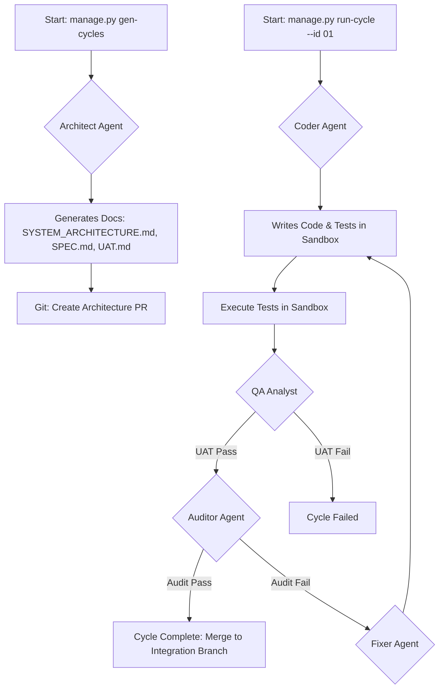

# System Architecture: Autonomous Development Environment (AC-CDD)

## 1. Core Philosophy

The Autonomous Development Environment (AC-CDD) is an AI-native framework designed to automate the software development lifecycle. It operates on a **Cycle-Based, Contract-Driven** model, where development is broken down into discrete, verifiable cycles, and all work is governed by machine-readable "contracts" (specifications and tests).

The core philosophy is to **separate the "what" from the "how."** The human developer defines the high-level requirements (the "what"), and the AC-CDD system, with its team of specialized AI agents, handles the implementation, testing, and quality assurance (the "how").

## 2. High-Level Architecture

The system is composed of four main layers:

1.  **Orchestration Layer**: Manages the overall workflow, state, and interaction between agents.
2.  **Agent Layer**: Contains the specialized AI agents responsible for specific tasks (e.g., architecture, coding, auditing).
3.  **Execution Layer**: Provides a secure, sandboxed environment for running code, tests, and other commands.
4.  **Data & Artifacts Layer**: Manages all project-related documents, source code, and generated artifacts.

  <!-- Placeholder for a diagram -->

---

## 3. Core Components

### 3.1. Orchestration Layer

#### **`manage.py` (CLI - Command Line Interface)**
*   **Description**: The primary user entry point to the AC-CDD system. It exposes commands like `init`, `gen-cycles`, and `run-cycle`.
*   **Responsibilities**:
    *   Parsing user commands and arguments.
    *   Initializing the `LangGraph` orchestrator.
    *   Managing the overall session state (`.ac_cdd_session.json`).

#### **LangGraph State Machine**
*   **Description**: The heart of the orchestration layer. It defines the development workflow as a state graph, where each node represents a specific task (e.g., "Run Coder Session," "Run Audit," "Evaluate UAT").
*   **Responsibilities**:
    *   Managing the flow of control between different agents and tools.
    *   Persisting the state of a development cycle.
    *   Handling branching logic (e.g., proceeding to the "Fixer" state if an audit fails).

### 3.2. Agent Layer

The system employs a "committee" of specialized AI agents, each with a distinct role.

#### **Architect Agent (via Jules)**
*   **Trigger**: `gen-cycles` command.
*   **Responsibilities**:
    *   Consumes the raw requirements from `dev_documents/ALL_SPEC.md`.
    *   Generates the high-level `SYSTEM_ARCHITECTURE.md`.
    *   Breaks down the architecture into detailed, actionable plans for each development cycle, producing `CYCLE{xx}/SPEC.md` and `CYCLE{xx}/UAT.md`.

#### **Coder Agent (via Jules)**
*   **Trigger**: `run-cycle` command.
*   **Responsibilities**:
    *   Reads the `SPEC.md` and `UAT.md` for a given cycle.
    *   Writes the initial implementation of the required features and corresponding tests.
    *   Operates within the secure sandbox environment.

#### **Auditor Agent (Committee of Auditors via LLMReviewer)**
*   **Trigger**: Post-implementation phase of a `run-cycle`.
*   **Responsibilities**:
    *   Performs a strict, multi-pass review of the code generated by the Coder Agent.
    *   Checks for code quality, adherence to specifications, and potential bugs.
    *   Produces a structured audit report with required changes. The system runs multiple independent auditors to ensure comprehensive feedback.

#### **Fixer Agent (via Jules)**
*   **Trigger**: A failed audit from the Auditor Agent.
*   **Responsibilities**:
    *   Resumes the Jules session with the audit report as context.
    *   Analyzes the audit feedback and implements the necessary code changes.
    *   Submits the corrected code, which then re-enters the audit phase. This loop continues until all auditors approve.

#### **QA Analyst Agent**
*   **Trigger**: After tests are executed in the sandbox.
*   **Responsibilities**:
    *   Analyzes the test execution results.
    *   Compares the results against the Gherkin-style behavior definitions in `UAT.md`.
    *   Provides a pass/fail verdict for the cycle's User Acceptance Tests.

### 3.3. Execution Layer

#### **E2B Secure Sandbox**
*   **Description**: A fully isolated, ephemeral cloud environment where all code execution takes place.
*   **Responsibilities**:
    *   Installing project dependencies.
    *   Running the user project's test suite.
    *   Executing any other commands required by the agents in a secure manner.
    *   Synchronizing the generated/modified code back to the local filesystem.

### 3.4. Data & Artifacts Layer

#### **`dev_documents/`**
*   **Description**: The single source of truth for all project documentation and specifications.
*   **Contents**:
    *   `ALL_SPEC.md`: The initial, high-level user requirements.
    *   `SYSTEM_ARCHITECTURE.md`: This document.
    *   `CYCLE{xx}/`: Directory for each development cycle, containing:
        *   `SPEC.md`: Detailed technical specifications for the cycle.
        *   `UAT.md`: User Acceptance Tests in Gherkin format.
        *   `test_execution_log.txt`: Raw output from the test runs.

#### **`src/`**
*   **Description**: The directory where the user's product source code is developed and maintained by the AI agents.

#### **Git Version Control**
*   **Description**: The system is deeply integrated with Git for branching, committing, and creating pull requests.
*   **Workflow**:
    *   The `gen-cycles` command creates a dedicated architecture branch.
    *   Each `run-cycle` command creates a feature branch for that cycle.
    *   Successful cycles are merged into an integration branch for the session.
    *   A final pull request is created from the integration branch to `main` at the end of the session.

## 4. Workflow Diagram

