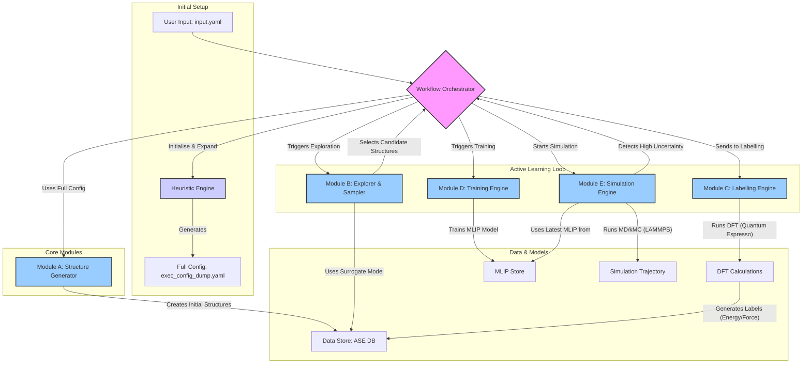

# MLIP-AutoPipe: System Architecture Document

**Version:** 1.0.0
**Status:** Final
**Authors:** System Architect (Jules)

## 1. Summary

The "Machine Learning Interatomic Potential Automatic Generation and Analysis Pipeline" (MLIP-AutoPipe) represents a paradigm shift in computational materials science. The project's core philosophy is to **"remove the human expert from the loop,"** addressing the most significant bottleneck in modern materials simulation: the reliance on researcher intuition and manual intervention. Currently, the development of accurate Machine Learning Interatomic Potentials (MLIPs) is an artisanal process. It demands deep domain expertise to select appropriate training data, configure complex first-principles calculations, and iteratively refine the potential. This dependency on human know-how makes the process slow, costly, and difficult to reproduce, hindering the pace of materials discovery. MLIP-AutoPipe tackles this challenge head-on by creating a fully autonomous, closed-loop system that intelligently navigates the vast chemical space to generate high-fidelity potentials with minimal user input.

The user simply provides a chemical composition, and the system takes over. It leverages a sophisticated, physics-informed strategy to manage the entire workflow, from initial structure generation to active learning and finally to large-scale simulation. By codifying expert knowledge into a set of robust, automated heuristics and coupling it with the predictive power of machine learning, the pipeline democratises access to high-precision atomistic modelling. It automates the tedious and error-prone tasks of data generation through Density Functional Theory (DFT) calculations, model training, and validation. The system is designed not merely to automate a linear sequence of tasks but to create a dynamic, self-improving ecosystem. Its integrated active learning loop allows the MLIP to intelligently identify regions of uncertainty during live simulations, trigger new DFT calculations to gather data in those regions, and retrain itself on the fly. This ensures that the computational effort is always focused on the most informative atomic configurations, dramatically improving data efficiency. The final output is not just a potential but a comprehensive analysis toolkit, enabling the study of complex phenomena such as phase transitions, diffusion, and chemical reactions over timescales far exceeding what is possible with direct first-principles methods. This project will significantly accelerate research and development in fields ranging from battery materials and catalysis to alloy design and pharmaceuticals.

Furthermore, the system architecture incorporates a novel "Two-Tier Configuration Strategy." This design choice directly serves the core philosophy by separating user intent from execution complexity. Users interact with a minimal `input.yaml` file, specifying only the essential scientific goal (e.g., "create a potential for FePt between 300K and 1000K"). The system's internal Heuristic Engine then expands this high-level request into a complete, detailed execution plan, `exec_config_dump.yaml`. This file specifies every technical parameter, from DFT convergence settings to the choice of surrogate models, all determined by built-in physical and chemical knowledge. This approach drastically lowers the barrier to entry for non-specialists while ensuring that every calculation is performed according to best practices, guaranteeing reproducibility and scientific rigour. The automation of these complex decisions is the key to removing the expert from the critical path, transforming MLIP generation from a bespoke research project into a reliable, on-demand computational service.

## 2. System Design Objectives

The primary objective of the MLIP-AutoPipe system is to achieve complete automation of the MLIP generation workflow, guided by the principle of eliminating manual, expert-driven decision-making. To achieve this, the design is governed by several key goals, constraints, and measurable success criteria.

**Goals:**
1.  **Full Automation and Autonomy:** The system must operate end-to-end without human intervention. From a simple compositional input, it must autonomously generate diverse initial structures, perform DFT calculations, train a series of MLIPs with increasing accuracy, and validate the final potential. The active learning loop must be self-governing, detecting model uncertainty and triggering retraining cycles automatically.
2.  **High Data Efficiency:** The system must intelligently select the most informative atomic configurations for DFT labelling. By using foundation models for initial exploration and uncertainty quantification for active learning, it will minimise the number of expensive DFT calculations required, focusing resources only where new physical information can be gained.
3.  **Physical Realism and Robustness:** The generated potentials must be physically meaningful. The implementation of Delta Learning, where the model learns the residual to a known physical baseline (like a ZBL potential for core repulsion), is critical. This ensures sensible behaviour even in sparse-data regions, preventing catastrophic failures like atomic collapse.
4.  **Reproducibility and Provenance:** Every calculation and decision made by the system must be logged and reproducible. The "Two-Tier Configuration" strategy is central to this goal. The system-generated `exec_config_dump.yaml` serves as a complete, unambiguous record of the entire workflow, ensuring that any result can be verified and reproduced at a later date.
5.  **Modularity and Extensibility:** The architecture must be composed of loosely coupled modules (Structure Generator, Sampler, Labeling Engine, etc.). This design will allow for the easy integration of new algorithms, DFT codes, MLIP frameworks, or surrogate models as they become available, ensuring the system remains at the cutting edge of the field.

**Constraints:**
1.  **User Input Simplicity:** The user interface must be minimal. The primary interaction will be through a simple `input.yaml` file, abstracting away the immense complexity of the underlying workflow.
2.  **Computational Resource Management:** The system will operate on high-performance computing (HPC) resources. It must be a good citizen, correctly utilising schedulers, managing parallel processes (e.g., via `mpirun`), and providing clear configuration for resource allocation.
3.  **Dependency on External Codes:** The system relies on third-party scientific software, primarily Quantum Espresso for DFT and LAMMPS for Molecular Dynamics. The architecture must gracefully handle the integration of these user-provided or auto-built codes, managing their execution and parsing their outputs reliably.

**Success Criteria:**
1.  **Successful End-to-End Run:** The system must be able to successfully generate a converged MLIP for a variety of elemental compositions (e.g., a binary alloy like FePt, an ionic solid like NaCl, a molecular system like H2O) from only a `input.yaml` file, without any errors or manual fixes.
2.  **Accuracy Benchmark:** The final MLIP's accuracy must be comparable to direct DFT calculations. Success will be measured by achieving a root-mean-square error (RMSE) for forces of less than 0.05 eV/Å against a held-out test set of DFT data.
3.  **Efficiency Benchmark:** The system should produce a high-quality potential using at least 50% fewer DFT calculations than a conventional, manually curated active learning approach or a simple "brute-force" molecular dynamics-based training set.
4.  **Reproducibility Check:** Given the same `input.yaml` and software versions, two independent runs of the pipeline must produce MLIPs with statistically identical performance metrics (force RMSE, energy RMSE). The generated `exec_config_dump.yaml` must be identical.

## 3. System Architecture

The MLIP-AutoPipe is designed as a modular, workflow-driven system. A central Orchestrator manages the flow of data and control between five distinct, specialised modules. This architecture ensures a clear separation of concerns, making the system easier to develop, test, and maintain. Data persistence and traceability are handled by a central database (e.g., ASE DB), which records every structure, calculation, and model generated throughout the workflow.



**Component Descriptions:**

1.  **Workflow Orchestrator:** This is the central brain of the system. It reads the configuration files, initiates tasks for each module in the correct sequence, and manages the overall state of the pipeline. It is responsible for orchestrating the main active learning loop: simulation -> uncertainty detection -> labelling -> retraining.

2.  **Heuristic Engine:** Triggered at the start of a run, this component expands the user's minimal `input.yaml` into a comprehensive `exec_config_dump.yaml`. It contains the codified domain knowledge required for automation, such as determining bond types, selecting appropriate DFT parameters based on SSSP protocols, estimating melting points, and choosing the best universal surrogate potential.

3.  **Module A: Structure Generator:** This module is responsible for creating a diverse, physically plausible set of initial structures without relying on expensive simulations. It analyses the input composition to determine the material type (alloy, ionic, etc.) and applies the appropriate generation algorithm (e.g., SQS for alloys, Normal Mode Sampling for molecules, AIRSS for ionic crystals).

4.  **Module B: Explorer & Sampler:** This performance-critical module performs a vast, low-cost exploration of the material's phase space. It uses a pre-trained universal potential (a "foundation model" like MACE or M3GNet) to run large-scale molecular dynamics simulations. From the resulting millions of configurations, it uses optimised descriptor calculations and clustering algorithms (DIRECT sampling) to select a small, diverse, and maximally informative subset of structures for expensive DFT labelling.

5.  **Module C: Labelling Engine:** This module acts as a robust, automated interface to the DFT code (Quantum Espresso). It takes a set of atomic configurations, automatically generates the necessary input files with optimised parameters (k-points, cutoffs, smearing), executes the DFT calculation, parses the output, and stores the resulting energy, forces, and stresses in the central database. It also includes error-recovery logic for common DFT convergence failures.

6.  **Module D: Training Engine:** This module trains the MLIP model itself. It implements the Delta Learning strategy, fitting the model to the residual between the DFT labels and a physical baseline potential (e.g., ZBL). It handles data preparation, model training, and validation, storing the final trained potential for use by the simulation engine.

7.  **Module E: Simulation Engine:** This is the "science" engine. It uses the latest trained MLIP to run large-scale, long-timescale simulations like Molecular Dynamics (MD) or kinetic Monte Carlo (kMC) via LAMMPS. Critically, it performs inference "on-the-fly" (OTF), constantly monitoring the model's uncertainty for each atomic configuration. When the uncertainty exceeds a defined threshold, it pauses the simulation and sends the high-uncertainty structure back to the Orchestrator to be labelled, thus closing the active learning loop.

## 4. Design Architecture

The software will be a Python-based command-line application, structured as a modular library with a clear entry point. The project will adhere to modern Python development standards, using `pyproject.toml` for dependency management with the `uv` package manager for speed and reproducibility. The codebase will be organised to reflect the modular system architecture, ensuring a clean separation between the core logic of each module, the data models, and the orchestration layer.

**File Structure:**

```
mlip_autopipec/
├── main.py                # CLI entry point
├── orchestrator.py        # Main workflow control logic
├── config/
│   ├── parser.py          # Logic for reading input.yaml
│   └── expander.py        # The Heuristic Engine
├── modules/
│   ├── a_structure_generator.py
│   ├── b_explorer_sampler.py
│   ├── c_labelling_engine.py
│   ├── d_training_engine.py
│   └── e_simulation_engine.py
├── data/
│   ├── models.py          # Pydantic models for data structures (e.g., AtomicConfig, DFTResults)
│   └── database.py        # Interface to the ASE database
├── utils/
│   ├── dft_utils.py       # Helpers for interacting with Quantum Espresso
│   └── lammps_utils.py    # Helpers for interacting with LAMMPS
└── pyproject.toml         # Project definition and dependencies
```

**Class/Function Overview:**

*   **`main.py`**: Will use a library like `click` or `typer` to define the main CLI command `mlip-pipe <input.yaml>`. It will instantiate and run the `WorkflowOrchestrator`.
*   **`orchestrator.WorkflowOrchestrator`**: The main class managing the pipeline. It will have methods like `run_initial_seeding()`, `run_exploration_phase()`, and the main `run_active_learning_loop()`. It will hold the state of the workflow and call the respective modules.
*   **`config.expander.HeuristicEngine`**: This class will contain the logic to transform the minimal user config into the full execution config. Methods will include `_determine_bond_type()`, `_get_dft_parameters()`, `_select_surrogate_model()`, etc.
*   **`modules.*`**: Each module will be implemented as a class with a primary `execute()` method that takes the current state/data as input and returns the result. For example, `c_labelling_engine.LabellingEngine.execute(structures)` will run DFT on the given structures and return the labels. Performance-critical parts, like in the `ExplorerSampler`, will use Numba's `@jit` decorator on specific functions for C-like speed.
*   **`data.models`**: This will define strict data structures using Pydantic for inputs and outputs between modules. For example, a `DFTResult` class will have typed fields for `energy`, `forces`, `stress`, and metadata, ensuring data integrity.

**Data Models:**

The system will rely on well-defined data structures, primarily managed by the ASE (Atomic Simulation Environment) library and validated with Pydantic.

*   **`ase.Atoms`**: The central object for representing an atomic configuration. It holds atom types, positions, cell dimensions, and can store calculation results.
*   **ASE Database (`ase.db`)**: A SQLite-based database used to store and query `Atoms` objects and their associated data (e.g., DFT energy, forces). This will be the central "data lake" for the project.
*   **Pydantic Models**: For configuration and inter-module communication, Pydantic models will enforce a strict schema. For example:
    ```python
    class DFTConfig(BaseModel):
        code: Literal["quantum_espresso"]
        command: str
        ecutwfc: float
        kpoints_density: float
        # ... and so on
    ```
This ensures that the `Full Config` is always valid and complete before the main workflow begins, preventing runtime errors due to misconfiguration. The design prioritises clarity, robustness, and performance, using modern tools to build a reliable and extensible scientific pipeline.

## 5. Implementation Plan

The project will be developed over five distinct, sequential cycles. Each cycle builds upon the last, delivering a self-contained, testable set of functionalities. This iterative approach allows for gradual complexity management and ensures that a functional core is established early in the development process.

**Cycle 01: The Core Engine (Labelling and Training)**
This foundational cycle focuses on creating the absolute core of the pipeline: the ability to perform a DFT calculation and train a basic MLIP from it. The goal is to establish the link between the DFT engine and the MLIP training framework.
*   **Features:**
    *   Implement **Module C (Labelling Engine)**: Create a robust wrapper around Quantum Espresso to execute single-point calculations. This includes automatic input file generation from an `ase.Atoms` object and parsing of the output to extract energy and forces.
    *   Implement **Module D (Training Engine)**: Integrate a modern MLIP framework (e.g., MACE). Develop the training pipeline, including the Delta Learning approach where the model learns the difference between DFT and a baseline potential (e.g., LJ).
    *   Establish the project structure with `pyproject.toml` and `uv`.
    *   Create the initial data models and the ASE database interface.
*   **Outcome:** A command-line tool that can take a structure file, calculate its DFT properties, and train a rudimentary MLIP. This cycle proves the core concept.

**Cycle 02: Initial Structure and Configuration Automation**
This cycle focuses on removing the need for manual structure input and complex configuration. It introduces the "brains" of the automation process.
*   **Features:**
    *   Implement **Module A (Structure Generator)**: Develop the logic for generating initial structures based on chemical formula. This includes implementing SQS for alloys, Normal Mode Sampling for molecules, etc.
    *   Develop the **Heuristic Engine and Two-Tier Config Strategy**: Implement the logic that reads the minimal `input.yaml`, analyses the system, and generates the complete `exec_config_dump.yaml`. This is a critical step in achieving full automation.
*   **Outcome:** The system can now be started from a simple `input.yaml` file. It will automatically generate a set of diverse starting structures and all necessary DFT/MLIP configurations, then use the engine from Cycle 01 to label them and train a first-pass MLIP.

**Cycle 03: Efficient Exploration and Sampling**
With the core and automation in place, this cycle focuses on data efficiency. The goal is to replace the "dumb" initial structure generation with a much more intelligent and expansive exploration of the potential energy surface.
*   **Features:**
    *   Implement **Module B (Explorer & Sampler)**: Integrate a universal potential (foundation model) to run fast, large-scale MD simulations.
    *   Develop and optimise the **DIRECT sampling** algorithm. This involves writing high-performance code (using Numba) for descriptor calculation, dimensionality reduction, and clustering to select the most informative structures from the massive dataset generated by the surrogate model.
*   **Outcome:** The pipeline becomes significantly more powerful. Instead of just a few initial structures, it now explores a vast conformational space at low cost, ensuring the subsequent DFT calculations are spent on a much more diverse and representative dataset, leading to a more robust MLIP.

**Cycle 04: The Active Learning Loop (Closing the Loop)**
This cycle implements the final, and most critical, piece of the autonomous workflow: the self-improving active learning loop.
*   **Features:**
    *   Implement **Module E (Simulation Engine)**: Integrate LAMMPS for running MD or kMC simulations using the trained MLIP.
    *   Develop the **On-the-Fly (OTF) Uncertainty Monitoring**: Implement the logic to estimate the MLIP's uncertainty during the simulation.
    *   Build the main **Orchestrator Logic**: Implement the loop that: 1) Runs a simulation with the current MLIP. 2) Pauses when uncertainty is high. 3) Extracts the uncertain structure. 4) Sends it to Module C for labelling. 5) Retrains the MLIP with the new data using Module D. 6) Resumes the simulation with the improved MLIP.
*   **Outcome:** A fully autonomous, self-correcting system. The pipeline can now start with a basic potential and iteratively and intelligently improve it until a desired level of accuracy and stability is reached.

**Cycle 05: User Interface, Finalisation, and Optimisation**
The final cycle focuses on usability, performance, and packaging the system for release.
*   **Features:**
    *   **CLI Refinement**: Improve the command-line interface, adding options for verbosity, logging, and inspection of intermediate results.
    *   **Performance Profiling and Optimisation**: Profile the entire pipeline to identify and eliminate bottlenecks, particularly in the sampling and kMC components.
    *   **Documentation**: Write comprehensive user documentation, tutorials, and examples.
    *   **Packaging**: Package the project for distribution via PyPI, ensuring it can be easily installed with `uv pip install`.
*   **Outcome:** A polished, well-documented, and high-performance tool ready for use by the materials science community.

## 6. Test Strategy

Testing will be a continuous process throughout the implementation, with a multi-layered approach to ensure correctness, robustness, and physical accuracy. Each cycle will have a dedicated testing focus, building upon the tests from the previous cycle.

**Overall Strategy:**
*   **Unit Testing:** Each function and class in the codebase will be accompanied by unit tests using the `pytest` framework. This ensures that individual components behave as expected in isolation. Mocking will be used extensively to isolate components, for example, mocking DFT code calls to test the Labelling Engine's logic without actually running Quantum Espresso.
*   **Integration Testing:** These tests will verify that the different modules of the pipeline interact correctly. For example, an integration test would check if the structures generated by Module A are correctly passed to and processed by Module C.
*   **End-to-End (E2E) / Regression Testing:** These are full pipeline tests run on small, well-understood chemical systems (e.g., a silicon unit cell). These tests run the entire workflow from `input.yaml` to a final MLIP. Their purpose is to catch regressions and verify that the final output is physically plausible. The results (e.g., final force RMSE) will be compared against known reference values.

**Cycle-Specific Test Plans:**

**Cycle 01: The Core Engine**
*   **Unit Tests:**
    *   Test the Quantum Espresso input writer with various atomic structures.
    *   Test the output parser's ability to correctly extract energy and forces from sample QE output files (including malformed ones).
    *   Test the `DeltaLearning` logic to ensure the residual is calculated correctly.
*   **Integration Tests:**
    *   A test that runs a real (but very fast) DFT calculation on a 2-atom system and ensures the result is correctly passed to the Training Engine.

**Cycle 02: Initial Structure and Configuration Automation**
*   **Unit Tests:**
    *   Test the `HeuristicEngine`'s logic for different inputs (e.g., verify it correctly identifies "FePt" as an alloy and "H2O" as a molecule).
    *   Test that the generated `exec_config_dump.yaml` is valid and contains all the required keys.
    *   Test each structure generation algorithm (SQS, NMS) to ensure it produces the correct number and type of structures.
*   **Integration Tests:**
    *   Test the flow from `input.yaml` -> `HeuristicEngine` -> `StructureGenerator`, verifying that the correct algorithm is called based on the derived bond type.

**Cycle 03: Efficient Exploration and Sampling**
*   **Unit Tests:**
    *   Test the Numba-optimised descriptor calculation functions for correctness against a reference Python implementation.
    *   Test the clustering and sampling logic on a known dataset to ensure it selects a diverse subset.
*   **Integration Tests:**
    *   Run a short surrogate MD simulation and ensure the trajectory is correctly passed to the DIRECT sampler, and a valid set of candidate structures is returned. This test will use a pre-trained MACE model.

**Cycle 04: The Active Learning Loop**
*   **Unit Tests:**
    *   Test the uncertainty quantification logic. This will involve creating a dummy MLIP model that returns predictable uncertainty values to verify the detection threshold.
    *   Test the structure extraction logic for periodic boundary conditions.
*   **Integration Tests:**
    *   Create a "mock" active learning loop where the DFT and MLIP training steps are replaced by fast mock functions. This will test the orchestrator's state management and control flow (simulate -> detect -> retrain -> resume) without the computational overhead.
*   **E2E Tests:**
    *   Run a full, but short, active learning cycle on a simple system like Si or Al. This will be a key regression test to ensure the entire autonomous loop functions as intended.

**Cycle 05: User Interface and Finalisation**
*   **Unit Tests:**
    *   Test the CLI argument parsing and error handling.
*   **E2E Tests:**
    *   Run the E2E tests from Cycle 04 using the final CLI command to ensure the user-facing entry point is working correctly.
    *   Test the pipeline on a wider variety of chemical systems to ensure generalisability and robustness. This will form the final validation suite.
