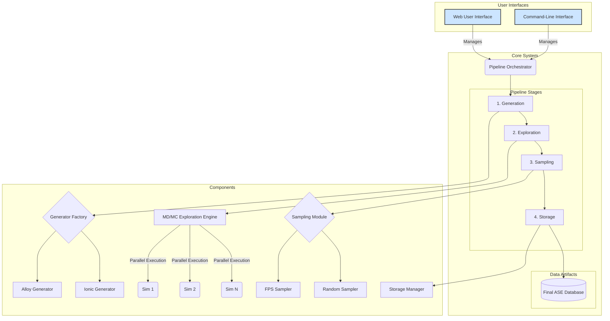

# System Architecture: MLIP-AutoPipe

## 1. Summary

The MLIP-AutoPipe (Machine Learning Interatomic Potential - Automated Pipeline) is a sophisticated, high-throughput computational framework designed to automate the generation of high-quality, physically-valid, and diverse training data for modern Machine Learning Interatomic Potentials (MLIPs), such as MACE and SevenNet. The core philosophy of this project is to remove the human expert from the loop, replacing a traditionally manual, intuition-driven process with a robust, reproducible, and scalable automated workflow. The system addresses a critical bottleneck in the materials science and computational chemistry domains: the creation of extensive and reliable datasets required to train MLIPs that can accurately predict material properties. These models are only as good as the data they are trained on, and generating this data—spanning a wide range of thermodynamic conditions and atomic configurations—is a non-trivial task.

The MLIP-AutoPipe system is engineered to explore the thermodynamic phase space of a given chemical system efficiently. It does not merely generate random atomic structures; instead, it employs a sophisticated pipeline that mimics the process a human expert would follow. It starts by generating sensible initial seed structures based on well-defined physical and chemical rules. These seeds are then subjected to rigorous exploration using advanced simulation techniques, primarily Molecular Dynamics (MD) and hybrid Monte Carlo (MC) methods. This exploration phase is crucial as it pushes the system to discover atomic configurations that are thermodynamically accessible but may be under-sampled in standard simulations. This includes high-energy configurations, transition states, and defect structures, which are often the "edge cases" where MLIPs fail and are therefore essential for creating robust and generalisable models.

The pipeline is architected as a modular, four-stage process: Generation, Exploration, Sampling, and Storage. This modularity is a key design feature, allowing for flexibility, extensibility, and independent development and testing of each component. For instance, the Generation stage can be easily extended to support new types of materials (e.g., polymers, complex molecular crystals) by simply adding a new generator module that adheres to a common interface. Similarly, the Sampling stage can incorporate more advanced techniques beyond the initial Farthest Point Sampling (FPS) implementation, such as curriculum learning or uncertainty-based sampling, without requiring changes to the rest of the pipeline. The final output of the system is a curated, well-structured database of atomic configurations, complete with all necessary metadata (energy, forces, stress, etc.), ready to be consumed by MLIP training frameworks. This structured output ensures reproducibility and facilitates data sharing and collaboration within the research community. The system will be accessible via both a powerful Command-Line Interface (CLI) for batch processing and automated workflows, and an intuitive Web-based Graphical User Interface (Web UI) for interactive exploration, configuration, and visualisation.

## 2. System Design Objectives

The design of the MLIP-AutoPipe system is guided by a set of clear objectives aimed at creating a tool that is not only powerful but also reliable, user-friendly, and maintainable. These objectives address the technical challenges inherent in automated materials simulation and the practical needs of the researchers who will use the system.

**Primary Objectives:**

*   **Automation and Reproducibility:** The foremost objective is to fully automate the end-to-end workflow of training data generation. The system must eliminate the need for manual intervention, from the creation of initial structures to the final storage of the dataset. Every step of the process must be deterministic and logged, ensuring that a given configuration file will always produce the exact same dataset. This guarantees reproducibility, a cornerstone of scientific research.
*   **Physical Validity:** The system must enforce strict physical and chemical constraints at every stage. Generated structures must be physically plausible, avoiding unrealistic atomic overlaps or incorrect charge balancing. During simulation, the system must detect and handle anomalies like "Coulomb explosions" or physically impossible configurations, ensuring the integrity of the final dataset.
*   **Diversity and Richness of Data:** The system is designed to generate datasets that are not just large but also diverse. It must actively explore a wide region of the potential energy surface, seeking out rare but important configurations. The implementation of hybrid MD/MC methods and sophisticated sampling algorithms like FPS is central to achieving this objective. The goal is to produce datasets that enable MLIPs to be robust and accurate across a broad range of conditions.
*   **Modularity and Extensibility:** The architecture must be highly modular, with clear separation of concerns between the different stages of the pipeline (Generation, Exploration, Sampling, Storage). This will be achieved through well-defined interfaces (Abstract Base Classes) for key components like structure generators and sampling algorithms. This design will allow future developers to easily extend the system's capabilities—for example, by adding support for new material classes, integrating different simulation engines, or implementing novel sampling strategies—without requiring a rewrite of the core logic.
*   **User-Friendliness and Accessibility:** The system will cater to two primary user personas. For power users and for integration into larger computational workflows, a comprehensive Command-Line Interface (CLI) will provide full control over all parameters and enable batch processing. For researchers who prefer a more interactive and visual approach, a Web UI will be developed. This UI will allow users to configure simulations, monitor their progress in real-time, and visualise the generated structures, making the tool accessible to a broader audience, including those who may not be experts in command-line tools.

**Constraints:**

*   **Dependency Management:** The system will rely on established, open-source scientific libraries such as the Atomic Simulation Environment (ASE), Pymatgen, and popular MLIP frameworks (MACE, SevenNet). The choice of external dependencies will be carefully managed to ensure stability and avoid version conflicts.
*   **Performance:** While accuracy and diversity are paramount, the system must be performant enough to be practical. It will leverage parallel processing to distribute simulation tasks across multiple CPU cores. Careful consideration will also be given to memory management, especially when handling large MLIP models, to prevent bottlenecks and ensure scalability.

## 3. System Architecture

The MLIP-AutoPipe system is designed as a multi-layered, modular pipeline. The architecture separates the core logic of the simulation workflow from the user-facing interfaces (CLI and Web UI). This separation ensures that the core engine can be developed and tested independently and can be driven by different front-ends.

The core of the system is the **Pipeline Orchestrator**. This component is responsible for managing the four-stage workflow:

1.  **Generation:** This stage is responsible for creating the initial set of "seed" atomic structures. It contains a factory mechanism that delegates the creation process to specialised **Structure Generators** based on the user's configuration. For example, an `AlloyGenerator` might be used for metallic alloys, while an `IonicGenerator` would handle ionic crystals, ensuring correct charge neutrality. These generators produce an initial set of structures that are physically plausible.

2.  **Exploration:** This is the computational heart of the system. The `Exploration Engine` takes the seed structures and subjects them to Molecular Dynamics (MD) or hybrid MD/MC simulations. This engine is designed for robustness and parallel execution. It uses a process pool to run multiple simulations concurrently. A key feature is its ability to automatically select the appropriate thermodynamic ensemble (NPT for bulk systems, NVT for surfaces) and to use a mixed potential (e.g., MACE + ZBL) to prevent unphysical behaviour at high temperatures.

3.  **Sampling:** The exploration phase generates a massive amount of data in the form of simulation trajectories. The `Sampling Module` is responsible for intelligently selecting a small, diverse, and informative subset of these structures for the final dataset. It will implement various strategies, with Farthest Point Sampling (FPS) based on SOAP descriptors as the primary method for ensuring structural diversity.

4.  **Storage:** The final stage involves persisting the sampled structures and their associated metadata (energy, forces, stresses) into a structured database. The `Storage Manager` will use the ASE database format (which is based on SQLite), providing a standardised and widely-compatible output.

**Data Flow:**

The data flows sequentially through these four stages. The `Pipeline Orchestrator` manages the state and the hand-off of data between stages. Checkpoints are created after each major stage (e.g., `initial_structures.xyz`, `trajectory_data/`, `sampled_structures.db`) to ensure fault tolerance and allow the pipeline to be resumed from an intermediate point.

**User Interfaces:**

*   **Command-Line Interface (CLI):** Built using the `Typer` library, the CLI is the primary interface for power users. It exposes all configuration options as command-line arguments and options, making it ideal for scripting and integration into automated high-throughput screening workflows.
*   **Web User Interface (Web UI):** A secondary interface will be developed to provide a more interactive and visual experience. This will likely be a separate application (e.g., built with a framework like FastAPI and a modern JavaScript front-end) that interacts with the core pipeline logic. It will allow users to build configuration files through a guided interface, launch and monitor jobs, and visualise atomic structures directly in the browser.



## 4. Design Architecture

The software design of MLIP-AutoPipe will follow modern object-oriented principles, with a strong emphasis on modularity, abstraction, and type safety, leveraging Pydantic for data modelling and validation.

**File Structure:**

The project will be organised into a clear, hierarchical file structure within the `src/mlip_autopipec` directory.

```
src/mlip_autopipec/
├── __init__.py
├── cli/
│   ├── __init__.py
│   └── main.py              # Typer-based CLI application
├── core/
│   ├── __init__.py
│   ├── orchestrator.py      # Main PipelineOrchestrator class
│   └── models.py            # Pydantic models for configuration and results
├── generators/
│   ├── __init__.py
│   ├── base.py              # Abstract Base Class for generators
│   ├── alloy.py             # AlloyGenerator implementation
│   └── ionic.py             # IonicGenerator implementation
├── exploration/
│   ├── __init__.py
│   └── engine.py            # MD/MC ExplorationEngine
├── sampling/
│   ├── __init__.py
│   ├── base.py              # Abstract Base Class for samplers
│   └── fps.py               # Farthest Point Sampling implementation
└── storage/
    ├── __init__.py
    └── database.py          # ASE database wrapper/manager
```

**Data Models (Pydantic):**

The backbone of the system's configuration and data handling will be a set of strictly-defined Pydantic models in `core/models.py`. This schema-first approach ensures that all configuration data is validated at runtime, preventing common errors and improving developer productivity.

*   `SystemConfig`: Defines the chemical system (elements, composition, etc.).
*   `GenerationConfig`: Parameters for the generation stage (e.g., structure type, supercell size).
*   `ExplorationConfig`: All parameters for the MD/MC simulation (temperature, pressure, MLIP model, MC moves).
*   `SamplingConfig`: Configuration for the sampling stage (method, number of samples).
*   `FullConfig`: A top-level model that nests all the other configuration models, providing a single object to configure the entire pipeline.
*   `DFTResult`: A model to represent the output of a single-point calculation (energy, forces, stress), ensuring data consistency before it is stored in the database.

**Class/Function Definitions Overview:**

*   **`cli.main.app`**: The `Typer` application instance that defines the CLI commands (e.g., `run`, `config`).
*   **`core.orchestrator.PipelineOrchestrator`**: The main class that drives the workflow. Its `run()` method will execute the four pipeline stages in sequence. It will be initialised with a `FullConfig` object.
*   **`generators.base.BaseStructureGenerator` (ABC)**: Defines the interface for all structure generators. It will have a single abstract method, `generate()`, which takes a `GenerationConfig` and returns a list of `ase.Atoms` objects.
*   **`generators.alloy.AlloyGenerator`**: A concrete implementation for generating alloy structures.
*   **`exploration.engine.ExplorationEngine`**: This class will manage the complex logic of running parallel MD/MC simulations. It will contain methods to dynamically set up the correct ASE calculator (e.g., MACE + ZBL) and thermodynamic ensemble.
*   **`sampling.base.BaseSampler` (ABC)**: Defines the interface for sampling algorithms. Its `sample()` method will take a trajectory and a `SamplingConfig` and return a curated list of `ase.Atoms` objects.
*   **`storage.database.AseDBWrapper`**: A helper class that encapsulates all interactions with the ASE database, providing methods like `write_results()` and `connect()`.

This design promotes separation of concerns. The `Orchestrator` doesn't need to know *how* structures are generated, only that it can call a `generate()` method on a generator object. This makes the system easy to extend and test.

## 5. Implementation Plan

The development of the MLIP-AutoPipe project will be divided into two distinct, sequential cycles. This phased approach allows for the incremental delivery of functionality, ensuring that a stable, core product is available early, with more advanced features being built upon that foundation.

**Cycle 1: Core Framework and Basic Pipeline (Minimum Viable Product)**

This initial cycle focuses on establishing the fundamental architecture and implementing a complete, albeit basic, end-to-end pipeline. The primary goal is to create a functional command-line tool that can generate a dataset for a simple, well-defined use case, such as a binary alloy. This cycle lays the groundwork for all future development.

*   **Project Scaffolding:** Initialise the project with the defined directory structure (`src/mlip_autopipec`, `cli`, `core`, etc.) and set up the `pyproject.toml` file with all necessary dependencies (`ase`, `pydantic`, `typer`, `pyyaml`).
*   **Configuration and Data Models:** Implement all Pydantic models (`SystemConfig`, `GenerationConfig`, `ExplorationConfig`, `SamplingConfig`, `FullConfig`) in `core/models.py`. This schema-first approach is critical for ensuring data integrity from the outset. Implement a YAML loader to parse a user-provided configuration file into the `FullConfig` object.
*   **CLI Foundation:** Develop the initial Command-Line Interface using `Typer` in `cli/main.py`. This will include a main `run` command that takes a path to the YAML configuration file as input.
*   **Core Orchestrator:** Implement the `PipelineOrchestrator` class in `core/orchestrator.py`. This class will manage the overall workflow, calling each of the four stages in sequence.
*   **Generator Implementation (Alloy):** Implement the `BaseStructureGenerator` abstract base class and a concrete `AlloyGenerator`. This generator will be capable of creating simple random alloy structures based on composition and a specified crystal structure (e.g., FCC, BCC).
*   **Basic Exploration Engine:** Implement a simplified version of the `ExplorationEngine`. In this cycle, it will focus on running standard NVT Molecular Dynamics using a simple, fast potential like ASE's built-in EMT (Effective Medium Theory) calculator. Parallel execution using `ProcessPoolExecutor` will be implemented.
*   **Basic Sampling and Storage:** Implement a simple random sampling strategy. The `AseDBWrapper` will be created to handle writing the final sampled structures to an ASE database.
*   **Unit and Integration Tests:** Develop a comprehensive suite of unit tests for each component (e.g., config parsing, generator logic). An end-to-end integration test will be created to run a full pipeline with a simple configuration and verify the final database output.

**Cycle 2: Advanced Simulation, Sampling, and User Interface**

Building on the stable foundation of Cycle 1, this cycle will introduce the advanced features that differentiate MLIP-AutoPipe as a powerful and intelligent data generation tool. The focus will be on implementing the sophisticated simulation techniques, intelligent sampling, and the user-friendly Web UI.

*   **Advanced Exploration Engine:** Enhance the `ExplorationEngine` to support modern MLIPs like MACE. This includes implementing the "late-binding" calculator pattern to avoid pickling large models. The logic for hybrid MD/MC simulations (including atom swaps) and the automatic ensemble switching (NVT vs. NPT) based on vacuum detection will be implemented. The ZBL potential mixing for high-energy repulsion will also be integrated.
*   **Advanced Sampling Module:** Implement the Farthest Point Sampling (FPS) algorithm in the `sampling` module. This will involve integrating a library to compute SOAP (Smooth Overlap of Atomic Positions) descriptors, which will be used as the feature vectors for the FPS algorithm.
*   **Expanded Generators:** Implement additional structure generators, such as the `IonicGenerator` (which will include charge balancing checks) and potentially knowledge-based generators that can use crystallographic databases.
*   **Web User Interface (Proof of Concept):** Develop a basic Web UI. This will involve setting up a FastAPI backend that can receive a configuration from a web form, construct the `FullConfig` Pydantic model, and launch the pipeline orchestrator as a background task. The front-end (e.g., using Vue or React) will provide a simple interface for setting key parameters and visualising the initial and final structures.
*   **Robustness and Error Handling:** Implement more sophisticated error handling throughout the pipeline, particularly within the exploration engine to gracefully handle and log simulation crashes (e.g., "Coulomb explosions").
*   **Comprehensive Testing:** Extend the test suite to cover all new functionalities. This will include tests for the hybrid MD/MC logic, the FPS sampling algorithm, and the new generators. End-to-end tests will be expanded to use a real MLIP model (if feasible in a CI environment) to validate the advanced exploration capabilities.

## 6. Test Strategy

A rigorous, multi-layered testing strategy is essential to ensure the correctness, reliability, and robustness of the MLIP-AutoPipe system. The strategy encompasses unit tests, integration tests, and user acceptance tests (UAT), with a focus on automation and coverage.

**Cycle 1 Test Strategy:**

*   **Unit Testing:** Each component will be tested in isolation to verify its specific functionality. This is the foundation of the testing pyramid.
    *   **Pydantic Models:** Tests will be written to ensure that the configuration models (`FullConfig`, etc.) correctly validate input data, raising `ValidationError` for invalid configurations (e.g., negative temperatures, incorrect element symbols). This verifies the schema.
    *   **Generators:** The `AlloyGenerator` will be tested to confirm that it produces the correct number of structures, with the specified composition and crystal structure. Assertions will check atom counts and species ratios. Physical validation logic (e.g., minimum atomic distance checks) will also be unit tested.
    *   **Orchestrator:** The `PipelineOrchestrator`'s logic will be tested using mock objects for the generator, explorer, sampler, and storage components. This will verify that the orchestrator calls each stage in the correct order and handles data hand-offs correctly, without needing to run actual simulations.
    *   **CLI:** The `Typer` CLI will be tested using `typer.testing.CliRunner`. These tests will simulate command-line invocations with different arguments (e.g., valid and invalid config file paths) and assert that the application exits with the correct status code and produces the expected output.

*   **Integration Testing:** These tests will verify that the different components of the pipeline work together as expected.
    *   **End-to-End Pipeline Test:** A primary integration test will run the entire pipeline from start to finish using a simple, fast-running configuration (e.g., a small binary alloy system using the EMT potential). The test will invoke the CLI, wait for the process to complete, and then open the output ASE database to verify its contents. Assertions will check the number of structures in the database and the presence of required metadata (energy, forces). This test ensures the integrity of the entire workflow.

**Cycle 2 Test Strategy:**

*   **Unit Testing (Advanced Features):** The unit test suite will be expanded to cover the new, more complex functionalities.
    *   **Exploration Engine:** The logic for automatic ensemble switching (NVT vs. NPT) will be tested by creating mock `ase.Atoms` objects with and without a vacuum layer and asserting that the correct ASE dynamics object is instantiated. The hybrid MD/MC logic will be tested by checking that the simulation trajectory shows evidence of atom swaps or other MC moves. Mocking will be used extensively to isolate the logic from the actual execution of computationally expensive potentials.
    *   **Sampling:** The `FPSSampler` will be tested to ensure it correctly selects a diverse subset of structures. This can be tested with a dummy trajectory containing clusters of similar structures and asserting that the sampler picks one from each cluster.
    *   **Generators:** The `IonicGenerator` will be tested to ensure that it generates charge-neutral structures.

*   **Integration Testing (MLIP Integration):**
    *   **MLIP Pipeline Test:** The end-to-end integration test will be enhanced or duplicated to use a small, fast MACE model instead of the EMT potential. This will be a more realistic test of the advanced exploration capabilities and will verify that the "late-binding" calculator logic works correctly in a multiprocessing environment. This test may need to be marked as a "slow" test and run less frequently than the main suite.
    *   **Web UI API Testing:** The FastAPI backend for the Web UI will be tested at the API level. HTTP requests will be sent to its endpoints to simulate interactions from the front-end, and the responses will be validated. This will test the logic of launching and monitoring pipeline runs via the web interface.

*   **User Acceptance Testing (UAT):** For each cycle, UAT will be performed using Jupyter Notebooks as specified in the `UAT.md` files. These notebooks will provide a guided, interactive way for a user (or a QA analyst) to run the pipeline with a realistic configuration and then load, analyse, and visualise the results to confirm that they meet the high-level requirements defined in the project specifications. This provides the final validation that the software is not just technically correct but also fit for its scientific purpose.
