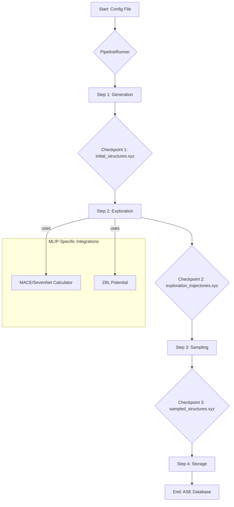

# System Architecture: MLIP-AutoPipe

## 1. Summary

The proposed system, named "MLIP-AutoPipe," is a highly automated framework designed to generate optimal training data for Machine Learning Interatomic Potentials (MLIPs) like MACE and SevenNet. The core philosophy is to eliminate manual expert intervention in the data generation pipeline. By leveraging a sophisticated combination of molecular dynamics (MD), Monte Carlo (MC) simulations, and advanced sampling techniques, MLIP-AutoPipe will autonomously explore the vast chemical and structural phase space to discover physically-valid and diverse atomic configurations.

A key innovation is the hybrid MD/MC exploration engine. This engine dynamically adapts its simulation strategy, such as switching between NPT and NVT ensembles by detecting vacuums. Furthermore, it integrates classical potentials like ZBL to handle short-range atomic interactions correctly, preventing catastrophic failures like "Coulomb explosion" during high-temperature simulations.

## 2. System Design Objectives

The primary objective is to **automate and accelerate the generation of high-quality, diverse, and physically-valid training data for MLIPs**.

*   **Autonomy and Robustness:** The system must operate with minimal human supervision, handling errors gracefully.
*   **Physical Realism:** Generated structures must be physically meaningful. The integration of the ZBL potential is a direct implementation of this objective.
*   **Diversity and Exploration:** The system is designed to maximize data diversity by exploring a wide range of the potential energy surface using various simulation techniques.
*   **Efficiency and Scalability:** The system must leverage multi-core CPUs efficiently for the computationally expensive exploration phase.
*   **Modularity and Extensibility:** The modular architecture (e.g., `BaseGenerator` abstract class) allows for future expansion.
*   **Usability and Accessibility:** A core CLI tool will be supplemented by a user-friendly Web UI.

## 3. System Architecture and MLIP Integration

The system is a modular, four-stage pipeline. The architecture is explicitly designed to support and integrate with specialized MLIP tools and libraries.



**MLIP Integration Points:**

*   **Exploration Stage:** This is the primary integration point for MLIP-specific tools.
    *   **MLIP Calculators:** The `md_engine.py` will use ASE's calculator interface to dynamically load and use MLIP models like **MACE** for energy and force calculations. The configuration file will specify the path to the desired model.
    *   **Potential Mixing for Stability:** The engine will implement a potential mixing scheme to combine the MLIP with the **ZBL potential**. This is crucial for accurately modeling the high-energy repulsion when atoms get too close, a common failure point in high-temperature simulations. This will be implemented as a custom ASE calculator that wraps the MLIP and ZBL calculators.

## 4. Design Architecture

The project will follow a modern Python package structure within the `src/mlip_autopipec` directory.

**File Structure:**

```
.
├── pyproject.toml
├── src
│   └── mlip_autopipec
│       ├── __init__.py
│       ├── cli.py
│       ├── config.py
│       ├── pipeline
│       │   └── runner.py
│       ├── generators
│       │   ├── base.py
│       │   └── alloy.py
│       ├── explorers
│       │   └── md_engine.py
│       ├── sampling
│       │   ├── base.py
│       │   └── random.py
│       └── storage
│           └── db_wrapper.py
└── tests
    └── ...
```

## 5. Implementation Plan

The project is divided into two 2-week sprint cycles.

**CYCLE 01: Core Engine and CLI**
The milestone is a functional CLI tool that can execute the full data generation pipeline for alloys.
*   **Tasks:** Implement `pyproject.toml`, Pydantic configs, `AseDBWrapper`, `AlloyGenerator`, core MD engine, `RandomSampler`, `PipelineRunner`, and the `typer` CLI.

**CYCLE 02: Advanced Features, Web UI, and Robustness**
This cycle adds sophisticated scientific methods and a user-friendly Web UI.
*   **Tasks:** Implement the hybrid MD/MC engine (atom swaps), the `FarthestPointSampler` (FPS), the `IonicGenerator`, **ZBL potential mixing**, and a Streamlit-based Web UI.

## 6. Test Strategy

We will use `pytest` for comprehensive automated testing. UAT will be performed using Jupyter Notebooks to analyze the scientific validity of the output.

## 7. Dependency Management

*   **External Packages:** We will use `uv` and a `uv.lock` file to pin the exact versions of all external Python packages (like `ase`, `mace-torch`).
*   **Internal Modules:** The system's modular architecture, based on Abstract Base Classes (e.g., `BaseStructureGenerator`), decouples the components.
