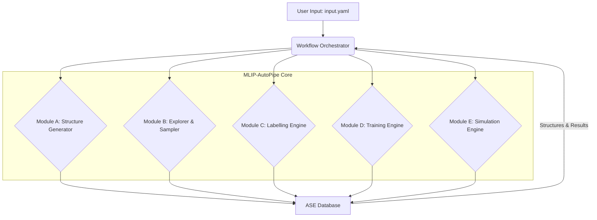

# System Architecture: MLIP-AutoPipe

## 1. Summary

The MLIP-AutoPipe (Machine Learning Interatomic Potential Automatic Pipeline) system is a next-generation computational materials science platform designed to automate the entire workflow of creating and utilising high-fidelity interatomic potentials. The core philosophy of the project is to "remove the human expert from the loop," addressing the significant bottlenecks that currently hinder the broad application of machine learning potentials. Traditionally, the development of MLIPs has been a craft, heavily reliant on the intuition and deep domain knowledge of experienced researchers. This manual process involves selecting appropriate training data, managing complex quantum mechanical calculations, and fine-tuning model hyperparameters. Such a dependency on human expertise makes the process slow, difficult to reproduce, and inaccessible to non-specialists. MLIP-AutoPipe aims to transform this paradigm by introducing a fully autonomous, self-directing, and robust pipeline that is accessible to both experts and novices in the field. By codifying expert knowledge into automated heuristics and intelligent algorithms, the system not only accelerates the development process from months to days but also introduces a level of rigor and reproducibility that is often difficult to achieve in manual workflows. It democratises access to high-quality potentials, enabling a broader range of scientists and engineers to leverage the power of atomistic simulations for materials discovery and design without requiring years of specialised training in computational physics.

The system takes minimal user input—typically just the chemical composition of a material—and orchestrates a complex sequence of tasks to deliver a bespoke, highly accurate MLIP. This process begins with intelligent initial structure generation, where physics-based heuristics are employed to create a diverse and physically meaningful set of atomic configurations without resorting to expensive first-principles calculations. It then uses a state-of-the-art universal potential, MACE, as a surrogate model to rapidly explore the material's vast configuration space. This exploration is coupled with an information-theoretic sampling strategy, known as DIRECT sampling, to identify the most informative atomic structures for training the MLIP. These selected structures are then automatically labelled using the Quantum Espresso engine, which is integrated with robust error handling and automatic parameter optimisation to ensure high-quality data. The training engine then uses this data to build the MLIP, employing a delta learning technique to improve accuracy by learning the residual error relative to a physical baseline potential. The final, crucial stage is an on-the-fly active learning loop, where the newly trained potential is used in simulations, its uncertainty is continuously monitored, and any new, informative configurations encountered are fed back into the training set for iterative refinement. This closed-loop system ensures that the potential becomes progressively more accurate and reliable over time. By automating these intricate steps, MLIP-AutoPipe will democratise the creation of bespoke MLIPs, enabling researchers to focus on scientific discovery rather than the laborious mechanics of potential development, ultimately accelerating the pace of innovation in materials science, chemistry, and engineering.

## 2. System Design Objectives

The primary objective of MLIP-AutoPipe is to deliver a fully autonomous, "zero-touch" pipeline for the generation of bespoke, high-accuracy machine learning interatomic potentials. The success of the system will be measured against several key criteria that define its utility, robustness, and efficiency. These objectives guide the architectural decisions and feature prioritisation throughout the development process.

**Autonomy and Usability:** The foremost goal is to eliminate the need for expert human intervention. The system must be capable of making intelligent decisions at every stage, from initial data generation to active learning. This means abstracting away the complexities of DFT calculations, hyperparameter tuning, and sampling strategies. The user interface should be minimal, requiring only essential inputs like chemical composition and target simulation conditions. Success here means that a non-expert user can reliably generate a high-quality potential without needing to understand the intricate physics or computer science underpinning the pipeline. This objective will be achieved through a sophisticated heuristic engine that automatically determines optimal calculation parameters, from DFT cutoffs to MD temperatures. It also involves implementing robust, self-correcting mechanisms within the pipeline, such as the automated recovery from failed DFT calculations, which shields the user from common technical hurdles. The final CLI will be designed for clarity and simplicity, with self-documenting commands and helpful error messages.

**Accuracy and Reliability:** The generated potentials must be of sufficient accuracy to rival those produced by manual, expert-driven methods. They should faithfully reproduce the underlying potential energy surface as described by first-principles calculations. The system must include mechanisms for quantifying and systematically reducing uncertainty. The active learning loop is central to this objective, ensuring that the potential is continuously refined and validated against new data. Reliability also extends to the software's robustness; it must handle a wide range of materials and gracefully recover from common failures in DFT calculations or simulation runs. To achieve this, we will enforce the use of high-quality, standardized protocols like SSSP for DFT parameterisation. The delta learning approach will be a core feature, as it focuses the MLIP's learning capacity on the complex quantum mechanical effects not captured by simpler classical potentials. Furthermore, the uncertainty quantification in the active learning loop will be based on committee models, a proven technique for robustly estimating model confidence.

**Efficiency and Scalability:** Computational cost is a major constraint in materials simulation. The system is designed to be highly efficient by minimising the number of expensive DFT calculations required. This is achieved through a multi-faceted strategy: intelligent initial structure generation, the use of a computationally cheap surrogate model (MACE) for exploration, and information-theoretic sampling to select only the most valuable data points for labelling. The software architecture must be scalable, capable of leveraging parallel computing resources (both for DFT calculations and machine learning tasks) to handle large systems and complex materials efficiently. Performance-critical code sections, such as the descriptor calculations for DIRECT sampling, will be optimised using JIT compilation with Numba. The system will also be designed to integrate with job scheduling systems, allowing the DFT calculation workloads to be distributed across high-performance computing clusters.

**Modularity and Extensibility:** The field of materials modelling is in constant evolution, with new algorithms and models emerging regularly. To ensure long-term viability, MLIP-AutoPipe is designed with a modular architecture. Each component—the structure generator, the labelling engine, the training engine—is a distinct, swappable module with a well-defined interface. This will allow the system to be easily updated with new DFT codes (e.g., VASP, CP2K), MLIP frameworks (e.g., NequIP, Allegro), or sampling algorithms as they become available, preventing technological lock-in and fostering a platform for future research and development. This modularity also facilitates easier testing and maintenance of the codebase. The choice of a modern Python foundation with clear class-based modules and dependency management via `pyproject.toml` is a direct implementation of this philosophy.

## 3. System Architecture

The MLIP-AutoPipe system is architected as a modular, five-component pipeline orchestrated by a central workflow manager. This design promotes separation of concerns, allowing each module to be developed, tested, and updated independently. Data flows sequentially through the modules, with persistent storage and tracking handled by a central ASE database, ensuring full provenance for every calculation.



1.  **Workflow Orchestrator:** This is the central nervous system of the pipeline. It parses the user's high-level configuration (`input.yaml`), expands it into a detailed execution plan (`exec_config_dump.yaml`) using a physics-based heuristic engine, and then directs the flow of data and execution between the different modules. It is responsible for initiating tasks, monitoring their progress, and managing the state of each atomic structure in the database (e.g., transitioning it from `needs_labelling` to `labelled`). It also manages the active learning loop, deciding when to stop the simulation and trigger a re-training cycle.

2.  **Module A: Structure Generator:** This module is responsible for creating the initial seed data for the pipeline. It takes the material's composition and, based on an automated analysis of its bonding characteristics (alloy, molecular, ionic, etc.), employs the most appropriate physics-based heuristic to generate a diverse set of initial atomic structures. This avoids the need for expensive *ab initio* molecular dynamics for initial data generation. All generated structures are registered in the central ASE database with a status of `generated`.

3.  **Module B: Explorer & Sampler:** This module uses a pre-trained, universal MLIP (MACE) as a fast surrogate model to perform large-scale molecular dynamics simulations. It explores a vast region of the material's phase space at a fraction of the cost of DFT. The resulting trajectory is then analysed using information-theoretic methods (DIRECT sampling) to identify a small, diverse, and highly informative subset of structures that will be most beneficial for training the bespoke MLIP. These selected candidate structures are flagged in the database with a status of `selected_for_labelling` for the next stage.

4.  **Module C: Labelling Engine:** This module takes the structures selected by the Explorer & Sampler and performs high-precision DFT calculations on them using Quantum Espresso. It automates the entire process, including the generation of input files, selection of pseudopotentials and cutoff energies (following the SSSP protocol), and management of the calculation jobs. Crucially, it includes robust error-handling and recovery mechanisms to deal with common DFT convergence issues. The calculated energies, forces, and stresses are then stored back into the ASE database, associated with their respective atomic structures, and the status is changed to `labelled`.

5.  **Module D: Training Engine:** This module uses the DFT-labelled data stored in the database to train the bespoke MLIP. It employs a "delta learning" strategy, training the model to predict the difference between the DFT results and a simpler, physics-based reference potential (like Lennard-Jones). This approach often leads to better accuracy and data efficiency. The engine handles the optimisation of the MLIP's hyperparameters and saves the trained model artifact for use in the final module. In the context of active learning, this module will train an ensemble of models to facilitate uncertainty quantification.

6.  **Module E: Simulation Engine:** This is the application and refinement stage. The newly trained MLIP is used to run large-scale, long-timescale simulations (MD or kMC). During these simulations, the engine continuously monitors the model's uncertainty by evaluating the variance in predictions from the model ensemble. If the simulation ventures into a region of configuration space where the model is uncertain, the engine triggers the active learning loop. It extracts the novel structure, sends it back to the Labelling Engine (Module C) for DFT calculation, and then retrains the MLIP (Module D) with this new data point, thus iteratively improving the potential's robustness and accuracy.

## 4. Design Architecture

The software architecture of MLIP-AutoPipe is designed to be modular, maintainable, and extensible, adhering to modern Python development practices. The codebase will be organised into a clear, hierarchical file structure that separates concerns and promotes code reuse.

**File Structure:**

```
src/
└── mlip_autopipec/
    ├── __init__.py
    ├── cli.py              # Command-line interface entry point (using Click)
    ├── config/
    │   ├── expander.py     # Heuristic engine for config expansion
    │   └── models.py       # Pydantic models for configuration
    ├── data/
    │   ├── database.py     # ASE DB wrapper and data access layer
    │   └── models.py       # Pydantic models for database objects
    ├── modules/
    │   ├── __init__.py
    │   ├── a_structure_generator.py
    │   ├── b_explorer_sampler.py
    │   ├── c_labelling_engine.py
    │   ├── d_training_engine.py
    │   └── e_simulation_engine.py
    ├── utils/
    │   ├── dft_utils.py    # Helpers for Quantum Espresso
    │   └── parallel.py   # Parallel execution helpers
    └── orchestrator.py     # Main workflow orchestration logic
tests/
pyproject.toml
```

**Class/Function Definitions Overview:**

*   **`cli.py`**: Contains the main `click` command group, providing entry points for running the pipeline (e.g., `mlip-pipe run input.yaml`). This module is the primary user-facing component. It handles parsing command-line arguments, validating inputs like file paths, and configuring system-level concerns like logging verbosity. It then instantiates and delegates control to the `Orchestrator`.
*   **`orchestrator.py`**: The `Orchestrator` class is the core of the system. It will be initialised with the full configuration and will have methods like `run_pipeline()`, which will sequentially call the different modules. It manages the overall state of the workflow, deciding which module to run next based on the state of the data in the database. It is also responsible for managing the active learning loop, including versioning of the trained potentials.
*   **`config/expander.py`**: The `ConfigExpander` class contains the logic to read a minimal `input.yaml` and produce a fully-specified `exec_config_dump.yaml`. It will house methods like `_infer_bond_type()` and `_select_dft_params()`. This class encapsulates the "expert knowledge" of the system.
*   **`config/models.py`**: Defines Pydantic models (`MinimalConfig`, `FullConfig`, `DFTParams`, etc.) for strong typing and validation of all configuration parameters. This ensures that all components receive a valid and complete set of parameters before execution, preventing runtime errors due to misconfiguration.
*   **`data/database.py`**: The `AseDB` class provides a high-level API for interacting with the project's database, with methods for adding new structures, querying by state (e.g., `get_unlabelled_structures`), and updating with results. This abstraction isolates the rest of the application from the specific database implementation.
*   **`modules/*.py`**: Each module is implemented as a class (e.g., `StructureGenerator`, `LabellingEngine`). Each class has a primary public method, e.g., `run()`, which is called by the orchestrator. This encapsulates the logic for each stage of the pipeline. For example, `LabellingEngine.run()` iterates through structures needing labels, calls a private `_run_qe()` method, and handles results and errors.
*   **`utils/*.py`**: This package contains stateless helper functions used across different modules, such as functions to generate QE input files or to parallelise DFT calculations across multiple cores.

**Data Models:**

The system will rely heavily on Pydantic for defining clear, validated data structures for both configuration and runtime data.

*   **Configuration Models**: As described above, these models define the structure of the `input.yaml` and `exec_config_dump.yaml` files, ensuring all required parameters are present and correctly typed before the pipeline starts.
*   **Data Models**: For data passing between modules or stored in the database's metadata, Pydantic models will also be used. For example, a `DFTResult` model could be defined to hold the energy, forces, stress, and convergence status of a calculation, ensuring a consistent data structure is always used when updating the database. The primary data carrier, however, will be the `ase.Atoms` object itself, with results attached via its `calc` attribute or stored in its `info` dictionary. The `AseDB` wrapper will manage the serialisation of this data to and from the database. This combination of ASE for atomic data and Pydantic for metadata provides a robust and type-safe data handling strategy.

## 5. Implementation Plan

The development of MLIP-AutoPipe is broken down into five sequential and logical cycles, ensuring a phased rollout of functionality. Each cycle builds upon the previous one, culminating in the fully autonomous pipeline.

**Cycle 01: Core Engine & Workflow Foundation**
This foundational cycle focuses on establishing the backbone of the pipeline. The primary goal is to create a workflow that can take a pre-existing set of atomic structures, label them using an automated DFT engine, and train a basic MLIP. This cycle intentionally omits automated structure generation and active learning to focus on the core calculation and training loop. We will establish the project structure, dependency management with `uv`, and the basic `Orchestrator` logic. Key deliverables include a robust `LabellingEngine` (Module C) that can reliably run Quantum Espresso, handle its outputs, and recover from basic errors, and a functional `TrainingEngine` (Module D) that can train an ACE potential from the generated data. The Two-Tier configuration system will be introduced, although the heuristic engine will be minimal at this stage. This cycle will also involve setting up the ASE database wrapper and defining the initial data schema, including the status flags for tracking structures. We will implement the core logic for parsing QE output files, a non-trivial task that requires robust handling of different formats and potential error messages. The `TrainingEngine` will include the baseline implementation of the delta learning strategy, which is fundamental to the accuracy of the final potential. This initial cycle validates the most critical third-party integrations—Quantum Espresso and the ACE training library—and ensures they can be controlled programmatically.

**Cycle 02: Automated Structure Generation & Configuration Expansion**
This cycle tackles the crucial "cold start" problem: generating the initial dataset. Here, we will develop the `StructureGenerator` (Module A). This involves implementing the logic to automatically classify a material based on its composition and then apply the appropriate heuristic—SQS for alloys, Normal Mode Sampling for molecules, and so on. The goal is to produce a diverse, physically relevant set of structures without any DFT calculations. In parallel, the `ConfigExpander` heuristic engine will be significantly enhanced. It will be developed to intelligently infer optimal DFT parameters, simulation temperatures, and other key settings from the minimal user input, truly beginning to "remove the expert from the loop" at the configuration stage. The implementation will involve integrating with materials science libraries like `pymatgen` to access the necessary data for bond characterization and heuristic rule implementation. The SQS implementation will likely wrap a robust external code like `icet`, and the interface will be carefully managed. This cycle is about codifying expert knowledge that typically precedes any MLIP workflow into a fully automated and reproducible software component.

**Cycle 03: Efficient Exploration with a Surrogate Model**
This cycle focuses on dramatically improving the data efficiency of the pipeline. We will implement the `Explorer & Sampler` (Module B). This involves integrating the pre-trained MACE universal potential as a surrogate model. The module will use MACE to run very fast, large-scale MD simulations to explore the material's energy landscape. The core technical challenge of this cycle is the implementation of the DIRECT sampling algorithm. This will involve calculating SOAP/ACE descriptors for the vast number of frames in the MD trajectory and then using a computationally efficient clustering and sampling method, optimised with Numba, to select the most informative structures for expensive DFT labelling. This will ensure that DFT resources are spent only on data points that provide the most new information. This implementation will require careful performance engineering. The descriptor calculation loop, which can be a significant bottleneck, will be profiled and optimized, likely using Numba to achieve near-native code speed. The choice of clustering algorithm (e.g., Mini-Batch K-Means) will be critical to handle the potentially millions of frames generated by the MD simulations efficiently.

**Cycle 04: Active Learning and Long-Timescale Simulation**
With the core components in place, this cycle closes the loop, transforming the linear pipeline into a self-improving, autonomous system. We will develop the `SimulationEngine` (Module E) and integrate the full On-the-Fly (OTF) active learning workflow. The engine will use the bespoke MLIP trained in Cycle 01-03 to run simulations. It will continuously monitor the model's uncertainty during the simulation. When uncertainty exceeds a dynamic threshold, the simulation is paused, the new structure is extracted (with advanced handling for periodic boundaries), and it is passed back to Module C for labelling and Module D for retraining. This cycle will also involve integrating advanced simulation techniques like Adaptive kMC, enabling the exploration of rare events and long-timescale phenomena. A key design decision here will be the implementation of the uncertainty metric. We will implement an ensemble-based approach, where the `TrainingEngine` is modified to produce a committee of models. The `SimulationEngine` will then calculate the variance of the predictions from this committee, a robust and widely used method for uncertainty quantification.

**Cycle 05: User Interface, Finalisation, and Documentation**
The final cycle focuses on usability, robustness, and polish. A user-friendly command-line interface (CLI) will be built using the `click` library, providing clear commands, options, and feedback to the user. The code will be thoroughly documented, and comprehensive user guides and tutorials will be written. This cycle also involves rigorous testing of the entire integrated pipeline on a diverse set of benchmark materials to ensure its robustness and reliability. The goal of this phase is to transition the project from a collection of powerful tools into a polished, accessible, and well-documented scientific software package. This includes implementing rich console outputs using libraries like `rich` to display progress bars and structured logs, making the long-running process transparent to the user. A full suite of end-to-end benchmark tests on known materials will be performed to scientifically validate that the generated potentials are physically reasonable.

## 6. Test Strategy

The testing strategy for MLIP-AutoPipe is multi-layered, incorporating unit, integration, and end-to-end tests to ensure correctness, reliability, and scientific validity at every level of the system.

**Cycle 01: Core Engine & Workflow Foundation**
*   **Unit Tests:** Each utility function, such as QE input file parsers, will be tested in isolation. The `LabellingEngine` will be tested using mock `subprocess.run` calls to simulate QE execution, verifying that it correctly handles successful runs, errors (e.g., SCF non-convergence), and the parsing of output files. The `TrainingEngine`'s data preparation logic will be tested to ensure data is correctly formatted for the ACE model. We will create a suite of static QE output files that represent different success and failure modes and test the parser against each one to ensure it extracts data correctly or raises the appropriate exception. The delta learning calculation will be tested with a simple, known potential to verify the correctness of the subtraction.
*   **Integration Tests:** We will test the flow between the `Orchestrator`, `LabellingEngine`, and `TrainingEngine`. This will use a small, fixed set of pre-computed atomic structures and their expected DFT results stored on disk. The test will run the pipeline, which will call a mocked QE (that returns the pre-computed results), and verify that the `TrainingEngine` receives the data correctly and that a model file is produced. This test ensures the database interactions and the state transitions (`needs_labelling` -> `labelled`) are handled correctly.

**Cycle 02: Automated Structure Generation & Configuration Expansion**
*   **Unit Tests:** The bond-type classification logic will be tested with various chemical formulas. Each structure generation method (SQS, NMS, etc.) will be tested to ensure it produces the correct number and format of structures with valid `ase.Atoms` objects. The `ConfigExpander` will be tested to verify that minimal configurations are correctly expanded into full, valid configurations for a range of material types, checking that the inferred DFT parameters are sensible.
*   **Integration Tests:** A test will run the `StructureGenerator` and verify that the generated structures are correctly saved into a test database. Another test will link the `ConfigExpander` to the `Orchestrator`, ensuring that a minimal `input.yaml` successfully triggers the expanded configuration used by the pipeline modules, and no parameters are missing for the downstream components.

**Cycle 03: Efficient Exploration with a Surrogate Model**
*   **Unit Tests:** The descriptor calculation functions (e.g., SOAP/ACE) will be tested for correctness and performance (benchmarked with Numba). The clustering and sampling logic of the DIRECT algorithm will be tested with synthetic data to ensure it selects a diverse and representative subset of points. The test will create a synthetic dataset with clear clusters of varying densities and assert that the stratified sampling selects representatives from each cluster.
*   **Integration Tests:** A full integration test for Module B will be created. It will use a short, pre-recorded MD trajectory. The test will run the descriptor calculation, clustering, and sampling, and verify that the correct structures are flagged in the test database for subsequent labelling. We will mock the MACE model to avoid GPU dependencies in standard CI environments. This test will focus on verifying that the number of selected structures matches the user's request.

**Cycle 04: Active Learning and Long-Timescale Simulation**
*   **Unit Tests:** The uncertainty calculation method, based on model committees, will be tested to ensure it returns sensible values. The logic for extracting a sub-structure for re-training, including the advanced boundary treatment, will be tested in isolation to prevent artifacts from periodic boundaries.
*   **End-to-End (E2E) Tests:** This cycle requires the first true E2E test. It will be a "short loop" test that runs the entire pipeline on a very simple system (e.g., a silicon dimer). The test will: 1. Generate an initial structure. 2. Label it. 3. Train a trivial MLIP ensemble. 4. Run a short MD simulation with the `SimulationEngine`. 5. Force the uncertainty to be high to trigger the active learning loop. 6. Verify that a new structure is extracted and sent back to the labelling queue. This test confirms that the entire feedback loop is wired correctly, including the re-training and model versioning.

**Cycle 05: User Interface, Finalisation, and Documentation**
*   **Unit Tests:** The `click`-based CLI will be tested using `CliRunner` to verify that all commands, arguments, and options work as expected and that appropriate error messages are shown for invalid input. This includes testing for non-existent files, malformed configs, and help text generation.
*   **E2E Tests:** A suite of E2E tests will be developed for a range of benchmark materials (e.g., Si, FePt, an ionic crystal). These tests will run the full pipeline from a minimal `input.yaml` and verify the final outcome. While we won't check for the exact scientific accuracy of the potential (as this is non-deterministic), we will assert that the pipeline completes successfully, a potential file is created, and the database contains structures in all the expected states. We will also perform basic scientific validation, like checking that the lattice constant of a crystal is reasonable, to ensure the potential is not nonsensical. These tests serve as the ultimate validation of the integrated system.
