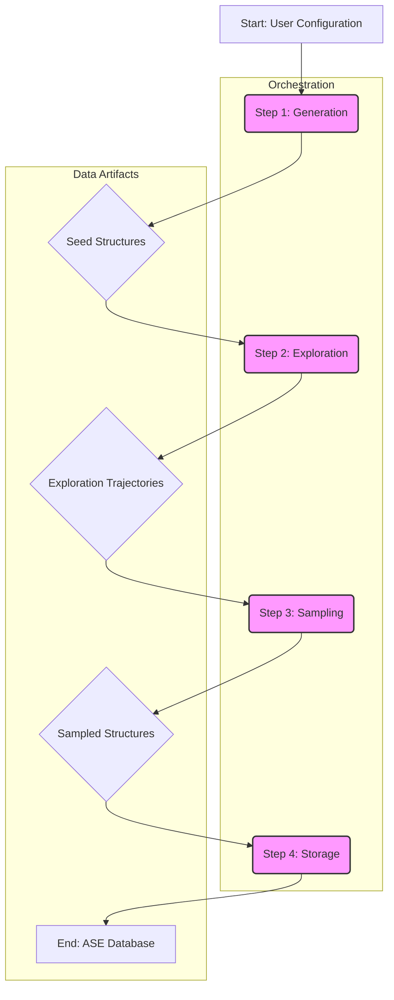

# System Architecture: MLIP-AutoPipe

## 1. Summary

The MLIP-AutoPipe project is a specialised, automated software pipeline designed to generate high-quality, physically coherent, and diverse datasets for training modern Machine Learning Interatomic Potentials (MLIPs), such as MACE and SevenNet. The fundamental purpose of this system is to remove the human expert from the loop—a traditionally time-consuming and expertise-heavy process—by creating a fully automated, robust, and intelligent framework. The development of reliable MLIPs is often bottlenecked by the generation of training data. Manual data generation is not only slow but also prone to human bias, where researchers may inadvertently focus on comfortable, well-understood regions of the potential energy surface. This leads to datasets that lack the diversity needed to create a truly generalisable model. MLIPs trained on such data often fail when encountering atomic configurations that were not well-represented in their training set, leading to inaccurate energy and force predictions, a phenomenon sometimes referred to as "seeing ghosts." These failures can manifest as catastrophic simulation crashes or, more subtly, as unphysical results over long timescales.

This system directly addresses this problem by systematically exploring a vast chemical and structural phase space to produce datasets that cover not only stable, low-energy configurations but also critical high-energy states, transition states, and distorted structures. These "failure-prone" configurations—such as those involving bond-breaking events, unusual coordination numbers, grain boundaries, or point defects—are precisely what is needed to teach the model the underlying physics of the system and build a robust and generalisable potential. The scientific impact of developing better MLIPs is immense; it enables simulations of larger systems for longer times, bridging the gap between quantum mechanical accuracy and classical potential efficiency. This capability is transformative for fields like materials science, where it can accelerate the discovery of new alloys and catalysts, and for biochemistry, where it can aid in understanding complex molecular interactions.

The pipeline is engineered to handle a wide array of physical systems, demonstrating its versatility. This includes metallic alloys (from simple binary solid solutions to complex multi-principal element alloys), ionic crystals (e.g., oxides and salts, where charge balance is critical), covalent materials (like diamond and graphite), complex interfaces (such as solid-solid grain boundaries or solid-vacuum surfaces), and surface adsorption phenomena. It also incorporates a knowledge-based generation module that can infer initial crystal structures from chemical formulas using crystallographic databases and symmetry principles. The system architecture is modular, comprising four distinct stages: Generation, Exploration, Sampling, and Storage. This design ensures a clear separation of concerns and allows for future extensibility. The initial **Generation** stage creates a set of seed structures. The **Exploration** stage, the scientific heart of the pipeline, uses advanced simulation techniques like Molecular Dynamics (MD) and hybrid Monte Carlo (MC) methods to evolve these seeds in a thermodynamically guided search of the potential energy surface. Finally, the **Sampling** and **Storage** stages intelligently select the most informative data points and archive them in a structured, queryable database. A key technical innovation is its "late-binding" approach to computational resources, which avoids the severe performance and memory penalties associated with serialising (pickling) large PyTorch-based ML models between parallel processes. This, combined with its built-in physical validation mechanisms, ensures both computational efficiency and scientific rigour.

## 2. System Design Objectives

The primary objective of the MLIP-AutoPipe system is to achieve **fully automated, end-to-end dataset generation**. This concept extends beyond simple scripting; it signifies the creation of a system that can proceed from a single, high-level configuration file to a final, analysis-ready database without requiring any manual intervention. This level of automation is crucial for enabling high-throughput computational materials science, allowing researchers to explore dozens of chemical systems in the time it would traditionally take to curate a single dataset. By reducing the cognitive load and manual effort required, it frees up valuable researcher time to focus on scientific analysis rather than data wrangling. The system must handle all intermediate steps, including structure creation, simulation setup, execution, data extraction, and final storage, providing clear logs and status updates throughout the process.

A second core objective is to guarantee the **physical realism and chemical validity** of all generated structures. The principle "garbage in, garbage out" is especially true for training data. The system will therefore incorporate a multi-stage validation process. In the generation stage, it will enforce fundamental physical constraints, such as checking that inter-atomic distances are not unrealistically small by comparing them against known covalent radii. For ionic systems, generators will have built-in logic to ensure charge neutrality in the unit cells they create. Furthermore, the system will ensure that simulation cells are sufficiently large relative to the MLIP's cutoff radius to avoid atoms interacting with their own periodic images, a common source of error in molecular simulations. This rigorous, physics-based validation at every step is essential for producing high-quality, trustworthy data.

**Scalability and performance** are paramount design considerations, as the exploration of chemical space is a computationally intensive task. The system is architected from the ground up for parallel execution, leveraging Python's `ProcessPoolExecutor` to take full advantage of multi-core CPUs. This is essential for throughput, as it allows dozens of simulations to be run concurrently. The choice of process-based parallelism over thread-based is deliberate, as it circumvents Python's Global Interpreter Lock (GIL), which would otherwise be a bottleneck for CPU-bound simulation code. The design also incorporates a "late-binding" calculator instantiation strategy. Instead of creating the large, memory-intensive MLIP model in the main process and attempting to pickle it to worker processes—an inefficient and error-prone operation—the system passes only the configuration, and each worker process is responsible for loading the model into its own memory space. This significantly reduces inter-process communication overhead and improves scalability. Looking forward, the architecture is designed to be compatible with future scaling to distributed computing environments like HPC clusters, potentially using frameworks like Dask or Ray.

Finally, the system is designed for **configurability, extensibility, and robustness**. Using the Hydra framework for configuration allows for a highly flexible and composable setup, where users can easily override parameters from the command line or mix and match configuration files. The software design leans heavily on object-oriented principles, particularly the use of abstract base classes to define clear interfaces for components like `BaseStructureGenerator`. This makes the system highly extensible; a researcher could add support for a new material class, such as a `MolecularCrystalGenerator`, by simply creating a new class that inherits from the base interface and adding a corresponding option to the configuration schema, without needing to modify the core pipeline orchestrator. Robustness is achieved through diligent checkpointing and fault tolerance. The pipeline is designed to be resumable, saving its state after each major stage. If a long-running exploration job fails, all the data from successfully completed trajectories is preserved, and the job can be restarted without losing work. Safety mechanisms, such as charge-swap prevention in ionic systems and automatic dumping of crashed structures for debugging, are built in to make the entire process more resilient.

## 3. System Architecture

The system is designed as a modular, sequential pipeline orchestrated by a central `WorkflowOrchestrator`. This architecture ensures a clean, unidirectional data flow and a strong separation of concerns between the different logical stages of the dataset generation process. This design makes the system easier to understand, maintain, and extend. The four primary components are the Generator, Explorer, Sampler, and Storage modules, each acting on the data produced by the previous stage.



1.  **Generation Stage**: This is the entry point of the pipeline. Its input is the user-defined configuration, encapsulated in a Pydantic object. A `GeneratorFactory` inspects the configuration and instantiates the appropriate generator for the requested physical system (e.g., `AlloyGenerator`, `IonicGenerator`, `SlabGenerator`). This generator is responsible for creating the initial set of atomic structures, or "seed" configurations. These are not merely random arrangements; they are created based on crystallographic principles, respecting lattice types, compositions, and physical constraints. Immediately after creation, each structure is passed through a validation layer to check for issues like unrealistic atomic overlaps. The output of this stage is a set of validated `ase.Atoms` objects, which are saved to an intermediate file (`initial_structures.xyz`) and logged in a checkpoint database. This state isolation is crucial, as it allows the pipeline to be resumed from this point, skipping the potentially lengthy generation process on subsequent runs.

2.  **Exploration Stage**: This is the core computational engine of the pipeline, where the initial static structures are brought to life. The `WorkflowOrchestrator` feeds the seed structures into the `MDExplorer`. This component is a sophisticated simulation manager that runs molecular dynamics or hybrid MD/MC simulations in parallel using a `ProcessPoolExecutor`. For each seed structure, a worker process is spawned. Inside the worker, the appropriate MLIP calculator is loaded (the "late-binding" pattern), a thermostat and barostat are configured, and the simulation is run. A key architectural feature is the automatic ensemble switching. The explorer intelligently analyzes the geometry of the input structure to detect the presence of a vacuum layer. If a vacuum is found, it automatically applies the NVT (constant volume) ensemble to prevent the unphysical collapse of the simulation cell. For bulk materials, it uses the NPT (constant pressure) ensemble to allow the cell to relax naturally. This intelligence removes a common point of error for users. The explorer can also introduce Monte Carlo moves, such as swapping atoms of different species, which allows the system to explore compositional space in a way that is difficult to achieve with MD alone. The output of this stage is a large collection of simulation trajectories, which are files containing thousands of atomic snapshots.

3.  **Sampling Stage**: The exploration stage produces a vast amount of highly correlated data; adjacent frames in an MD trajectory are often very similar. Training a model on all of this data would be inefficient and confer little benefit. The Sampling stage addresses this by selecting a smaller, more informative subset of structures. A `SamplerFactory` chooses the appropriate algorithm based on the user's configuration. This can range from simple random sampling to the more advanced Farthest Point Sampling (FPS) algorithm. FPS works by transforming each atomic structure into a high-dimensional vector representation (using SOAP descriptors) and then selecting a subset of structures that are maximally distant from each other in this feature space. This ensures the final dataset has maximum structural diversity, which is a key ingredient for training a robust MLIP. The output of this stage is a curated list of `ase.Atoms` objects, ready for final storage.

4.  **Storage Stage**: The final, sampled structures are handed over to the `Storage` component, an `AseDBWrapper` class. This module uses the robust Atomic Simulation Environment (ASE) library to save the structures into a structured SQLite database. Crucially, it doesn't just store the atomic positions and species. It also saves rich metadata associated with each structure, including its calculated potential energy, the forces on each atom, the system's stress tensor, and provenance information (e.g., which simulation run it came from, the simulation temperature). This creates a persistent, easily queryable, and analysis-ready archive, representing the final product of the pipeline.

## 4. Design Architecture

The project follows a clean, object-oriented design with a strong emphasis on the separation of concerns, modularity, and type safety. This is reflected in its file structure and its consistent use of established software design patterns. Pydantic is the cornerstone of the data modeling and configuration strategy, ensuring that all data moving through the system is validated and conforms to a clear schema.

**File Structure Overview:**

```
src/mlip_autopipec/
├── __init__.py
├── cli.py                 # Command-line interface entry point. Built with Typer for robust argument parsing and command definition. Uses 'rich' for enhanced terminal output.
├── config.py              # Contains all Pydantic models that define the structure of the Hydra configuration. Includes detailed validators for cross-field consistency.
├── database.py            # A dedicated data access layer (DAL). The AseDBWrapper class encapsulates all database interactions, abstracting away the underlying ase.db implementation.
├── factories.py           # Implements the Factory Method pattern. Contains functions that are responsible for creating instances of generators, explorers, etc., based on the config.
├── interfaces.py          # Defines the application's "contracts" using Abstract Base Classes (ABCs). Ensures that all concrete implementations of a given component share the same interface.
└── pipeline/
    ├── __init__.py
    ├── orchestrator.py    # The main WorkflowOrchestrator class. It coordinates the execution of the pipeline stages but contains no business logic itself.
    ├── generation.py      # Contains concrete implementations of IStructureGenerator, like AlloyGenerator, responsible for the logic of creating initial structures.
    ├── exploration.py     # Contains the MDExplorer, the core scientific engine for running simulations.
    └── sampling.py        # Contains concrete sampler implementations like RandomSampler and FarthestPointSampler.
tests/
├── conftest.py            # Pytest configuration and shared fixtures.
├── test_generation.py     # Unit tests for the generator classes.
├── test_exploration.py    # Unit tests for the exploration engine.
└── test_sampling.py       # Unit tests for the sampling algorithms.
```

**Core Design Patterns and Data Models:**

-   **Abstract Base Classes (ABCs)**: The design is heavily reliant on interfaces defined in `interfaces.py` to decouple the high-level orchestrator from the low-level concrete implementations. For example, the `IStructureGenerator` ABC defines a `.generate()` method. The `WorkflowOrchestrator` simply calls this method on whatever generator object it is given. It doesn't know or care if it's an `AlloyGenerator` or an `IonicGenerator`. This adheres to the Liskov Substitution Principle and the Dependency Inversion Principle. It makes the system incredibly modular; adding a new generator type requires zero changes to the orchestrator logic, promoting maintainability and extensibility.

-   **Pydantic for Configuration and Data**: Adopting a schema-first approach with Pydantic is a cornerstone of the design. All configuration is parsed into strongly-typed Pydantic models defined in `config.py`. This provides numerous benefits: 1) **Validation**: Invalid configurations are caught early with clear error messages. For example, a validator can ensure that `composition` percentages sum to 1.0. 2) **Documentation**: The Pydantic models themselves serve as a clear, executable definition of the configuration schema. 3) **Developer Experience**: IDEs can provide autocompletion and type checking for configuration objects, reducing bugs. Beyond configuration, Pydantic models can also be used to represent key data structures that are passed between pipeline stages, ensuring data integrity throughout the workflow.

-   **Factory Pattern**: To avoid coupling the orchestrator (or the CLI) to concrete implementations, we use factory functions in `factories.py`. A function like `create_sampler(config: SamplingConfig) -> ISampler` contains the `if/elif/else` logic to decide which sampler class to instantiate (`RandomSampler` or `FarthestPointSampler`) based on the configuration. This centralizes the object creation logic, making it easy to add new samplers in the future by modifying only the factory and the config schema, without touching the orchestrator.

-   **Dependency Injection**: The `WorkflowOrchestrator` class is designed to receive its dependencies (the generator, explorer, and sampler objects) upon initialization, rather than creating them itself. Its `__init__` method will look like `def __init__(self, generator: IStructureGenerator, explorer: IExplorer, ...):`. This inversion of control is crucial for testability. In a unit test for the orchestrator, we can easily inject mock objects (e.g., a `MockGenerator` that returns a fixed, known atomic structure) to test the orchestrator's logic in isolation, without needing to run a real generation or simulation process. This makes our tests fast, deterministic, and focused.

## 5. Implementation Plan

The project will be developed over two distinct, sequential cycles. This iterative approach allows us to build and validate a core, functional system before adding more complex features, reducing risk and providing incremental value.

**Cycle 1: Core Pipeline and CLI (500+ words)**

This foundational cycle is focused on building the "steel frame" of the application. The primary goal is to deliver a functional, end-to-end command-line tool that can perform the simplest version of the pipeline: generating initial structures and saving them to a database. This cycle deliberately omits the complex scientific simulation logic to focus on getting the core architecture, data flow, and user interface right. The implementation will proceed in a logical, bottom-up fashion. We will begin by defining the data contracts—the Pydantic models in `config.py`—as this schema will drive the development of all other components. We will write extensive unit tests for these models to ensure the validation logic is flawless. Next, we will implement the `database.py` module, creating a robust wrapper around the ASE database functionality and covering it with unit tests that verify all CRUD (Create, Read, Update, Delete) operations.

With the data and storage layers in place, we will define the core `interfaces.py` for our pipeline components. We will then create the first concrete generator, `AlloyGenerator`, which will contain the logic for creating random alloy structures based on the configuration. This component will also be thoroughly tested. A crucial step in this cycle is the implementation of "stub" versions of the explorer and sampler. These will be simple classes that conform to the interfaces but perform a "pass-through" operation—they simply return the data they receive without modification. This allows us to build and test the main `WorkflowOrchestrator` and the entire data pipeline without needing the complex logic from Cycle 2. Finally, we will build the user-facing `cli.py` module using Typer, which will handle argument parsing, configuration loading via Hydra, and invoking the pipeline. The main deliverable of this cycle is a working `mlip-autopipec run` command. A user will be able to write a simple YAML file, run the command, and receive a populated ASE database of initial structures. This provides a tangible, useful tool and validates that the fundamental "plumbing" of the application is sound before we add the complexity of the exploration engine.

**Cycle 2: Advanced Exploration and Web UI (500+ words)**

The second cycle builds directly on the stable foundation of Cycle 1 to implement the sophisticated scientific heart of the application and to provide a more accessible user interface. The highest priority is the development of the `MDExplorer` in `pipeline/exploration.py`. This is a significant undertaking that will be broken into smaller tasks. First, we will implement the basic parallel MD execution using `ProcessPoolExecutor`. Then, we will integrate the critical "late-binding" calculator pattern to ensure efficient use of memory and computational resources. The next step is to implement the intelligent, automatic thermodynamic ensemble switching logic, which involves writing a function to detect vacuum layers in atomic structures. We will also add the hybrid MD/MC functionality, allowing for Monte Carlo atom swaps to be mixed into the simulation. Concurrently, we will replace the stub sampler with the `FarthestPointSampler`. This will involve integrating a third-party library like `dscribe` for calculating the SOAP descriptors and then implementing the iterative FPS algorithm itself. Both the explorer and the sampler will require a new suite of sophisticated unit tests to verify their complex logic.

Once this core backend functionality is complete and tested, the focus will shift to the user experience. We will develop a web-based graphical user interface (Web UI) in the `web/` directory. For rapid development and ease of use, we will likely use the Streamlit framework. The UI will feature an interactive form that dynamically generates the configuration for the pipeline, providing a much more intuitive experience than editing a YAML file by hand. Upon submission, the UI will launch the pipeline as a background process, displaying its log output in real-time on the webpage. The final feature will be a results viewer, which will allow the user to load a generated database and visualise the atomic structures directly in the browser using a library like `py3Dmol`. This transforms the application from a tool for experts into a platform that is accessible to a broader range of scientists and students. The successful completion of this cycle will result in a feature-complete, powerful, and user-friendly tool that fulfills all the project's initial objectives.

## 6. Test Strategy

The testing strategy is comprehensive and multi-layered, designed to ensure the correctness, robustness, and scientific validity of the software at every stage of development. We will use the `pytest` framework for its powerful features and clear syntax.

**Cycle 1: Core Pipeline and CLI (500+ words)**

-   **Unit Testing**: The foundation of our testing strategy is a rigorous suite of unit tests for each component, ensuring they function correctly in isolation. We will use `pytest-mock` extensively to achieve this isolation. For example, when testing the `WorkflowOrchestrator`, we will inject mock objects for the generator, explorer, sampler, and database wrapper. This allows us to verify the orchestrator's logic—that it calls its dependencies in the correct sequence with the correct data—without any reliance on their actual implementations. For the `AseDBWrapper`, our unit tests will not touch a real database on the main filesystem; instead, they will use a temporary file that is created at the beginning of a test and guaranteed to be deleted at the end, using a `pytest` fixture. This ensures tests are independent and repeatable. For the `AlloyGenerator`, tests will verify not just the happy path but also edge cases. We will assert that the generated structures have the correct number of atoms and the correct chemical composition. Crucially, we will also test the validation logic by writing tests that expect a specific exception (e.g., `PhysicsViolationError`) to be raised when provided with an impossible configuration, using the `pytest.raises` context manager. For the Pydantic configuration models, tests will confirm that all validators work as expected, checking both valid and invalid data inputs to ensure user-friendly error messages are generated.

-   **Integration Testing**: While unit tests focus on individual components, integration tests ensure they work together as a cohesive whole. The primary integration test for Cycle 1 will focus on the main user entry point: the CLI. We will use the `click.testing.CliRunner` to invoke the `mlip-autopipec run` command from within a test script. To ensure the test does not interfere with the user's file system, we will use the `runner.isolated_filesystem()` context manager, which creates a temporary empty directory for the test to run in. The test will programmatically create a `config.yaml` file inside this temporary directory, execute the CLI command, and then inspect the results. The assertions will be comprehensive: 1) The command exits with a success code (0). 2) The console output contains the expected log messages, confirming the pipeline stages were executed. 3) The specified output database file exists in the temporary directory. 4) We will connect to the output database using the real `AseDBWrapper` and verify its contents, asserting that it contains the correct number of structures with the correct chemical properties. This single test provides a high degree of confidence that the entire application "plumbing" is correctly assembled and functioning from end to end.

**Cycle 2: Advanced Exploration and Web UI (500+ words)**

-   **Unit Testing**: The testing focus in Cycle 2 shifts to the new, computationally complex components. It is not feasible to run a full MD simulation in a unit test, so we will use mocking to test the logic of the `MDExplorer`. The MLIP calculator itself will be mocked to return predictable, deterministic energies and forces. This allows us to test the logic of a Monte Carlo swap move: we can mock the calculator to report a lower energy for the swapped configuration and assert that the move is accepted. We can also test the automatic ensemble switching logic. We will create two `ase.Atoms` objects in the test, one representing a bulk material and one a surface slab, pass them to the explorer, and assert that the explorer calls the correct ASE dynamics module (`NPT` or `NVT`) in each case. For the `FarthestPointSampler`, we will create a small, fixed dataset of feature vectors (mocking the SOAP descriptors) and test the `FPS` algorithm against a known, manually calculated outcome, ensuring the implementation is correct.

-   **Integration Testing**: The end-to-end integration tests will be expanded to include the new exploration and sampling stages. A full test with a real MLIP model would be too slow for a CI/CD environment. Therefore, our key strategy will be to run the pipeline with a fast, classical potential, such as ASE's built-in Effective Medium Theory (`EMT`) calculator. This allows us to run a genuine, albeit short, MD simulation in a few seconds. The integration test will configure a run using the `EMT` potential, execute the CLI, and then perform assertions on the output database. A critical assertion will be to verify that the final structures have been genuinely modified by the simulation. We will check that their potential energies and atomic positions are different from those of the initial seed structure, providing strong evidence that the exploration engine is working correctly.

-   **End-to-End (E2E) Testing**: For the Web UI, we will introduce a new layer of testing. We will use a browser automation framework like **Playwright** to write E2E tests. A typical test script will: 1) Start the Streamlit web application as a subprocess. 2) Use Playwright to launch a real browser (e.g., Chrome). 3) Navigate to the application's URL. 4) Programmatically interact with the UI elements: filling in text boxes for the chemical formula, selecting options from dropdowns for the sampler. 5) Click the "Run Pipeline" button. 6) Wait for the log viewer on the page to display a "Pipeline completed successfully" message. This provides the ultimate confidence that the application is working correctly from the user's perspective, from browser interaction all the way to backend computation.
