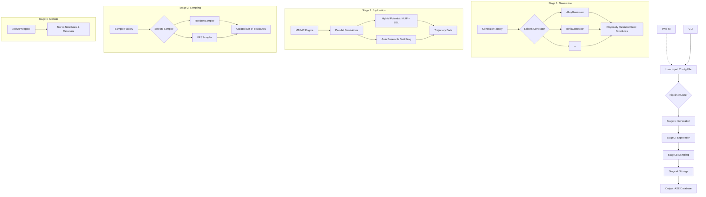

# SYSTEM_ARCHITECTURE.md

## 1. Summary

This document outlines the system architecture for the MLIP-AutoPipe project, a sophisticated framework designed to automate the generation of high-quality training data for Machine Learning Interatomic Potentials (MLIPs) like MACE and SevenNet. The core philosophy of this project is to "remove the human expert from the loop" by creating a fully automated, physically robust, and intelligent pipeline. The system moves beyond simple random structure generation, employing advanced simulation techniques such as molecular dynamics (MD) and Monte Carlo (MC) to explore the thermodynamic phase space of a given material system. This allows for the efficient discovery of diverse and challenging atomic configurations, including high-energy states and transition pathways, which are critical for training robust and accurate MLIPs. The framework is engineered to handle a wide variety of physical systems, including multi-component alloys, ionic crystals, covalent materials, material interfaces, and surface adsorption phenomena. It also incorporates a knowledge-based approach, leveraging crystallographic databases and symmetry principles to generate plausible seed structures from simple chemical formulas.

The architecture is designed to be modular, scalable, and extensible. The entire workflow is orchestrated by a central pipeline runner that executes a sequence of well-defined stages: initial structure generation, structural exploration, intelligent sampling, and final database storage. Each stage is implemented as a distinct module with a clear interface, allowing for independent development, testing, and extension. For instance, the structure generation stage utilizes a factory pattern to dynamically select the appropriate generator based on the user-defined physical system. This modularity ensures that new types of materials or generation algorithms can be integrated with minimal effort. The system places a strong emphasis on physical realism and robustness. All generated structures undergo rigorous validation checks to prevent physically implausible configurations, such as atoms being too close to each other. During the exploration phase, the system uses a hybrid MD/MC engine that can automatically switch between different thermodynamic ensembles (NPT and NVT) based on the system's geometry, preventing common simulation artifacts. Furthermore, it incorporates a mixed potential approach, combining the MLIP with the classical ZBL potential to accurately describe short-range repulsive interactions and avoid catastrophic failures during high-temperature simulations. This meticulous attention to physical detail ensures the generated datasets are not only diverse but also of high fidelity, leading to more reliable and predictive MLIPs. The project is built with modern software engineering best practices, featuring a command-line interface (CLI) for batch processing and a web-based user interface (Web UI) for interactive configuration and visualization, catering to both automated workflows and exploratory research.

## 2. System Design Objectives

The primary objective of the MLIP-AutoPipe project is to drastically reduce the time and expertise required to generate high-quality datasets for training MLIPs. The system is designed to be a "push-button" solution that automates the entire data generation workflow, from initial structure creation to the final curated database. A key goal is to ensure the **physical validity** of all generated structures. This is achieved through a multi-layered validation strategy, including minimum atom distance checks, supercell size enforcement to avoid periodic image interactions, and charge neutrality constraints for ionic systems. The system aims for **configurational diversity** in the generated datasets. It must be capable of exploring a vast portion of the material's potential energy surface to find unique and informative structures. This is accomplished through a hybrid MD/MC exploration engine that combines thermal motion with stochastic moves like atom swaps and vacancy hops, effectively sampling both vibrational and compositional degrees of freedom.

Another crucial objective is **robustness and fault tolerance**. The exploration simulations are computationally intensive and can be prone to failure, especially at high temperatures. The system is designed to handle these failures gracefully. It includes mechanisms to detect and prevent "Coulomb explosions" in ionic systems, and it automatically discards and logs physically violated structures without crashing the entire workflow. The use of process-based parallelism ensures that a failure in one simulation does not affect others. The architecture must be **extensible and modular**. The project is intended to be a long-lived research tool, and it must be easy to add support for new types of materials, new exploration algorithms, or new sampling techniques. This is achieved through an object-oriented design with clear interfaces, such as the `BaseGenerator` abstract class, and the use of a factory pattern for dynamic component selection. Configuration management is handled by Hydra, which allows for a flexible and composable setup, making it easy for users to define and customize complex workflows.

Finally, the system is designed with **usability** in mind. It provides two primary interfaces: a powerful CLI for integration into automated high-throughput screening workflows, and an intuitive Web UI for users who prefer a graphical, interactive approach. The Web UI will allow for easy parameter setup, real-time monitoring of simulations, and visualization of the generated structures. This dual-interface approach ensures the tool is accessible to a wide range of users, from computational materials scientists running large-scale simulations to experimentalists who need to quickly generate a few structures for analysis. The success of the project will be measured by its ability to generate diverse, physically realistic datasets that result in MLIPs with demonstrably better accuracy and transferability compared to models trained on manually curated or randomly generated data.

## 3. System Architecture

The MLIP-AutoPipe system is designed as a modular, pipeline-based application. The architecture is centered around a `PipelineRunner` that orchestrates the flow of data through four distinct stages: Generation, Exploration, Sampling, and Storage. This separation of concerns allows for a clean and maintainable codebase.



The data flow begins with a user-provided configuration file, which is processed by the `PipelineRunner`. The runner first invokes the **Generation** stage. A `GeneratorFactory` reads the configuration and instantiates the appropriate generator (e.g., `AlloyGenerator`, `IonicGenerator`) for the specified material system. The generator creates a set of initial seed structures, applying various physical constraints and validations (e.g., checking for atomic overlap, ensuring supercell size). These seed structures are then passed to the **Exploration** stage. Here, the `MD/MC Engine` takes each seed structure and runs a simulation to generate a trajectory of atomic configurations. This process is parallelized to efficiently handle multiple structures. The engine uses a sophisticated hybrid potential that mixes the MLIP with a classical ZBL potential for stability and automatically adjusts the thermodynamic ensemble (NVT/NPT) based on the system's geometry. The raw trajectory data from this stage is extensive. Therefore, the **Sampling** stage is employed to select a diverse and informative subset of these structures. A `SamplerFactory` chooses the sampling method, which can be simple random sampling or the more advanced Farthest Point Sampling (FPS) based on SOAP descriptors to maximize structural diversity. Finally, the curated set of structures is passed to the **Storage** stage. An `AseDBWrapper` class handles the interaction with an ASE-compatible SQLite database, saving each structure along with relevant metadata, such as its potential energy, forces, and origin. This database serves as the final, clean, and ready-to-use dataset for training an MLIP. The entire process can be initiated via either a CLI or a Web UI, providing flexible access for different user workflows.

## 4. Design Architecture

The project will be structured into a main application package `mlip_autopipec` within the `src` directory. The design emphasizes a clean separation of concerns, with distinct modules for configuration, data models, core pipeline logic, and individual components for each stage.

**File Structure:**

```
src/mlip_autopipec/
├── __init__.py
├── cli.py                  # Command Line Interface entry point
├── web.py                  # Web User Interface entry point
├── config/
│   ├── __init__.py
│   └── schemas.py          # Pydantic models for configuration
├── data/
│   ├── __init__.py
│   └── models.py           # Pydantic models for data (e.g., AtomicStructure)
├── pipeline/
│   ├── __init__.py
│   └── runner.py           # Main PipelineRunner orchestrator
├── generators/
│   ├── __init__.py
│   ├── base.py             # Abstract BaseGenerator class
│   ├── alloy.py            # AlloyGenerator implementation
│   └── ...                 # Other generator implementations
├── explorers/
│   ├── __init__.py
│   └── md_engine.py        # Hybrid MD/MC exploration engine
├── samplers/
│   ├── __init__.py
│   ├── base.py             # Abstract BaseSampler class
│   ├── random.py           # RandomSampler implementation
│   └── fps.py              # FPSSampler implementation
├── storage/
│   ├── __init__.py
│   └── db_wrapper.py       # ASE Database wrapper
└── utils/
    ├── __init__.py
    └── physics.py          # Physics validation functions
```

**Class/Function Definitions Overview:**

-   **`config.schemas`**: This module will contain a set of Pydantic models that define the entire configuration structure. For example, a `SystemConfig` model for defining the material, an `ExplorationConfig` for MD/MC parameters, etc. This provides strong validation and clear documentation for all user-configurable parameters.
-   **`pipeline.runner.PipelineRunner`**: This class will be the central orchestrator. It will have a main `run()` method that takes the configuration object and executes the four stages (Generate, Explore, Sample, Store) in sequence.
-   **`generators.base.BaseGenerator`**: An abstract base class defining the interface for all generators. It will have a `generate()` method that returns a list of ASE `Atoms` objects and enforce validation checks.
-   **`explorers.md_engine.MDEngine`**: This class will encapsulate the logic for running MD/MC simulations. It will handle the setup of the ASE calculator (including the mixed MLIP+ZBL potential), automatic ensemble detection, and parallel execution.
-   **`samplers.base.BaseSampler`**: An abstract base class for sampling algorithms, with a `sample()` method that takes a trajectory and returns a curated list of `Atoms` objects.
-   **`storage.db_wrapper.AseDBWrapper`**: A utility class to abstract the details of writing to the ASE database.

**Data Models:**

The primary data objects passed between pipeline stages will be ASE `Atoms` objects, which are the standard for representing atomic structures in the Python ecosystem. Configuration will be handled exclusively through Pydantic models defined in `config/schemas.py` to ensure type safety, validation, and self-documentation. For instance, the main configuration object might look like this:

```python
# In config/schemas.py
from pydantic import BaseModel, Field
from typing import List, Dict

class SystemConfig(BaseModel):
    elements: List[str]
    composition: Dict[str, float]
    # ... other system parameters

class FullConfig(BaseModel):
    system: SystemConfig
    exploration: ExplorationConfig
    # ...
```

This schema-first approach ensures that all parts of the application operate on well-defined, validated data structures, significantly reducing the risk of runtime errors.

## 5. Implementation Plan

The project will be implemented in two distinct cycles to manage complexity and ensure a solid foundation before building the more advanced features.

**Cycle 1: Core Structure Generation Pipeline and CLI**

This initial cycle focuses on creating a robust, command-line-driven tool for generating physically valid seed structures. The goal is to deliver a functional and useful tool that can create high-quality initial datasets, which can then be used directly or as a starting point for more complex workflows. The scope includes setting up the project structure, implementing the configuration system using Pydantic and Hydra, and building the first and last stages of the pipeline: Generation and Storage. We will implement the full suite of generator classes (`AlloyGenerator`, `IonicGenerator`, `CovalentGenerator`, etc.) as described in the specification. Each generator will include rigorous physical validation checks, such as minimum atomic distance and supercell size enforcement. The `PipelineRunner` will be implemented to orchestrate this simple two-stage (Generate -> Store) workflow. Finally, a `click`-based CLI will be developed to allow users to run the pipeline from the command line, passing a configuration file as input. The output of this cycle will be a tool that can take a simple definition of a material system and produce a well-formed ASE database of validated seed structures. This provides immediate value and establishes the core architectural patterns for the rest of the project.

**Cycle 2: Advanced Exploration, Smart Sampling, and Web UI**

Building on the foundation of Cycle 1, this cycle will implement the sophisticated, dynamic parts of the workflow: the Exploration and Sampling stages. The core of this cycle is the development of the hybrid MD/MC engine (`explorers.md_engine.MDEngine`). This involves integrating an MLIP calculator (like MACE) with a classical ZBL potential, implementing the logic for automatic ensemble switching based on vacuum detection, and managing the parallel execution of simulations. This stage is critical for generating the diverse, high-energy structures that are essential for training robust MLIPs. Concurrently, we will implement the `Sampler` classes. This includes a simple `RandomSampler` and the more advanced `FPSSampler`, which will use SOAP descriptors to select a structurally diverse subset of frames from the MD trajectories. The `PipelineRunner` will be extended to incorporate these two new stages, creating the full four-stage workflow. Finally, a web-based user interface will be developed using a framework like Streamlit or Gradio. This UI will provide an interactive way for users to build configuration files, launch pipeline runs, monitor their progress, and visualize the resulting structures. This will make the tool accessible to a broader audience and enhance its usability for exploratory research.

## 6. Test Strategy

Testing will be a critical component of each cycle, ensuring the reliability and correctness of the framework. We will use `pytest` as the testing framework and aim for high test coverage.

**Cycle 1 Test Strategy:**

-   **Unit Testing:** Each `Generator` class will be tested in isolation. We will create mock configuration objects and assert that the generated structures meet all physical validation criteria. For example, we will test the `AlloyGenerator` to ensure it produces structures with the correct composition and that no two atoms are closer than the specified minimum distance. We will also write unit tests for the Pydantic configuration schemas to ensure they correctly validate and reject invalid user inputs. The `AseDBWrapper` will be tested using a mock database connection to verify that it correctly writes the structures and metadata.
-   **Integration Testing:** We will write integration tests for the CLI and the `PipelineRunner`. These tests will involve running the pipeline with a series of small, well-defined configuration files. We will then inspect the output ASE database to verify that the correct number of structures were generated and that they have the expected properties. For example, we will run a test case for generating 10 TiO2 ionic structures and assert that the final database contains 10 entries, each with the correct stoichiometry and charge neutrality. These tests will cover the end-to-end workflow from configuration file to final database output.

**Cycle 2 Test Strategy:**

-   **Unit Testing:** The `MDEngine` will be the primary focus of unit testing in this cycle. Since running actual MD simulations is too slow for unit tests, we will heavily mock the ASE `Atoms` and `Calculator` objects. We will write tests to verify the logic for automatic ensemble switching (i.e., given a structure with a vacuum slab, assert that the NVT ensemble is chosen). We will also test the logic for the hybrid MD/MC moves, such as asserting that an atom swap move correctly exchanges the positions of two atoms of different species. The `FPSSampler` will be tested with a pre-computed set of SOAP descriptors to ensure it correctly selects the most diverse structures.
-   **Integration Testing:** End-to-end integration tests will be developed for the full four-stage pipeline. These tests will use a fast, simple classical potential (like EMT) instead of a full MLIP to keep runtime manageable. We will run a small case (e.g., generate 2 seed structures, explore for 10 steps each, sample 5 final structures) and assert that the final database contains the correct number of diverse structures. We will also perform basic "smoke tests" for the Web UI, using a tool like `playwright` to ensure that the UI launches, that the input fields can be populated, and that a pipeline run can be triggered. These tests will validate that all components of the system work together as expected.
