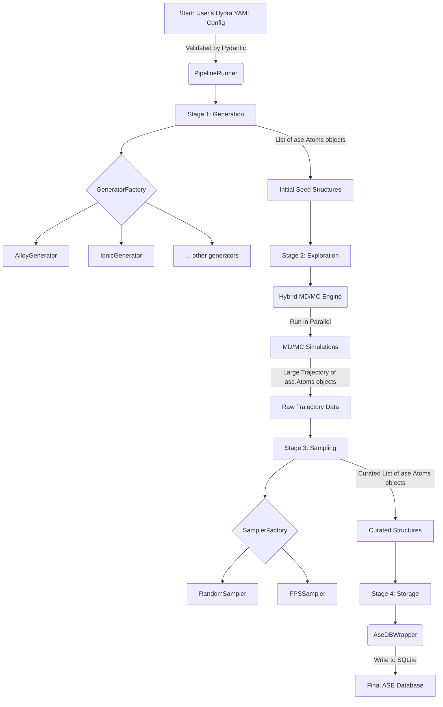

# SYSTEM_ARCHITECTURE.md

## 1. Summary

The MLIP-AutoPipe project is an advanced, autonomous framework meticulously designed to generate high-quality, physically relevant, and diverse datasets for training modern Machine Learning Interatomic Potentials (MLIPs), such as MACE and SevenNet. The core philosophy of the project is to "remove the human expert from the loop" by creating a fully automated pipeline that encapsulates the complex, domain-specific knowledge required for robust materials simulation. The traditional methodology for creating training datasets for MLIPs is notoriously problematic. It often relies on a disjointed collection of manual scripts, ad-hoc procedures, and the intuition of seasoned researchers. This approach is not only incredibly time-consuming but also suffers from a critical lack of reproducibility, making it difficult to verify results or build upon previous work systematically. MLIP-AutoPipe directly confronts these challenges by providing a standardized, configuration-driven, and fully reproducible workflow, aiming to become an indispensable tool for both academic and industrial researchers in computational materials science.

The system is engineered from the ground up to handle a wide variety of physical systems, a crucial requirement for a general-purpose tool. Its architecture supports alloys, ionic crystals with charge-neutrality constraints, covalent materials, complex interfaces between different materials, and surface adsorption phenomena. A key innovation of the project is its departure from simplistic structure generation techniques, which often produce physically unrealistic or low-diversity datasets. Instead, it employs sophisticated and physically grounded simulation techniques, primarily Molecular Dynamics (MD) and a hybrid Monte Carlo (MC) approach. This allows the system to explore the thermodynamically accessible phase space for a given material, effectively simulating how the material would behave under realistic temperature and pressure conditions. This exploration is vital for identifying not just the stable, low-energy configurations, but also the high-energy and transition-state structures that are critically important for training a robust and accurate MLIP. These "failure-prone" configurations are often the most valuable data points, as they teach the model the energetic penalties for unrealistic atomic arrangements, thereby improving its predictive power and stability.

The architecture is founded upon a modular, four-stage pipeline: Generation, Exploration, Sampling, and Storage. This deliberate separation of concerns ensures that each stage of the process is well-defined, independently testable, and easily extensible. The initial structure Generation phase uses a library of physics-based rules and established crystallographic databases to create valid seed configurations. The Exploration phase then takes these seeds and uses the powerful hybrid MD/MC engine to diversify them into a large trajectory of thousands of distinct structures. The Sampling phase then intelligently post-processes this trajectory, using advanced algorithms like Farthest Point Sampling (FPS) to select a small, information-rich subset of the most diverse structures. Finally, the Storage phase archives this curated dataset into a structured, queryable ASE (Atomic Simulation Environment) database, complete with all relevant metadata. The entire process is orchestrated by a central pipeline runner and configured via the Hydra framework, allowing for flexible and powerful customization without altering the core, validated codebase. This comprehensive, automated, and physically grounded approach represents a significant leap forward, enabling researchers to develop more accurate and reliable MLIPs with far greater efficiency and confidence.

## 2. System Design Objectives

The primary objective of the MLIP-AutoPipe system is to automate and standardize the generation of training data for MLIPs. This overarching goal is supported by a series of detailed design principles and success criteria that guide the architecture and implementation.

**Automation and Reproducibility:** The system must be fully automated, requiring only a single, declarative configuration file to execute the entire data generation workflow. This is a cornerstone objective, designed to eliminate manual intervention, reduce the potential for human error, and ensure that the entire process is scientifically reproducible. Reproducibility is paramount in scientific research; a result that cannot be reproduced is of limited value. To this end, the system will use the Hydra configuration framework, which allows configurations to be version-controlled and shared. The success of this objective will be measured by the ability to generate a bit-for-bit identical output dataset from the same configuration file and random seed, ensuring that results are verifiable and comparable over time. This deterministic behavior is critical for debugging, validating, and publishing research based on the generated data.

**Physical Realism and Validity:** The generated structures must be physically plausible and relevant to the system being studied. The principle of "garbage in, garbage out" is particularly true for MLIPs. The framework will enforce a strict set of physics-based validation checks at every stage. In the generation phase, this includes ensuring minimum atomic separation distances to prevent unrealistic overlaps, maintaining charge neutrality in ionic systems, and creating supercells of an appropriate size to avoid periodic boundary condition artifacts. The exploration phase is designed around MD and MC simulations precisely because these methods inherently respect the laws of physics, evolving the system in a way that naturally explores the relevant thermodynamic ensemble. The success of this objective will be validated by the physical integrity of the output datasets and, ultimately, by the improved accuracy and stability of MLIPs trained on this data compared to data from more naive generation methods.

**Diversity and Informativeness:** A good dataset is not just large; it is diverse and information-rich. The system must be designed to maximize the structural diversity of the output dataset, covering a wide range of configurations including stable ground states, metastable states, high-energy distorted configurations, and critical transition states. This objective is achieved primarily through the combination of high-temperature MD exploration and intelligent sampling. High-temperature simulations provide the kinetic energy needed to overcome energy barriers and explore a wider range of the potential energy surface. Subsequently, the system will employ Farthest Point Sampling (FPS) using SOAP (Smooth Overlap of Atomic Positions) descriptors as its default sampling method. Unlike random sampling, which tends to over-sample low-energy basins, FPS is a diversity-maximizing algorithm that selects data points that are structurally distinct from one another. The success of this objective will be measured by quantifying the structural diversity of the generated datasets (e.g., via principal component analysis of SOAP descriptors) and demonstrating a measurable improvement in the accuracy of MLIPs trained on FPS-curated data versus randomly sampled data.

**Modularity and Extensibility:** The system's architecture must be modular to facilitate future development and contributions from the community. Materials science is a rapidly evolving field, and the tool must be adaptable. This is achieved through a plugin-style architecture centered on Abstract Base Classes (ABCs) for key components like structure generators and samplers. This design choice creates a clean, stable interface, allowing a researcher to easily implement and add their own custom `MyNewMaterialGenerator` or `MyNovelSamplingAlgorithm` without needing to understand or modify the core pipeline logic. A Factory design pattern will be used to dynamically load and instantiate these user-defined components based on the configuration file. Success will be determined by the simplicity of the process for adding a new component, which should ideally require only writing a single class that conforms to the ABC interface and updating the configuration file.

**User-Friendliness and Accessibility:** The system must be accessible to a broad range of users, from computational experts to experimental scientists who may be less familiar with command-line tools. To this end, the project will feature two primary user interfaces. A comprehensive Command-Line Interface (CLI) will serve power users who need to script and automate large-scale data generation campaigns. A browser-based Graphical User Interface (GUI) will provide an interactive, user-friendly way to configure parameters, launch runs, and visualize the generated structures. This dual-interface approach ensures that the power of the tool is not limited by a steep learning curve. Success will be measured by user feedback, the clarity of the documentation, and the tool's adoption within the wider materials science community.

## 3. System Architecture

The MLIP-AutoPipe system is designed as a modular, sequential pipeline orchestrated by a central runner. This architecture ensures a clear and predictable flow of data, with each component having a single, well-defined responsibility. The data flows through four main stages: Generation, Exploration, Sampling, and Storage, transforming from a simple configuration into a curated, high-value dataset.



**Architectural Components and Data Flow:**

The process begins when the user provides a YAML configuration file. This file is the sole input to the system.

*   **PipelineRunner:** This is the central orchestrator of the entire workflow. It is instantiated with the validated configuration object. Its primary role is to manage the lifecycle of the other components and to control the flow of data from one stage to the next. It sequentially calls each stage, passing the output of the previous stage as the input to the next.

*   **Stage 1: Generation:** The `PipelineRunner` first invokes the `GeneratorFactory`. Based on a `type` field in the configuration (e.g., `alloy`), the factory instantiates the appropriate concrete generator class (e.g., `AlloyGenerator`). This generator then creates a set of initial seed structures. These are not just random arrangements; they are physically plausible configurations based on known crystal structures and compositions. The output of this stage is a Python list of `ase.Atoms` objects, which serve as the starting points for the exploration phase. This list is held in memory to be passed to the next stage.

*   **Stage 2: Exploration:** The list of initial `ase.Atoms` objects is passed to the `HybridMDEngine`. This is the most computationally intensive part of the pipeline. The engine is responsible for running MD or hybrid MD/MC simulations on each of the seed structures. To improve performance, these simulations are executed in parallel using Python's `ProcessPoolExecutor`. The engine includes sophisticated logic, such as automatically detecting whether to use an NPT (constant pressure, for bulk materials) or NVT (constant volume, for surfaces with vacuum layers) ensemble. The output of this stage is a vast trajectory, which is essentially a very large list containing thousands of `ase.Atoms` objects, representing snapshots of the system's state at different points in time during the simulations.

*   **Stage 3: Sampling:** The raw trajectory from the exploration stage is then passed to the `Sampler`. Similar to generation, a `SamplerFactory` determines which sampling algorithm to use based on the configuration (e.g., `fps`). The `FPSSampler`, for example, will first compute a structural fingerprint (like a SOAP vector) for every `Atoms` object in the trajectory. It then runs the Farthest Point Sampling algorithm to select a smaller, user-defined number of structures that are maximally diverse in this fingerprint space. The output of this stage is a much smaller, curated list of `ase.Atoms` objects, representing the most informative and diverse configurations from the entire simulation.

*   **Stage 4: Storage:** Finally, this curated list of structures is passed to the `AseDBWrapper`. This component's sole responsibility is to interact with the storage backend. It connects to an SQLite database file and writes each `ase.Atoms` object to it. Crucially, it also saves important metadata alongside each structure, such as its calculated potential energy, atomic forces, and the simulation parameters from which it originated. The final output of the entire pipeline is a single, self-contained, and portable SQLite database file that constitutes the final training dataset.

## 4. Design Architecture

The project will be structured as a standard Python package named `mlip_autopipec` located within the `src` directory. This follows modern Python packaging conventions and facilitates installation and distribution. The internal structure is designed to be logical and modular, with a clear separation of concerns between different functionalities.

**File Structure:**

```
src/mlip_autopipec/
├── __init__.py
├── cli.py                 # Typer-based Command-Line Interface logic
├── config.py              # Central Pydantic models for all configuration
├── database.py            # AseDBWrapper class for database interactions
├── pipeline.py            # Main PipelineRunner orchestrator class
├── generators/
│   ├── __init__.py
│   ├── base.py            # BaseStructureGenerator abstract base class
│   ├── alloy.py           # Generator for alloy structures
│   └── ionic.py           # Generator for ionic crystal structures
├── explorers/
│   ├── __init__.py
│   └── md_engine.py       # The Hybrid MD/MC simulation engine
├── samplers/
│   ├── __init__.py
│   ├── base.py            # BaseSampler abstract base class
│   └── fps.py             # Farthest Point Sampler implementation
└── web/
    └── app.py             # FastAPI backend and frontend for the Web UI (Cycle 2)
tests/
├── conftest.py            # Shared pytest fixtures
├── test_cli.py
├── test_config.py
├── test_generators.py
├── test_explorers.py
├── test_samplers.py
└── test_pipeline.py
```

**Class and Module Definitions:**

*   **`config.py`**: This is arguably the most critical file from a design perspective. It will contain a set of nested Pydantic `BaseModel` classes that precisely define the entire configuration schema for the application. This schema-first approach ensures that any configuration loaded into the system is fully validated, typed, and has default values applied before any business logic is executed. It serves as a single source of truth for all configurable parameters, from the number of atoms and simulation temperature to the database path and sampling method. Using Pydantic provides automatic error reporting for invalid configurations, which is invaluable for user experience.

*   **`cli.py`**: This module will house the Typer-based Command-Line Interface. It will define commands such as `run-pipeline`, which will accept arguments like `--config-path`, and `run-webui`, which will start the web server. The logic within this module will be minimal, acting primarily as an entry point that parses user input, loads the configuration from the specified YAML file into the Pydantic models, and then instantiates and runs the `PipelineRunner`.

*   **`pipeline.py`**: This module contains the `PipelineRunner` class, the central orchestrator. It is initialized with a validated `FullConfig` Pydantic object. Its `run` method will implement the main logic of the four-stage pipeline, creating instances of the necessary generators, engines, and samplers, and passing the data between them in the correct sequence. It is the connective tissue that holds the modular components together.

*   **`generators/base.py`**: This file defines the `BaseStructureGenerator` Abstract Base Class (ABC). This class will have a single abstract method, `generate(self) -> list[ase.Atoms]`. All concrete generator classes must inherit from this ABC and implement this method. This enforces a uniform interface, or "contract," allowing the `PipelineRunner` to use any generator without knowing its specific implementation details.

*   **`explorers/md_engine.py`**: This module will contain the `HybridMDEngine` class. This is expected to be one of the most complex modules. It will encapsulate all the logic related to running simulations using the ASE library. It will manage the creation of ASE's dynamics objects, attach calculators (the MLIPs), run the simulation loops, and handle complex logic like MC atom swaps and automatic ensemble switching.

*   **`samplers/base.py`**: Similar to the generators, this file defines the `BaseSampler` ABC with an abstract method `sample(self, trajectory: list[ase.Atoms]) -> list[ase.Atoms]`. This contract ensures that all sampling algorithms, from simple random selection to complex FPS, can be used interchangeably by the pipeline.

*   **`web/app.py`**: This module will contain the web application, likely built using a modern Python web framework like FastAPI. It will define the API endpoints needed to receive a configuration from the browser, start a pipeline run in a background process, and provide status updates to the frontend. It will also serve the static HTML, CSS, and JavaScript files for the user interface.

## 5. Implementation Plan

The project will be developed across two distinct, sequential cycles. This phased approach allows for the incremental delivery of functionality, reducing risk and allowing for feedback and testing at each stage.

**Cycle 1: Core CLI Pipeline and Structure Generation (The Foundation)**

This initial cycle is focused on building the foundational "chassis" of the application. The primary goal is to deliver a fully functional, end-to-end, command-line-driven workflow for the simplest possible pipeline: generating initial structures and storing them in a database. The advanced exploration and sampling features, which represent the complex "engine" of the system, will be deferred to Cycle 2. The key deliverables are a robust CLI, a comprehensive and validated set of Pydantic models for configuration, a factory for creating various structure generators, concrete implementations for at least two generator types (e.g., `AlloyGenerator` and `IonicGenerator`), and a dedicated wrapper for managing the ASE database. By the end of this cycle, a user will be able to write a YAML file, run a single command, and receive a populated database of physically valid seed structures. This "walking skeleton" is not just a demo; it is a critical milestone that validates the entire data flow, the configuration system, and the database interface. It ensures that the core architecture is sound and that the interfaces between components are well-defined. Establishing a comprehensive testing framework using `pytest` will also be a key deliverable of this cycle. This includes setting up unit tests for each component and an end-to-end integration test for the CLI-driven workflow. This disciplined, test-first approach ensures that the foundation is stable and reliable before the more complex logic of Cycle 2 is built on top of it.

**Cycle 2: Advanced Exploration, Sampling, and Web UI (The Engine and Dashboard)**

This second cycle builds upon the stable foundation of Cycle 1 to implement the advanced, high-value features that are the project's main innovation. This cycle can be thought of as installing the powerful "engine" and the user-friendly "dashboard" into the chassis built in Cycle 1. The primary and most challenging task will be the development of the `HybridMDEngine`. This component will encapsulate the complex physics simulation logic, including the core MD loop, the integration of MC swap moves, the logic for automatic ensemble switching based on vacuum detection, and the integration of ZBL potentials to prevent unrealistic atomic overlaps at high temperatures. The second major backend feature is the implementation of the `FPSSampler`. This will require integrating a third-party library for calculating SOAP descriptors (e.g., `dscribe`) and then implementing the FPS algorithm itself. Once these backend components are complete and unit-tested, the `PipelineRunner` will be updated to include these new Exploration and Sampling stages, conditionally executing them based on the user's configuration. The final major deliverable of this cycle is the web-based user interface. This will be a separate but integrated sub-project, involving the creation of a FastAPI backend to expose the pipeline's functionality via a REST API, and a single-page JavaScript frontend that provides an intuitive form for building a configuration, a button to launch a run, and a display for real-time status updates. The completion of this cycle will realize the full vision of the project, delivering a powerful, intelligent, and accessible tool for the materials science community.

## 6. Test Strategy

The project will employ a multi-layered and comprehensive testing strategy, including unit, integration, and user acceptance testing for each cycle. All tests will be implemented using the `pytest` framework and will be designed to run in an automated CI/CD environment.

**Cycle 1: Core CLI Pipeline and Structure Generation**

The testing strategy for Cycle 1 focuses on ensuring the reliability of the foundational components and the integrity of the core data flow.
*   **Unit Tests:** Each component will be tested in strict isolation to verify its correctness.
    *   **Configuration Models (`test_config.py`):** The Pydantic models will be rigorously tested. We will assert that valid configuration dictionaries are parsed correctly and that invalid ones (e.g., with wrong data types, missing required fields, or values outside allowed ranges) raise a `pydantic.ValidationError`. This ensures the configuration system is robust.
    *   **Generators (`test_generators.py`):** Each generator will be tested to confirm that it produces the correct number of `ase.Atoms` objects and that these objects are physically valid. Assertions will check for things like correct chemical compositions, absence of overlapping atoms, and appropriate unit cell sizes.
    *   **Database Wrapper (`test_database.py`):** The `AseDBWrapper` will be tested using pytest's `tmp_path` fixture to create a temporary database for each test. Tests will write a known set of `ase.Atoms` objects and then read them back, asserting that the retrieved data is identical to the original. This guarantees the integrity of the persistence layer.
*   **Integration Tests:** The primary integration test for Cycle 1 will validate the end-to-end CLI workflow.
    *   **CLI to Database (`test_cli.py`):** This test will use the `click.testing.CliRunner` to invoke the `run-pipeline` command from within a pytest function. The test will first create a temporary, valid YAML configuration file. After invoking the CLI, it will assert a successful exit code. The main verification will be to use the `AseDBWrapper` to connect to the database file that the CLI just created and assert that it contains the correct number and type of structures, confirming the entire chain from configuration parsing to final storage is working correctly.

**Cycle 2: Advanced Exploration, Sampling, and Web UI**

Testing in Cycle 2 will address the increased complexity of the new components.
*   **Unit Tests:**
    *   **MD/MC Engine (`test_explorers.py`):** Testing the `HybridMDEngine` requires careful mocking. The actual MLIP calculator, which is computationally expensive and introduces external dependencies, will be replaced with a mock object that returns deterministic, predictable values for energy and forces. This will allow us to test the engine's internal logic in isolation. We can verify that the correct ASE dynamics integrator is chosen based on the system's properties (e.g., NVT for a slab), and that MC swap moves are correctly performed according to the specified frequency.
    *   **Samplers (`test_samplers.py`):** The `FPSSampler` will be tested with a small, fixed trajectory of `ase.Atoms` objects where the expected diverse subset is known. The test will run the sampler and assert that it selects the correct structures, validating the FPS implementation.
*   **Integration Tests:**
    *   **Full Pipeline (`test_pipeline.py`):** An integration test will cover the full `Generation -> Exploration -> Sampling -> Storage` pipeline. To make this feasible in a CI environment, it will use a very simple system (e.g., a 2-atom argon dimer) and a fast, classical potential like Lennard-Jones provided by ASE. The MD simulation will be very short (e.g., 10-20 steps). The key assertion will be to check the final database and confirm that the sampled structures are energetically and structurally different from the initial generated structure, proving that the exploration and sampling stages had a real effect.
*   **End-to-End (E2E) Tests:**
    *   **Web UI (`tests/e2e/test_webapp.py`):** The web UI will be tested using a dedicated E2E testing framework like Playwright. These tests will launch the web server as a separate process, then programmatically control a real web browser to interact with the UI. A typical test script would simulate a user's workflow: navigating to the page, filling out the configuration form, clicking the "Start Run" button, and then polling the UI for a "Completed" status message. This provides the ultimate validation that the frontend, backend, and core pipeline are all correctly integrated.