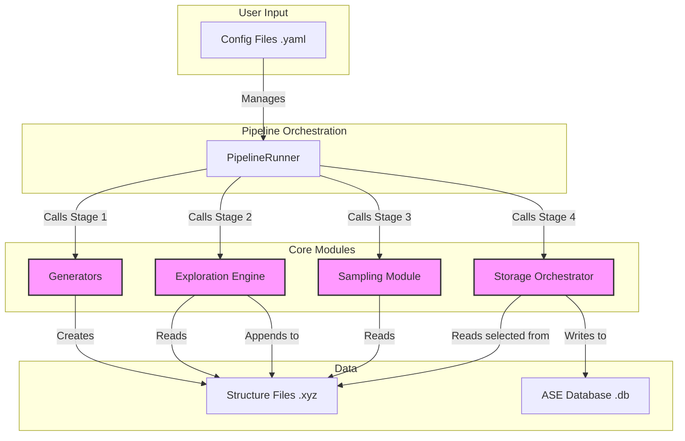

# System Architecture: MLIP-AutoPipe

## 1. Summary

The MLIP-AutoPipe project is a state-of-the-art computational framework designed to automate the generation of high-quality, diverse, and physically-valid training data for modern Machine Learning Interatomic Potentials (MLIPs), such as MACE and SevenNet. The core philosophy of this project is to "remove the human expert from the loop," providing a systematic and reproducible solution to one of the most significant bottlenecks in the development of new materials models: the creation of robust training datasets. Currently, generating such datasets is often a manual, time-consuming, and expertise-driven process, leading to inconsistencies and hindering the rapid development and deployment of new MLIPs. MLIP-AutoPipe aims to replace this ad-hoc process with an intelligent, automated pipeline that is both powerful for experts and accessible to newcomers in the field of computational materials science.

The system is engineered to explore the thermodynamic phase space of a given material system efficiently. Instead of merely generating random atomic configurations, it employs sophisticated simulation techniques, including Molecular Dynamics (MD) and Monte Carlo (MC), to discover thermodynamically accessible structures. This includes not only stable, low-energy configurations but also the critically important high-energy configurations and transition states where MLIPs are most likely to fail. By intelligently sampling these "failure-prone" structures, the framework ensures the resulting MLIPs are robust, accurate, and capable of predicting material properties across a wide range of temperatures and pressures.

The architecture is designed to be highly modular and extensible, accommodating a wide array of physical systems. This includes metallic alloys, ionic crystals, covalent materials, complex interfaces, and surface adsorption phenomena. The pipeline is broken down into four distinct, logical stages: initial structure **Generation**, thermodynamic **Exploration**, intelligent data **Sampling**, and final **Storage**. This modular design ensures a clear separation of concerns, making the system easier to maintain, test, and extend. For instance, a new structure generation algorithm or a more advanced sampling technique can be integrated with minimal disruption to the rest of the pipeline. Furthermore, the project leverages industry-standard tools from the computational materials science community, such as the Atomic Simulation Environment (ASE), and modern software engineering practices, including configuration management with Hydra and schema-first design with Pydantic. The final output is a curated, high-quality database of atomic structures, ready to be used for training next-generation MLIPs, thereby accelerating the pace of materials discovery and design.

## 2. System Design Objectives

The primary objective of MLIP-AutoPipe is to deliver a fully automated, reliable, and efficient pipeline for MLIP training data generation. The design is guided by a set of clear goals, constraints, and success criteria to ensure it meets the needs of the computational materials science community.

**Goals:**
1.  **Automation:** The system must fully automate the end-to-end process, from defining a material system to producing a final, curated database. The core goal is to minimise the need for manual intervention and expert intuition.
2.  **Data Quality and Physical Validity:** Every structure generated by the pipeline must be physically realistic. This involves rigorous checks for atomic overlaps, correct lattice parameters, and charge neutrality in ionic systems. The system must prevent common simulation artefacts like "Coulomb explosions."
3.  **Diversity and Robustness:** The generated dataset must be diverse, covering a wide area of the potential energy surface. The pipeline is explicitly designed to sample not just energy minima but also high-energy and transition-state configurations to produce robust MLIPs.
4.  **Modularity and Extensibility:** The architecture must be modular, allowing for the easy addition of new structure generators, exploration algorithms, or sampling methods. This ensures the tool can evolve with the state-of-the-art in the field.
5.  **User-Friendliness:** The system should be accessible to a broad range of users. This is achieved through a powerful Command-Line Interface (CLI) for experts and automated workflows, and an intuitive Web-based Graphical User Interface (Web UI) for interactive exploration and for those less familiar with command-line tools.

**Constraints:**
1.  **Dependency on External Libraries:** The project will rely on established, open-source libraries such as ASE for atomistic manipulations, Pymatgen for crystallographic logic, and PyTorch for interacting with MLIP models. The system's capabilities are therefore linked to the features and limitations of these underlying tools.
2.  **Computational Resources:** MD and MC simulations are computationally intensive. The system must be designed to run efficiently on high-performance computing (HPC) clusters and leverage parallel processing, but it is constrained by the available hardware (CPUs and GPUs).
3.  **Configuration Complexity:** While the use of Hydra provides powerful configuration capabilities, it also introduces a layer of complexity. The system design must strive to provide sensible defaults and clear documentation to avoid overwhelming the user.

**Success Criteria:**
1.  **Successful MLIP Training:** The primary success criterion is the ability to generate datasets that, when used to train MLIPs like MACE, produce models that accurately predict key material properties (e.g., energy, forces, stress) and exhibit stable simulation behaviour.
2.  **Pipeline Reliability:** The automated pipeline must run to completion without crashing for a well-defined set of use cases, including different material types and simulation parameters. It must include robust error handling and checkpointing.
3.  **Performance:** The pipeline should be performant enough to generate a reasonably sized dataset (e.g., a few thousand structures) for a typical binary alloy within a few hours on a standard compute node.
4.  **Adoption and Usability:** Success will be measured by the adoption of the tool within the research community. Positive user feedback regarding the clarity of the CLI, the intuitiveness of the Web UI, and the quality of the documentation will be key indicators.

## 3. System Architecture

The MLIP-AutoPipe system is designed as a sequential, four-stage pipeline, where each stage is a distinct module with a specific responsibility. The data flows from one stage to the next, with outputs being stored in a central database and on the file system at each key step to ensure checkpointing and state isolation. This modular architecture allows for greater flexibility and easier debugging.

The four core components are:
1.  **Generators:** This module is responsible for creating the initial set of "seed" structures. It contains a factory of different generator classes, each tailored to a specific type of physical system (e.g., alloys, ionic compounds, surfaces). These generators use libraries like ASE and Pymatgen to construct initial configurations based on user-defined parameters such as chemical composition and crystal structure. Crucially, all generated structures undergo a series of validation checks to ensure they are physically plausible before being passed to the next stage.
2.  **Exploration Engine:** This is the computational heart of the pipeline. It takes the seed structures and uses simulation techniques to explore the potential energy surface. The primary method is Molecular Dynamics (MD), which simulates the time evolution of the atomic system at a given temperature and pressure. The engine is designed to be highly sophisticated, supporting hybrid MD/MC methods to enhance sampling efficiency. It also includes features like automatic ensemble switching (NVT vs. NPT) based on system geometry and the integration of classical potentials like ZBL to handle short-range atomic interactions correctly.
3.  **Sampling Module:** The exploration stage can produce a vast number of structures. The Sampling module's role is to intelligently select a smaller, more informative subset for the final training dataset. It implements different strategies, from simple random selection to more advanced techniques like Farthest Point Sampling (FPS). FPS uses structure descriptors (like SOAP) to select a set of configurations that are maximally diverse, ensuring the final dataset is not redundant and covers the configuration space efficiently.
4.  **Storage Orchestrator:** This final module is responsible for persisting the curated data. It takes the sampled structures and saves them into a structured, queryable format, typically an ASE SQLite database. In addition to the atomic coordinates, it stores important metadata, such as the potential energy, atomic forces, virial stress, and parameters from the simulation from which the structure was derived.

The data flow is orchestrated by a central `PipelineRunner` class, which executes each stage in sequence. The entire process is configured via YAML files, which are managed by the Hydra library.



## 4. Design Architecture

Our design philosophy is "schema-first," built upon the robust foundation of Pydantic. All data structures, from configuration objects to intermediate results, will be defined as Pydantic models. This ensures type safety, automatic validation, and clear, self-documenting code. This approach catches errors early and makes the entire system more reliable and easier to reason about.

The project will be organised into a clear, modular file structure within the `src/mlip_autopipec` directory.

```text
src/mlip_autopipec/
├── __init__.py
├── cli.py                  # Main CLI entry point using Click/Typer
├── web_ui.py               # Web UI application using Flask/FastAPI
│
├── core/
│   ├── __init__.py
│   ├── models.py           # Core Pydantic data models (e.g., DFTResult, TrainingConfig)
│   ├── pipeline.py         # The main PipelineRunner orchestration class
│   └── interfaces.py       # Abstract base classes for engines/generators
│
├── components/
│   ├── __init__.py
│   ├── generators/         # Structure generation module
│   │   ├── __init__.py
│   │   ├── base.py         # BaseGenerator abstract class
│   │   └── alloy.py        # Concrete implementation for alloys
│   │   └── ...             # Other generator implementations
│   ├── exploration/        # Exploration engine module
│   │   ├── __init__.py
│   │   └── md_engine.py    # MD and MD/MC simulation logic
│   ├── sampling/           # Sampling module
│   │   ├── __init__.py
│   │   └── fps.py          # Farthest Point Sampling implementation
│   └── storage/            # Storage module
│       ├── __init__.py
│       └── database.py     # ASE DB wrapper and data persistence logic
│
└── utils/
    ├── __init__.py
    ├── physics.py          # Physics-based validation and utility functions
    └── config_loader.py    # Hydra configuration management utilities
```

**Key Class and Data Model Definitions:**

1.  **Configuration Models (`core/models.py`):** A set of nested Pydantic models will mirror the structure of the Hydra YAML configuration files. This provides a single source of truth for all configurable parameters, with validation handled automatically on startup. `FullConfig` will be the top-level model.

2.  **`PipelineRunner` (`core/pipeline.py`):** This class will be the main orchestrator. It will be initialised with the `FullConfig` object. It will have methods like `run_generation()`, `run_exploration()`, etc. It manages the flow of data between stages but does not contain the business logic of the stages themselves.

3.  **Generator Interface (`core/interfaces.py` and `components/generators/`):** We will define an abstract base class `BaseStructureGenerator`. Each specific generator (e.g., `AlloyGenerator`) will inherit from this base class and implement a `generate()` method. This ensures all generators adhere to a common interface, making them interchangeable.

4.  **`WorkflowOrchestrator` (`core/pipeline.py`):** This class will handle all interactions with the database, decoupling the computational engines from data persistence. Engines will be pure, data-in/data-out components. For example, the `LabelingEngine` will receive a list of structures and return a list of `DFTResult` Pydantic models. The orchestrator will then be responsible for committing these results to the database. This separation of concerns is critical for testability and maintainability. It prevents the database logic from being scattered across different parts of the codebase. The orchestrator will act as a service layer between the high-level pipeline and the low-level database-access code.

This architecture ensures that the system is not only robust and type-safe but also highly modular and testable. Each component can be tested in isolation by mocking its dependencies, leading to a more reliable final product.

## 5. Implementation Plan

The project will be developed over two sequential cycles. This approach allows us to deliver a functional core product in the first cycle and then build upon it with more advanced features in the second.

**Cycle 1: Core Command-Line Pipeline**
(Minimum 500 words)

The primary goal of Cycle 1 is to build a fully functional, end-to-end command-line tool that can perform the entire data generation workflow. This foundational version will provide users with a powerful automated tool, even without the more advanced features planned for the next cycle. The focus will be on correctness, robustness, and creating a solid architectural base. The user will interact with the system entirely through a Command-Line Interface (CLI), configuring the pipeline via a set of YAML files managed by Hydra.

The implementation will begin with establishing the core data structures as Pydantic models in `core/models.py`. This schema-first approach is critical, as it will define the contracts between different parts of the system from the outset. We will define models for configuration, atomic structures, and simulation results. Next, we will develop the `WorkflowOrchestrator` in `core/pipeline.py`, which will manage all database interactions. This centralises data persistence logic, making the system much cleaner and easier to test.

We will then implement the first set of **Structure Generators**. We will start with an `AlloyGenerator`, which is a common and important use case. This generator will be capable of creating random solid-solution alloys in specified crystal structures (e.g., FCC, BCC). It will incorporate essential physical validation checks, such as ensuring atoms are not too close to each other (`overlap_check`) and that the simulation cell is large enough to avoid periodic image interactions.

The **Exploration Engine** in Cycle 1 will focus on a robust implementation of standard Molecular Dynamics (MD). Users will be able to specify an NVT or NPT ensemble, set the temperature and pressure, and run the simulation using a compatible MLIP model like MACE. While the more complex hybrid MD/MC methods are deferred to Cycle 2, this core MD engine will be capable of exploring the potential energy surface and generating a trajectory of diverse structures. The engine will be built with parallelism in mind, using Python's multiprocessing capabilities to run multiple simulations concurrently.

For the **Sampling Module**, we will implement a straightforward random sampling strategy. This will involve reading the trajectory file from the exploration stage and selecting a specified number of structures at random. While less sophisticated than FPS, it is a simple and effective baseline that provides immediate value.

Finally, the **Storage Orchestrator** will be implemented to take the sampled structures and save them, along with their associated metadata (energy, forces), into an ASE database. The CLI, built using Typer or Click, will be the user's entry point, parsing command-line arguments and launching the `PipelineRunner` with the appropriate Hydra configuration. By the end of Cycle 1, we will have a complete, working CLI tool that automates the entire Generation -> Exploration -> Sampling -> Storage workflow.

**Cycle 2: Advanced Features and Web UI**
(Minimum 500 words)

With the core pipeline established in Cycle 1, the focus of Cycle 2 is to significantly enhance the system's capabilities and usability. This cycle will introduce more sophisticated algorithms for exploration and sampling, and will add a user-friendly Web UI for interactive operation.

The first major enhancement will be to the **Exploration Engine**. We will implement the hybrid MD/MC functionality. This is a critical feature for efficiently sampling the configuration space of complex systems like alloys. We will add MC "swap moves," where the identities of two different atoms are periodically swapped. This allows the system to overcome high energy barriers and explore different chemical orderings that would be inaccessible to standard MD on practical timescales. We will also implement a "smart rattle" move to model vacancy diffusion. Furthermore, we will build the automatic ensemble switching logic. The system will be able to detect the presence of a vacuum slab in the simulation cell and automatically switch from the NPT ensemble (which would incorrectly collapse the vacuum) to the NVT ensemble, making surface simulations much more robust.

The second major algorithmic improvement will be in the **Sampling Module**. We will implement Farthest Point Sampling (FPS). This requires integrating a library for computing SOAP (Smooth Overlap of Atomic Positions) descriptors, which represent the local atomic environment around each atom. The FPS algorithm will use these descriptors to select a subset of structures that are maximally different from each other, resulting in a much more diverse and information-rich dataset than random sampling. This directly improves the quality of the final MLIP by reducing data redundancy and ensuring the model is trained on a wider variety of atomic environments.

The most significant user-facing feature of Cycle 2 will be the development of a **Web-based Graphical User Interface (Web UI)**. This UI, likely built using a modern Python web framework like FastAPI or Flask, will provide an intuitive, interactive way to configure and run the pipeline. Users will be able to:
-   Set up the system parameters (elements, compositions, etc.) through web forms.
-   Configure the exploration and sampling parameters using sliders and dropdown menus.
-   Launch a pipeline run and monitor its progress in real-time.
-   Visualize the generated structures directly in the browser using a library like `nglview`.
This Web UI will make the tool accessible to a much broader audience, including experimental scientists and students who may not be comfortable working with the command line and YAML files. It lowers the barrier to entry for using advanced materials simulation tools, which is a core objective of the project.

## 6. Test Strategy

A rigorous, multi-layered testing strategy is essential to ensure the correctness, reliability, and robustness of the MLIP-AutoPipe framework. We will use the `pytest` framework and adopt a strategy that combines unit, integration, and end-to-end testing, with a specific focus for each development cycle.

**Cycle 1: Core Pipeline Testing**
(Minimum 500 words)

In Cycle 1, the testing focus is on ensuring the fundamental components of the CLI pipeline are working correctly and are well-isolated. The goal is to build a rock-solid foundation for future development.

**Unit Testing:** Each component will be tested in isolation. We will use `pytest` and its mocking capabilities extensively.
-   **Generators:** We will write unit tests for each structure generator (e.g., `AlloyGenerator`). These tests will verify that the generated structures have the correct number of atoms, the correct chemical composition, and adhere to physical constraints. For example, we will assert that no two atoms are closer than a specified minimum distance. We will mock external dependencies like `ase.build` to ensure the tests are fast and deterministic.
-   **WorkflowOrchestrator:** The database interaction logic is a critical component to test. We will write unit tests for the `WorkflowOrchestrator` that use an in-memory SQLite database. Tests will cover creating the database, adding structures, retrieving structures, and updating metadata. We will verify that the data is written and read correctly, and that edge cases (e.g., empty database) are handled gracefully.
-   **MD Engine:** Unit testing the MD engine is more complex. We will focus on testing the configuration and setup logic. For example, we will test that the correct ASE calculator is initialised based on the user's configuration, and that the simulation parameters (temperature, pressure) are set correctly. We will not run full MD simulations in unit tests; instead, we will use mock calculators that return predictable results to test the logic of the engine itself.
-   **Pydantic Models:** We will write tests to ensure our Pydantic configuration models correctly validate user input. These tests will check that valid configurations are accepted and that invalid ones (e.g., negative temperature, incorrect element symbols) raise a `ValidationError`. This is crucial for providing clear feedback to the user.

**Integration Testing:** After unit testing the components, we will write integration tests for the entire CLI pipeline.
-   We will use the `click.testing.CliRunner` to invoke the CLI programmatically. These tests will run a miniaturised, end-to-end pipeline on a very simple system (e.g., a 4-atom binary alloy).
-   The test will involve creating a temporary directory with a minimal Hydra configuration file. The test will then run the CLI command.
-   Assertions will be made at each stage. We will check that the initial structure file is created, that the MD trajectory file is generated, and, most importantly, that the final ASE database contains the expected number of structures with the correct metadata. These tests ensure that the different components of the pipeline correctly communicate and pass data to one another.

**Cycle 2: Advanced Features and UI Testing**
(Minimum 500 words)

In Cycle 2, the test strategy will expand to cover the new, more complex algorithms and the interactive Web UI. We will continue to add unit and integration tests for all new backend functionality.

**Unit Testing (New Features):**
-   **Hybrid MD/MC Engine:** We will write specific unit tests for the MC moves. For the swap move, we will create a simple two-element structure, run the move, and assert that the atom types have been correctly swapped while leaving their positions unchanged. We will also test the charge safety mechanism, ensuring that it correctly prevents invalid swaps in ionic systems.
-   **FPS Module:** The Farthest Point Sampling algorithm will be tested thoroughly. We will create a small, predictable set of structures with known similarities. We will then run the FPS algorithm and assert that it selects the expected subset of diverse structures. This will likely involve creating mock SOAP descriptors to control the input to the algorithm precisely.
-   **Auto Ensemble Switching:** We will test the `detect_vacuum` function directly. We will create test `Atoms` objects, some representing bulk crystals and others representing slabs with vacuum layers. We will then run the detection function and assert that it correctly classifies each system.

**Integration Testing (New Features):**
-   We will add new integration tests for the CLI that enable the advanced features. For instance, we will have a test case that runs a full pipeline with the hybrid MD/MC explorer and the FPS sampling strategy. The assertions will be similar to the Cycle 1 tests, but will verify that the new components are working correctly within the full workflow.

**End-to-End (E2E) UI Testing:**
-   Testing the Web UI requires a different approach. We will use a browser automation framework like **Playwright** to conduct E2E tests.
-   The E2E test suite will run in a CI/CD environment. It will start the Web UI application as a separate process.
-   The Playwright tests will then automate a web browser, simulating a real user's interaction with the application. A typical test scenario would be:
    1.  Navigate to the web application's home page.
    2.  Use Playwright's locators to find and fill in the web form fields for setting up a new calculation (e.g., enter "Fe", "Pt" as elements).
    3.  Click the "Run Pipeline" button.
    4.  Wait for the application to indicate that the pipeline has started and then completed.
    5.  Check the UI for output, for example, by verifying that a results table is populated or that a structure visualization appears.
-   These E2E tests are crucial for verifying that the frontend and backend are correctly integrated and that the user experience is seamless. They provide the highest level of confidence that the entire system is functioning as intended from the user's perspective.
