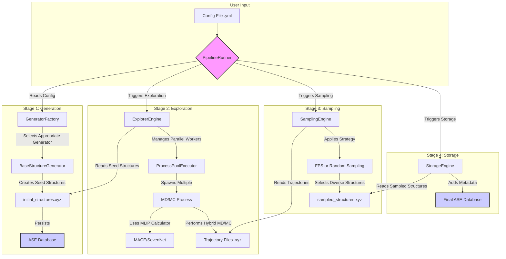

# System Architecture: MLIP-AutoPipe

## 1. Summary

The MLIP-AutoPipe (Machine Learning Interatomic Potential - Automated Pipeline) is a sophisticated, high-throughput software framework designed to automate the generation of physically-valid, diverse, and high-quality training data for next-generation Machine Learning Interatomic Potentials (MLIPs), such as MACE and SevenNet. The core philosophy of this project is to remove the human expert from the loop, replacing manual, intuition-driven data generation with a robust, reproducible, and intelligent automated workflow. Traditional methods for generating training data are often laborious, requiring significant domain expertise to select appropriate atomic configurations, run simulations, and curate the results. This manual process is not only a bottleneck in materials discovery but also introduces human bias and limits the exploration of the vast potential energy surface (PES). MLIP-AutoPipe directly addresses these challenges by providing a comprehensive, end-to-end pipeline that spans from initial structure creation to intelligent data sampling and final database curation.

The system is engineered to handle a wide array of physical systems, demonstrating its versatility and broad applicability in computational materials science. It supports the generation of complex structures including multi-component alloys, ionic crystals with charge-neutrality constraints, covalent materials, heterogeneous interfaces, and surface adsorption systems. Furthermore, it incorporates knowledge-based generation, leveraging crystallographic databases and symmetry principles to create realistic initial seed structures from simple chemical formulas. The heart of the pipeline lies in its exploration phase, which employs a powerful hybrid Molecular Dynamics (MD) and Monte Carlo (MC) engine. This is not a simple random structure generator; it simulates the actual thermodynamic evolution of a material, allowing it to explore accessible regions of the phase space. By simulating at elevated temperatures and applying various perturbations, the system is designed to efficiently discover high-energy configurations, transition states, and other "hard" cases where MLIPs are most likely to fail, thereby generating data that provides the highest learning value. The pipeline is architected as a modular, four-step sequence: Generation, Exploration, Sampling, and Storage. This design ensures a clear separation of concerns, enhances maintainability, and allows for future extensibility. Each stage is state-isolated, with intermediate results checkpointed to disk, making the entire workflow resilient to failures and interruptions. This robust design is critical for long-running, computationally intensive simulations. The framework is built with both automation and user interaction in mind, featuring a primary Command-Line Interface (CLI) for batch processing and a secondary Web UI for interactive configuration and visualization, catering to both production environments and research workflows. By integrating advanced techniques like Farthest Point Sampling (FPS) for data diversity and physics-based validation at every step, MLIP-AutoPipe represents a significant leap forward in the automation of computational materials science, aiming to accelerate the development and deployment of highly accurate MLIPs.

## 2. System Design Objectives

The primary objective of MLIP-AutoPipe is to deliver a fully automated, reliable, and efficient pipeline for MLIP training data generation. The design is guided by a set of core principles and goals aimed at maximizing scientific value, ensuring robustness, and providing a seamless user experience.

**Goals:**
1.  **Automation:** The foremost goal is to minimize manual intervention. The entire workflow, from defining a physical system to generating a final, curated database of atomic structures, should be executable via a single command with a declarative configuration file. This includes intelligent, automated decision-making, such as the automatic switching between NPT and NVT ensembles based on the detection of a vacuum layer.
2.  **Physical Validity:** Every structure generated by the pipeline must be physically realistic. This is enforced through a multi-layered validation strategy. Strict checks prevent atoms from overlapping unnaturally. For ionic systems, charge neutrality is maintained during atom swaps. The integration of the ZBL potential prevents unphysical atomic fusion at high temperatures, ensuring that even under extreme simulation conditions, the generated configurations represent plausible physical states.
3.  **Data Diversity and Quality:** The system must generate data that is not just random but maximally informative for training an MLIP. The objective is to explore the potential energy surface comprehensively. The hybrid MD/MC engine is designed to escape local energy minima and discover a wide range of configurations. The implementation of Farthest Point Sampling (FPS) is crucial, as it ensures that the final dataset is structurally diverse and avoids redundancy, leading to more efficient and robust model training.
4.  **Extensibility and Modularity:** The architecture must be modular to facilitate future expansion. The use of a factory pattern for structure generators allows new types of physical systems (e.g., polymers, amorphous materials) to be added with minimal changes to the core pipeline. The clear separation between the four main stages (Generation, Exploration, Sampling, Storage) allows each component to be developed, tested, and upgraded independently.
5.  **Robustness and Scalability:** The pipeline must be resilient to the inevitable failures that occur in long-running scientific simulations. This is achieved through progressive checkpointing, where simulation trajectories are continuously saved. The parallel execution of explorers using a process pool is designed to leverage multi-core architectures, ensuring the system can scale to handle large-scale data generation campaigns. Careful memory management, such as the "late binding" of MLIP calculators within worker processes, is a key design feature to prevent common issues in parallel high-performance computing.

**Constraints:**
1.  **Dependencies:** The system will rely on a curated set of established scientific Python libraries, primarily the Atomic Simulation Environment (ASE) for data structures, `pymatgen` for crystallographic logic, and MLIP packages like `mace-torch`. The choice of dependencies must be managed carefully to avoid conflicts and ensure long-term maintainability.
2.  **Performance:** While prioritizing physical accuracy, the simulations must be computationally tractable. The choice of MLIPs as the driving force for MD is a deliberate performance optimization over more accurate but slower DFT calculations. The parallelization strategy must be efficient to make high-throughput screening feasible on modern workstations and compute clusters.
3.  **User Interface:** The primary interface will be a command-line tool driven by a declarative configuration file (e.g., YAML format). This choice prioritizes automation and integration into larger computational workflows. A secondary, optional Web UI will be provided for interactive use cases but should not contain core logic.

## 3. System Architecture

The MLIP-AutoPipe framework is designed as a modular, multi-stage pipeline orchestrated by a central `PipelineRunner`. This architecture ensures a clean separation of concerns, with each component responsible for a specific task in the data generation workflow. Data flows sequentially through the stages, with outputs from one stage serving as inputs to the next. The entire process is designed for state isolation, with results persisted to the filesystem and a central database at critical checkpoints.



**Component Breakdown:**
1.  **PipelineRunner:** This is the central orchestrator. It reads the user's configuration file, initializes the necessary components for each stage, and executes the four stages in sequence. It manages the overall state of the workflow.
2.  **GeneratorFactory & Generators:** Based on the `system` type specified in the configuration (e.g., `alloy`, `ionic`), the `GeneratorFactory` instantiates the appropriate concrete generator class (e.g., `AlloyGenerator`, `IonicGenerator`). These generators are responsible for creating the initial set of seed structures. They incorporate physical validation logic, such as checking for atomic overlaps and ensuring supercell dimensions are adequate.
3.  **ExplorerEngine:** This component manages the high-level logic for the exploration phase. It reads the seed structures and distributes the simulation tasks across a pool of worker processes managed by `ProcessPoolExecutor`.
4.  **MD/MC Process:** Each worker process executes an independent simulation run. This is where the core computational work happens. The process initializes an MLIP calculator (late binding) and runs a hybrid MD/MC simulation. It implements features like automatic ensemble switching (NVT/NPT) and integrates the ZBL potential for stability. Trajectories are progressively written to disk to prevent data loss.
5.  **SamplingEngine:** After the exploration phase generates a large number of structures, the `SamplingEngine` is tasked with selecting a smaller, more diverse subset. It can be configured to use simple random sampling or the more sophisticated Farthest Point Sampling (FPS) algorithm, which uses SOAP descriptors to maximize structural diversity.
6.  **StorageEngine:** This is the final stage in the pipeline. It takes the intelligently sampled structures, enriches them with relevant metadata (e.g., energy, forces, simulation parameters), and stores them in a structured, queryable format using the ASE database interface (backed by SQLite).

This component-based architecture ensures that the system is maintainable and extensible. For example, adding a new exploration technique would involve creating a new explorer class without modifying the `PipelineRunner` or other components. The data flow is unidirectional and checkpointed, enhancing the robustness and reproducibility of the data generation process.

## 4. Design Architecture

The software design emphasizes a clean separation of concerns, leveraging object-oriented principles and established design patterns. The file structure is organized to reflect the modular architecture, with distinct directories for generators, explorers, sampling logic, and data storage. Pydantic models will be used extensively for configuration and data validation, ensuring robustness and providing clear, self-documenting data structures.

**File Structure:**
```
src/mlip_autopipec/
├── __init__.py
├── cli.py                # Main CLI entry point (Typer)
├── config/
│   ├── __init__.py
│   └── models.py         # Pydantic models for configuration
├── generators/
│   ├── __init__.py
│   ├── base.py           # Abstract BaseGenerator class
│   ├── alloy.py          # Alloy structure generator
│   └── ionic.py          # Ionic structure generator
├── explorers/
│   ├── __init__.py
│   └── engine.py         # MD/MC exploration engine
├── sampling/
│   ├── __init__.py
│   └── fps.py            # Farthest Point Sampling implementation
├── storage/
│   ├── __init__.py
│   └── database.py       # ASE Database wrapper
└── pipeline.py           # Core PipelineRunner orchestrator
```

**Key Class Definitions:**
*   **`config.models.FullConfig` (Pydantic Model):** A top-level Pydantic model that contains the entire configuration for a pipeline run. It will have nested models for `SystemConfig`, `ExplorationConfig`, `SamplingConfig`, etc. This provides static validation of the user's input configuration file.
*   **`generators.base.BaseStructureGenerator` (ABC):** An abstract base class that defines the common interface for all structure generators. It will have a concrete method `generate()` and abstract methods for specific logic. It will also encapsulate shared validation logic like the `overlap_check`.
*   **`explorers.engine.ExplorerEngine`:** This class will contain the logic to set up and run the parallel MD simulations. It will not contain the simulation logic itself but will manage the `ProcessPoolExecutor` and coordinate the distribution of tasks to worker functions.
*   **`pipeline.PipelineRunner`:** The main orchestrator class. It will be initialized with a `FullConfig` object. It will have methods like `run_generation()`, `run_exploration()`, etc., that encapsulate the logic for each stage of the pipeline, calling the appropriate service classes (generators, explorers) as needed.

**Data Models:**
The primary data objects passed between components will be `ase.Atoms` objects. These objects are a standard in the computational materials science community and contain all necessary information about an atomic structure (atomic numbers, positions, cell, etc.). For storing results, a custom Pydantic model `DFTResult` might be defined to structure the output data, including energy, forces, and stress, before it is serialized into the ASE database's `data` column. This ensures that the data being stored is well-defined and validated.

This design promotes code that is testable, maintainable, and extensible. By using abstract base classes and dependency injection (e.g., passing a generator instance to the `PipelineRunner`), the components are loosely coupled. The extensive use of Pydantic for configuration ensures that a large class of errors (invalid input parameters) are caught early, before any expensive computations begin.

## 5. Implementation Plan

The project will be developed over two distinct, sequential cycles. This iterative approach allows for the delivery of core functionality first, followed by the addition of more advanced features and user interface enhancements.

### CYCLE 01: Core Engine and Structure Generation
This foundational cycle focuses on building the backbone of the pipeline. The goal is to have a functioning command-line tool that can generate initial structures for alloys and ionic crystals and run the basic exploration simulation. This cycle will deliver a minimal viable product (MVP) that is already useful for generating simple datasets.

**Features:**
1.  **Project Scaffolding:** Set up the basic directory structure, `pyproject.toml` with dependencies (`ase`, `typer`, `pydantic`, `pymatgen`), and initial CI/CD configuration.
2.  **Configuration System:** Implement the Pydantic-based configuration models in `config/models.py`. This will define the schema for all user-configurable parameters.
3.  **CLI Entry Point:** Create the initial command-line interface in `cli.py` using Typer. It will have a single command `run` that takes a path to a configuration YAML file.
4.  **Structure Generators:** Implement the `BaseStructureGenerator` abstract class. Create two concrete implementations: `AlloyGenerator` for generating random multi-component alloys, and `IonicGenerator` for creating charge-neutral ionic crystals. This includes the essential physics validation checks.
5.  **Pipeline Orchestrator:** Develop the initial `PipelineRunner` in `pipeline.py`. It will be responsible for parsing the configuration and executing the "Generation" stage of the pipeline.
6.  **Basic Exploration Engine:** Implement a simplified version of the `ExplorerEngine`. It will run MD simulations in parallel using `ProcessPoolExecutor`. For this cycle, it will focus on running basic NVT simulations without the advanced features like automatic ensemble switching or hybrid MC.
7.  **Database Wrapper:** Create a simple wrapper in `storage/database.py` to handle writing the generated and explored structures to an ASE database.

### CYCLE 02: Advanced Exploration, Sampling, and User Interface
Building upon the foundation of Cycle 01, this cycle will introduce the more advanced and scientifically sophisticated features of the pipeline. The focus will be on enhancing the quality and diversity of the generated data and improving the usability of the tool.

**Features:**
1.  **Advanced Exploration:** Enhance the `ExplorerEngine` to include the hybrid MD/MC capabilities. This includes implementing the atom swap and vacancy hop Monte Carlo moves. The logic for automatic NVT/NPT ensemble switching based on vacuum detection will be implemented. The integration of the ZBL potential will also be completed.
2.  **Intelligent Sampling:** Implement the `SamplingEngine`. This includes creating a random sampler and, most importantly, the Farthest Point Sampling (FPS) implementation using SOAP descriptors to select a diverse subset of structures from the exploration trajectories.
3.  **Full Pipeline Integration:** Update the `PipelineRunner` and `cli.py` to execute all four stages of the pipeline in sequence: Generation, Exploration, Sampling, and Storage.
4.  **Web UI:** Develop a simple, secondary Web UI (e.g., using Streamlit or Flask) that allows users to interactively build the configuration file. The UI will provide a graphical way to set parameters and will include visualization of the generated structures. This UI will generate a valid YAML file that can then be used with the main CLI.
5.  **Enhanced Testing and Documentation:** Add comprehensive integration tests that cover the full end-to-end pipeline. Improve the documentation, providing tutorials and detailed explanations of the various configuration parameters.

## 6. Test Strategy

The testing strategy is designed to ensure the reliability, correctness, and physical validity of the generated data. It combines unit tests for individual components, integration tests for the pipeline workflow, and end-to-end user acceptance tests.

### CYCLE 01: Core Engine and Structure Generation
The testing for the first cycle will focus on verifying the core components and the initial pipeline integration.
*   **Unit Testing:**
    *   **Configuration:** Test the Pydantic models to ensure they correctly parse valid configuration files and raise validation errors for invalid inputs (e.g., negative temperatures, incorrect element symbols).
    *   **Generators:** For `AlloyGenerator` and `IonicGenerator`, unit tests will verify that the generated structures have the correct composition, density, and adhere to physical constraints (e.g., no overlapping atoms). Mocking will be used to isolate the generator logic from filesystem dependencies.
    *   **CLI:** The Typer test runner will be used to test the command-line interface, ensuring it handles arguments correctly and provides informative error messages.
    *   **Database:** Test the `AseDBWrapper` to confirm that it can correctly connect to a database, write `Atoms` objects, and read them back without data loss. These tests will use an in-memory SQLite database.
*   **Integration Testing:**
    *   An integration test will cover the workflow from reading a configuration file to running the generation stage and storing the initial structures in the database. This will verify that the `PipelineRunner` correctly wires together the configuration parser, the generator factory, and the database writer.
    *   A separate integration test will focus on the exploration engine, ensuring that it can correctly take a set of `Atoms` objects, run a short MD simulation for each in parallel, and produce trajectory files.

### CYCLE 02: Advanced Exploration, Sampling, and User Interface
Testing in the second cycle will build upon the first, adding coverage for the new, more complex features and the end-to-end workflow.
*   **Unit Testing:**
    *   **Advanced Explorer:** Unit tests will be added to verify the logic of the hybrid MD/MC moves. For example, a test will confirm that an atom swap move correctly exchanges the positions of two atoms of different species while preserving the total composition. The vacuum detection algorithm will be tested with known bulk and slab structures.
    *   **Sampling:** The FPS implementation will be tested with a small, well-defined set of structures to ensure it correctly calculates descriptors and selects the most diverse subset. The random sampler will be tested to ensure it selects the correct number of frames.
*   **Integration Testing:**
    *   The primary integration test will be an end-to-end test of the entire four-stage pipeline. It will use a minimal configuration file to run a short, complete workflow: generate a few seed structures, run a brief exploration, sample a handful of frames using FPS, and store the final results in the database. The test will then query the final database to assert that the number of structures and their metadata are correct.
*   **User Acceptance Testing (UAT):**
    *   UAT will be conducted using Jupyter Notebooks. These notebooks will guide a user (or an automated test runner) through realistic use cases. For example, a notebook will define a configuration for a binary alloy, run the full pipeline via the CLI, and then load the resulting ASE database. It will include cells to visualize the generated structures, plot the energy distribution, and analyze the diversity of the final dataset, thus providing a comprehensive validation of the project's ability to meet its scientific objectives.
