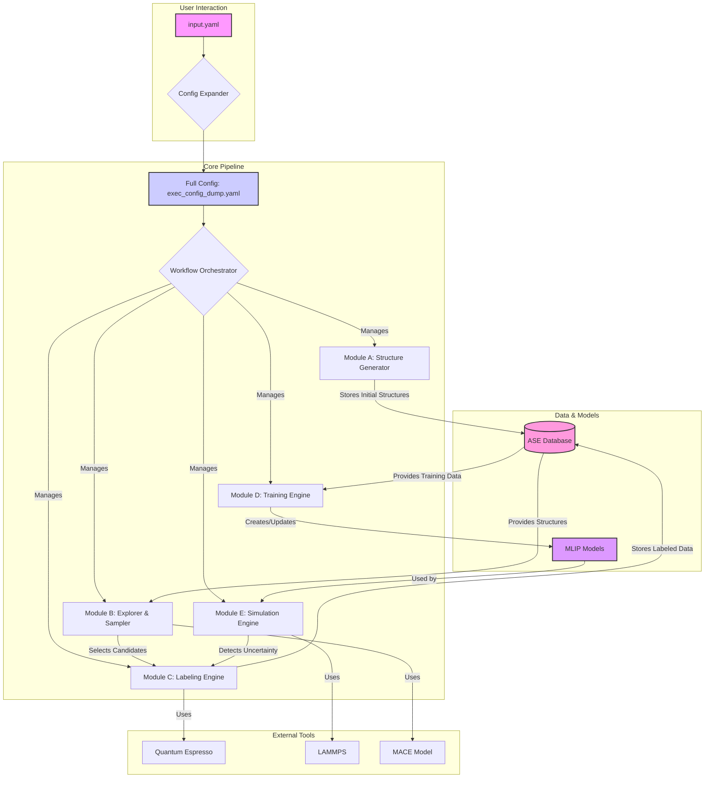

# SYSTEM_ARCHITECTURE.md

## 1. Summary

The MLIP-AutoPipe (Machine Learning Interatomic Potential - Automated Pipeline) system is a next-generation computational materials science platform designed to automate the entire lifecycle of creating, validating, and deploying high-fidelity interatomic potentials. The core philosophy of the project is "removing the human expert from the loop," addressing the most significant bottleneck in modern materials simulation: the reliance on expert intuition and manual intervention. Currently, the process of generating training data for MLIPs—deciding which atomic configurations to simulate under specific conditions—is a highly specialized and time-consuming task. This system replaces that ad-hoc process with a robust, physics-informed, and autonomous workflow. By leveraging a combination of physical heuristics, advanced sampling techniques, and active learning, MLIP-AutoPipe empowers researchers to generate bespoke, first-principles-accurate potentials simply by providing a material's composition.

The system is engineered to be a comprehensive solution, covering every stage from initial data generation to advanced, long-timescale simulations. It begins by programmatically generating a diverse and physically meaningful set of initial atomic structures without resorting to computationally expensive Ab Initio Molecular Dynamics (AIMD). It employs methods tailored to different material classes, such as Special Quasirandom Structures (SQS) for alloys and Normal Mode Sampling (NMS) for molecules. The pipeline then uses a state-of-the-art universal potential, MACE, as a surrogate model to rapidly explore a vast configuration space, identifying unique and informative structures for expensive quantum mechanical calculations.

Labelling is handled by an automated engine that interfaces with Quantum Espresso, a widely-used DFT code. This module intelligently manages calculation parameters, ensuring robust and high-quality results without manual tuning. The training engine implements a "Delta Learning" approach, where the MLIP learns the difference between a simple physical baseline potential and the true DFT energies, leading to more accurate and stable models. The final, and most innovative, stage is the deployment of the trained potential in an "on-the-fly" simulation loop. Here, the system actively monitors the simulation for excursions into uncharted atomic configurations, automatically triggers new DFT calculations to label these new configurations, and retrains the potential, creating a self-improving, autonomous learning cycle. This enables the exploration of complex phenomena like phase transitions and diffusion over timescales far exceeding what is possible with direct AIMD. The entire workflow is managed by a sophisticated orchestrator, ensuring seamless data flow and traceability through a centralized database, making the process reproducible and transparent.

## 2. System Design Objectives

The primary objective of the MLIP-AutoPipe system is to democratize the creation of high-quality machine learning potentials, making them accessible to a broader range of scientists and engineers, not just computational physics experts. This is achieved through a set of carefully defined design goals that prioritize automation, robustness, efficiency, and extensibility.

**Automation and User Experience:** The foremost goal is to create a zero-touch pipeline. The user interaction is intentionally minimized to specifying the material composition and the desired simulation conditions (e.g., temperature range). All subsequent steps—parameter selection for DFT calculations, choice of sampling strategy, hyperparameter tuning for the MLIP, and active learning decisions—are handled autonomously by the system. This objective directly supports the core philosophy of eliminating the human expert from the repetitive and error-prone tasks of data generation and model training.

**Physical Robustness and Accuracy:** The system is designed to be grounded in physical principles. Instead of relying on purely data-driven black-box methods, it incorporates domain knowledge at every stage. Initial structures are generated based on physical heuristics appropriate for the material type (alloy, molecular, ionic). The active learning loop is guided by uncertainty quantification, a principled way to identify regions where the model's predictions are unreliable. The "Delta Learning" strategy ensures that the MLIP correctly captures fundamental physical interactions, such as short-range repulsion, by building upon a simple, known physical potential. The objective is to produce potentials that are not only accurate within their training domain but also behave physically reasonably when extrapolating.

**Computational Efficiency:** A major constraint in materials simulation is the immense computational cost of first-principles calculations. A key design objective is to minimize the number of expensive DFT calculations required to train a high-quality potential. This is achieved through a multi-pronged strategy: using a fast surrogate model (MACE) to pre-screen candidates, employing intelligent sampling (DIRECT) to select the most informative data points, and using an active learning loop that focuses computational resources only on new, previously unseen configurations. By avoiding redundant calculations and focusing on information-rich data, the system aims to reduce the time-to-solution for generating a reliable potential by an order of magnitude or more compared to traditional methods.

**Modularity and Extensibility:** The field of materials informatics is rapidly evolving, with new algorithms and models constantly emerging. The system architecture is therefore designed to be highly modular and loosely coupled. Each component (Structure Generator, Explorer, Labeling Engine, etc.) is a distinct module with a well-defined interface. This allows for future upgrades and substitutions with minimal disruption. For example, the Quantum Espresso labeling engine could be swapped for another DFT code, or a new MLIP model architecture could be integrated into the training engine. This ensures the long-term viability and relevance of the platform, allowing it to incorporate state-of-the-art methods as they become available.

## 3. System Architecture

The MLIP-AutoPipe system is designed as a modular, five-stage pipeline orchestrated by a central workflow manager. Data persistence and traceability are managed through an ASE (Atomic Simulation Environment) database, which acts as the single source of truth for all structures, calculations, and model parameters.



**Component Breakdown:**

1.  **Config Expander:** This initial component is a heuristic engine that translates the user's high-level `input.yaml` into a comprehensive `exec_config_dump.yaml`. It analyzes the elemental composition to infer material type, selects appropriate DFT parameters based on established protocols (like SSSP), and sets up default simulation parameters, effectively codifying expert knowledge.

2.  **Workflow Orchestrator:** This is the central nervous system of the pipeline. It reads the full configuration file and directs the execution flow, passing data between the different modules. It is responsible for initiating each stage, handling dependencies, and managing the overall state of the workflow.

3.  **Module A: Structure Generator:** This module is responsible for creating the initial seed data for the MLIP. It does not perform any DFT calculations. Instead, it uses fast, physically-motivated algorithms to generate a diverse set of structures. This includes SQS for alloys, Normal Mode Sampling for molecules, AIRSS for ionic materials, and Melt-Quench techniques for covalent systems.

4.  **Module B: Explorer & Sampler:** This module takes the initial structures and uses a pre-trained, general-purpose surrogate model (MACE) to rapidly explore the potential energy surface. It runs large-scale MD simulations with the fast surrogate to generate millions of configurations, which are then clustered based on structural similarity. A DIRECT sampling algorithm selects a small, representative, and information-rich subset of these configurations to be passed to the expensive labeling engine.

5.  **Module C: Labeling Engine:** This module acts as a robust, automated interface to a DFT code (Quantum Espresso). It receives atomic structures, automatically generates the necessary input files with appropriate parameters (k-points, cutoffs, smearing), executes the calculation, parses the output to extract energy, forces, and stress, and handles common errors and convergence issues automatically.

6.  **Module D: Training Engine:** This module takes the DFT-labeled data from the database and trains the MLIP. It implements the Delta Learning strategy, fitting the model to the residual between a baseline physical potential (like Lennard-Jones) and the DFT data. It also includes logic for hyperparameter optimization to ensure the best possible model is trained.

7.  **Module E: Simulation Engine:** This is the active learning and deployment component. It uses the trained MLIP within a simulation engine like LAMMPS to run large-scale MD or kMC simulations. Crucially, it incorporates an "on-the-fly" uncertainty quantification mechanism. When the simulation enters a configuration where the MLIP's prediction is uncertain, this module traps the configuration, sends it back to the Labeling Engine for DFT calculation, and triggers the Training Engine to retrain and improve the model.

8.  **ASE Database:** This is the central data repository. It stores every atomic structure, its corresponding DFT labels, provenance information (how it was generated), and metadata. This ensures data integrity, reproducibility, and allows for efficient querying and data reuse.

## 4. Design Architecture

The project follows a modern Python project structure, emphasizing modularity and clear separation of concerns. The core logic is encapsulated within the `mlip_autopipec` package, located in the `src/` directory.

**File Structure:**

```
.
├── dev_documents/
├── src/
│   └── mlip_autopipec/
│       ├── __init__.py
│       ├── cli.py              # Main entry point (Click-based CLI)
│       ├── configs/
│       │   └── __init__.py
│       │   └── models.py       # Pydantic models for configuration files
│       ├── data/
│       │   ├── __init__.py
│       │   └── database.py     # ASE Database wrapper and data management
│       ├── modules/
│       │   ├── __init__.py
│       │   ├── a_structure_generator.py
│       │   ├── b_explorer_sampler.py
│       │   ├── c_labeling_engine.py
│       │   ├── d_training_engine.py
│       │   └── e_simulation_engine.py
│       ├── utils/
│       │   ├── __init__.py
│       │   └── dft_utils.py    # Helpers for DFT input/output parsing
│       └── workflow.py         # The Workflow Orchestrator logic
├── tests/
│   ├── e2e/
│   ├── property/
│   └── unit/
├── pyproject.toml
└── README.md
```

**Data Models (Pydantic-based):**

The system's configuration is strictly defined by Pydantic models located in `src/mlip_autopipec/configs/models.py`. This ensures type safety, validation, and provides a clear data contract for the entire application.

*   `SystemConfig`: Defines the physical system (elements, composition).
*   `SimulationConfig`: Defines the simulation parameters (temperature, active learning strategy).
*   `DFTComputeConfig`: Specifies all parameters for the DFT engine, including the code, command, pseudopotentials, and convergence settings.
*   `MLIPTrainingConfig`: Contains settings for the training process, such as the model type, cutoff radius, and loss function weights.
*   `MainConfig`: The top-level model that aggregates all other configuration models. This corresponds to the `exec_config_dump.yaml`.

**Class/Function Overview:**

*   `cli.py`: Implements the main command-line interface using `click`. The primary command `mlip-pipe` will take the `input.yaml` as an argument.
*   `workflow.py`: Contains the `WorkflowOrchestrator` class. This class is instantiated in the CLI and is responsible for loading the configuration and executing the main pipeline logic in sequence.
*   `configs/models.py`: Defines the Pydantic models mentioned above. It will also contain a `ConfigExpander` class responsible for the heuristic logic that converts the minimal `input.yaml` to the full `exec_config_dump.yaml`.
*   `data/database.py`: Implements a wrapper around the ASE Db, providing higher-level methods for adding/retrieving structures, querying by state (e.g., 'unlabeled', 'labeled'), and managing metadata.
*   `modules/`: Each file corresponds to a module in the system architecture. It will contain a primary class (e.g., `StructureGenerator`, `LabelingEngine`) that encapsulates the logic for that stage of the pipeline. These classes will be instantiated and called by the `WorkflowOrchestrator`.
*   `utils/dft_utils.py`: Contains helper functions for interacting with DFT codes, such as functions to parse Quantum Espresso output files to extract forces and energies, or to generate input files from ASE `Atoms` objects.

This architecture ensures that the core logic of each pipeline stage is isolated, making it easy to test, maintain, and upgrade individual components independently. The orchestrator acts as a coordinator, ensuring that these components work together seamlessly.

## 5. Implementation Plan

The project will be developed over five distinct cycles, each focusing on a logical subset of the total functionality. This phased approach allows for incremental development, testing, and delivery.

**Cycle 01: Core Engine - Automated Labeling and Training**
This foundational cycle focuses on creating the essential components for a non-active learning workflow. The goal is to establish a pipeline that can take a set of pre-existing atomic structures, label them using DFT, and train a basic MLIP.
*   **Features:**
    *   Implement the Pydantic models for configuration (`configs/models.py`).
    *   Develop the ASE Database wrapper (`data/database.py`) for data persistence.
    *   Implement the `LabelingEngine` (`modules/c_labeling_engine.py`) with a robust interface to Quantum Espresso, including automated parameter setting and error handling.
    *   Implement the `TrainingEngine` (`modules/d_training_engine.py`) to train an ACE model using the Delta Learning approach.
    *   Create the initial `WorkflowOrchestrator` (`workflow.py`) to connect these components.
    *   Develop the basic CLI (`cli.py`) to run this linear workflow.

**Cycle 02: Structure Generation and Configuration Expansion**
This cycle builds upon the core engine by automating the initial steps of the workflow: configuration and data generation. The goal is to remove the need for the user to provide initial structures.
*   **Features:**
    *   Develop the `ConfigExpander` logic to translate a minimal `input.yaml` into a full `exec_config_dump.yaml`.
    *   Implement `Module A: StructureGenerator` (`modules/a_structure_generator.py`) with initial support for SQS for alloys and NMS for molecules, based on the automatically determined material type.
    *   Integrate the `StructureGenerator` into the `WorkflowOrchestrator`.

**Cycle 03: Surrogate-Based Exploration and Sampling**
This cycle introduces the concept of efficient exploration, aiming to drastically reduce the number of DFT calculations needed.
*   **Features:**
    *   Integrate the MACE universal potential as a surrogate model.
    *   Implement `Module B: Explorer & Sampler` (`modules/b_explorer_sampler.py`). This includes running MD with MACE to generate a large trajectory.
    *   Implement the descriptor calculation (e.g., SOAP) and the DIRECT sampling algorithm to select a diverse subset of structures for labeling.
    *   Optimize performance-critical parts of the sampling process using Numba.

**Cycle 04: Active Learning and On-the-Fly Simulation**
This is the most advanced cycle, closing the loop to create a fully autonomous, self-improving system.
*   **Features:**
    *   Implement `Module E: SimulationEngine` (`modules/e_simulation_engine.py`) to run MD or kMC simulations with the trained MLIP using LAMMPS.
    *   Develop the on-the-fly uncertainty quantification mechanism.
    *   Implement the logic to trap high-uncertainty structures and send them back to the `LabelingEngine`.
    *   Modify the `WorkflowOrchestrator` to handle this iterative, non-linear loop, allowing the model to be retrained multiple times within a single run.
    *   Implement advanced boundary treatment for cluster extraction to ensure physical realism.

**Cycle 05: Advanced Features and Usability**
The final cycle focuses on refining the system, adding more advanced physics, and improving the user experience.
*   **Features:**
    *   Enhance `StructureGenerator` with support for Ionic (AIRSS) and Covalent (Melt-Quench) materials.
    *   Implement advanced features in the `LabelingEngine`, such as automatic handling of magnetism and Spin-Orbit Coupling.
    *   Refine the kMC implementation in the `SimulationEngine` with tiered rate calculations for efficiency.
    *   Improve documentation, add tutorials, and enhance the CLI with more user-friendly outputs and progress indicators.

## 6. Test Strategy

The testing strategy is designed to be comprehensive, covering all levels of the software stack from individual functions to the full end-to-end workflow. Testing is integrated into each development cycle.

**Unit Testing:**
Each module will have a corresponding suite of unit tests located in `tests/unit/`. The primary goal is to test components in isolation.
*   **Approach:** External dependencies such as the file system, database, and actual DFT/MD codes will be mocked using libraries like `pytest-mock`. For example, when testing the `LabelingEngine`, `subprocess.run` will be patched to return pre-defined Quantum Espresso output, allowing verification of the parsing logic without actually running DFT.
*   **Cycle 01:** Write unit tests for the database wrapper (mocking `ase.db.connect`), the `LabelingEngine`'s output parser, and the `TrainingEngine`'s interaction with the ACE library.
*   **Cycle 02:** Test the `ConfigExpander`'s heuristic logic with various minimal inputs. Test the `StructureGenerator`'s output for different material types to ensure it produces valid `Atoms` objects.
*   **Cycle 03:** Test the DIRECT sampling algorithm with known datasets to ensure correctness. Test the performance of Numba-optimized functions.
*   **Cycle 04:** Test the uncertainty quantification logic with mock model outputs. Test the cluster extraction and boundary treatment algorithms.
*   **Cycle 05:** Add tests for the new structure generation methods and advanced DFT features.

**Integration Testing:**
Integration tests will verify the interaction and data flow between different modules of the pipeline. These will be located in `tests/e2e/`.
*   **Approach:** These tests will use a real (but small and temporary) ASE database and will involve limited, controlled calls to external codes where necessary. For example, testing the link between the `Explorer` and `LabelingEngine` will involve writing candidate structures to the test database and verifying that the `LabelingEngine` correctly retrieves and processes them.
*   **Cycle 01:** Create a test that verifies the orchestrator can successfully run the `LabelingEngine` and then the `TrainingEngine`, passing data correctly through the test database.
*   **Cycle 02:** Test the flow from `ConfigExpander` to `StructureGenerator` to the database.
*   **Cycle 03:** Test the integration of the `Explorer & Sampler` with the database and the `LabelingEngine`.
*   **Cycle 04:** Design a test for a single, complete active learning loop, using a mock model that returns high uncertainty for a specific structure to trigger the retraining pathway.

**End-to-End (E2E) / User Acceptance Testing (UAT):**
E2E tests will validate the entire workflow from a user's perspective, running the full pipeline on small, well-understood physical systems. These tests also serve as the basis for the UAT defined in the `UAT.md` files for each cycle.
*   **Approach:** These tests will use the `click.testing.CliRunner` to invoke the command-line interface with a minimal `input.yaml` for a simple system (e.g., a Si diamond cell or an Ar dimer). They will run actual, albeit very fast, DFT and MD calculations. The tests will assert that the pipeline completes successfully and that the final output (e.g., a trained model file, simulation trajectory) is created and has the expected properties.
*   **Cycle 01:** A UAT to demonstrate that a set of provided Si structures can be labeled and a model trained.
*   **Cycle 02:** A UAT to show that providing `input.yaml` with `elements: ["Si"]` automatically generates initial structures and runs the workflow.
*   **Cycle 03 & 04:** A UAT for an FePt alloy, demonstrating the surrogate exploration and a single iteration of the active learning loop.
*   **Cycle 05:** UATs demonstrating the new features on appropriate material systems.
The test suite will be run automatically via CI on every commit to ensure that new changes do not introduce regressions.
