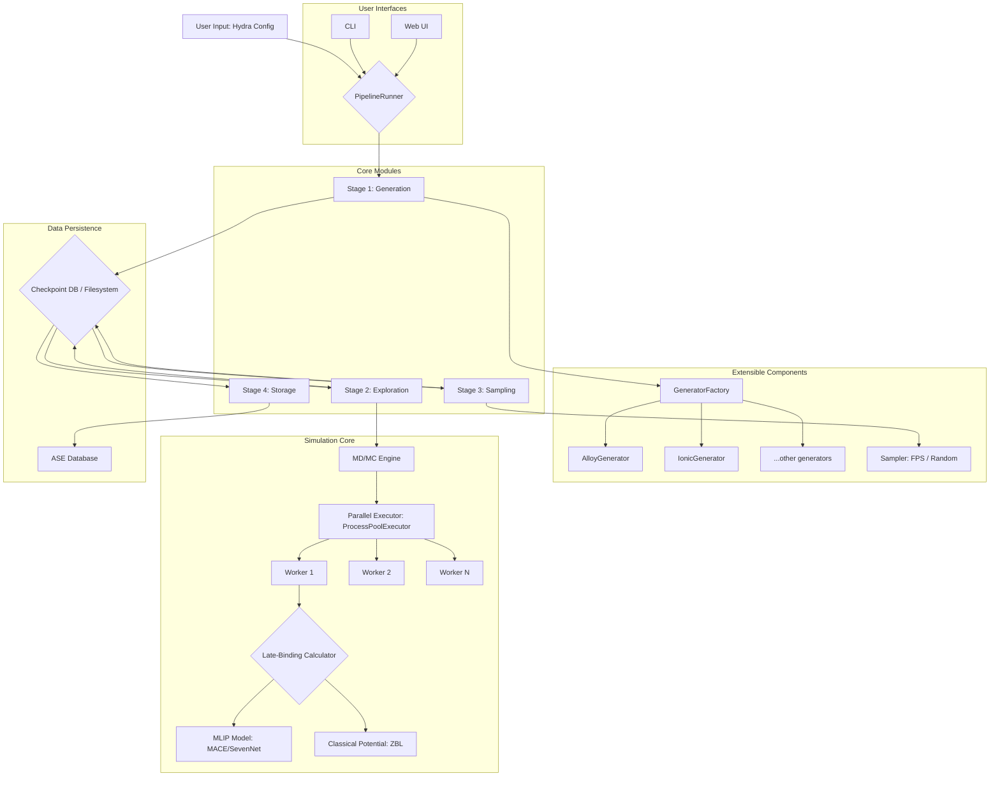

# SYSTEM ARCHITECTURE: MLIP-AutoPipe

## 1. Summary

MLIP-AutoPipe is a sophisticated, automated software framework designed to generate high-quality, diverse, and physically valid datasets for training modern Machine Learning Interatomic Potentials (MLIPs), such as MACE and SevenNet. The core philosophy of the project is to "remove the human expert from the loop" by creating a fully automated pipeline that encapsulates the complex domain knowledge of computational materials science. The system intelligently explores the thermodynamic phase space of a given material system to produce atomic configurations that are crucial for creating robust and accurate potential models. This includes not only stable, low-energy structures but also high-energy configurations, transition states, and defective structures, which are often the "hard cases" where MLIPs tend to fail.

The framework is architected as a modular, four-stage pipeline. The first stage, **Generation**, is responsible for creating initial "seed" structures based on user-defined physical parameters (e.g., chemical composition, crystal structure). It supports a wide range of material systems, including multi-component alloys, ionic crystals with charge balancing, covalent materials, interfaces, and surface adsorption systems. A key feature is its ability to generate structures from chemical formulas using crystallographic databases and symmetry logic. Crucially, all generated structures undergo rigorous physical validation to ensure that atomic distances are reasonable and that the simulation cell is sufficiently large to avoid self-interaction artifacts under periodic boundary conditions.

The second stage, **Exploration**, is the scientific heart of the system. It takes the initial structures and subjects them to simulated thermodynamic processes to explore a vast configuration space. This is achieved through advanced techniques like Molecular Dynamics (MD) simulations and a novel hybrid MD/Monte Carlo (MC) engine. The hybrid engine can perform not only standard MD steps but also MC moves like atomic swaps (for alloy configuration sampling) and vacancy-assisted hops, mimicking diffusion. A standout feature is the "Auto Ensemble Switching" capability, which automatically detects the nature of the system (e.g., bulk vs. slab with a vacuum) and applies the correct thermodynamic ensemble (NPT for bulk, NVT for slabs) to prevent simulation artifacts. This stage is designed for high-temperature simulations to actively seek out high-energy regions of the potential energy surface, which is a form of implicit active learning.

The third stage, **Sampling**, addresses the challenge of data redundancy. The exploration phase can generate millions of atomic configurations, many of which are highly correlated. This stage employs intelligent down-sampling techniques to select a small, information-rich subset of structures. Beyond simple random sampling, it implements Farthest Point Sampling (FPS) based on the SOAP (Smooth Overlap of Atomic Positions) descriptor. FPS is a powerful method that ensures the selected structures are maximally diverse in a chemical and structural sense, which is highly beneficial for MLIP training.

Finally, the fourth stage, **Storage**, archives the curated dataset into a robust, queryable database. It uses the Atomic Simulation Environment (ASE) database format, which is a standard in the materials science community. Each structure is stored with rich metadata, including its origin, energy, forces, and other relevant simulation parameters, ensuring traceability and reusability. The entire pipeline is configurable via the Hydra framework, offering exceptional flexibility, and is designed for parallel execution to leverage modern multi-core computing resources. The project aims to provide both a powerful command-line interface (CLI) for batch processing and an intuitive web-based graphical user interface (Web UI) for interactive exploration and visualization.

## 2. System Design Objectives

The primary objective of MLIP-AutoPipe is to dramatically accelerate the development of high-fidelity Machine Learning Interatomic Potentials by automating the most time-consuming and expertise-intensive step: training data generation. The system is designed to be a "fire-and-forget" tool that can be operated by non-experts, yet powerful enough to produce datasets that rival or exceed the quality of those curated manually by domain scientists.

**Goals:**
1.  **Automation and Robustness:** To create a fully automated, end-to-end pipeline that can run for extended periods without human intervention. This necessitates robust error handling, automatic recovery from simulation failures (e.g., "Coulomb explosions"), and intelligent, physics-aware decision-making within the simulation engine itself. The system must be able to handle unexpected physical phenomena gracefully.
2.  **Physical Validity:** To ensure that every single atomic structure generated by the pipeline is physically realistic. This involves implementing a multi-layered validation strategy, from basic checks on interatomic distances to sophisticated detection of simulation artifacts like unintended vacuum layer collapse. The integration of the ZBL potential to handle short-range repulsive interactions is a key component of this goal.
3.  **Data Diversity and Quality:** The system must go beyond generating simple, stable structures. The core objective is to explore the potential energy surface comprehensively, actively seeking out diverse configurations including high-energy states, defects, and transition pathways. The use of high-temperature hybrid MD/MC and FPS sampling are central to achieving this.
4.  **Extensibility and Generality:** The framework must be easily extensible to new types of materials and new simulation techniques. The design uses a factory pattern and a modular architecture, where new structure generators or exploration algorithms can be added with minimal code changes. It aims to support a wide variety of systems out-of-the-box, from simple alloys to complex interfaces.
5.  **Usability and Accessibility:** To cater to a broad user base, the system will provide two primary interfaces. A powerful CLI for experts and for integration into larger computational workflows, and an intuitive Web UI for students, educators, and researchers who prefer a more visual and interactive approach.

**Constraints:**
1.  **Computational Resources:** The exploration stage is computationally intensive. The system must be designed for efficient parallelization on multi-core CPUs. GPU acceleration is a consideration, but the design must account for the complexities of managing GPU resources in a multi-process environment.
2.  **Dependencies:** The project relies on a stack of established scientific Python libraries, including ASE, PyTorch (for MLIP models), and Hydra. The system's environment must be well-defined and reproducible.
3.  **Third-Party Potentials:** The accuracy of the exploration phase is contingent on the quality of the pre-trained MLIP model used. The system is a tool to *generate data* for a new potential, but it often needs an existing, approximate potential to guide the exploration.

**Success Criteria:**
1.  The system can successfully generate a database of at least 1,000 unique and physically valid structures for a given ternary alloy system from a simple configuration file, without crashing.
2.  A new MLIP trained exclusively on a dataset generated by MLIP-AutoPipe demonstrates a lower prediction error on a benchmark task compared to an MLIP trained on a dataset of equivalent size generated by random perturbations.
3.  A user can successfully install the software and run a complete data generation workflow using the CLI by following a 5-minute quick-start guide.
4.  The Web UI allows a user to define a new material system, launch a generation job, and visualize the resulting structures in 3D within the browser.

## 3. System Architecture

The MLIP-AutoPipe framework is designed as a monolithic but modular system, orchestrated by a central `PipelineRunner`. The architecture emphasizes a clear separation of concerns, with distinct modules for each stage of the data generation process. Data flows sequentially through these stages, with intermediate results checkpointed to the filesystem and a central database to ensure fault tolerance and state isolation.



**Data Flow and Components:**

1.  **User Interfaces (CLI/Web UI):** The user interacts with the system through one of two entry points. The CLI is the primary interface for automated, batch-driven workflows. The Web UI provides an interactive experience. Both interfaces are responsible for gathering user parameters and launching the `PipelineRunner`.
2.  **PipelineRunner:** This is the central orchestrator. It reads the configuration and executes the four stages (Generation, Exploration, Sampling, Storage) in sequence. It manages the overall workflow and handles high-level logic, such as resuming from a previous run.
3.  **Generation Stage:**
    *   **GeneratorFactory:** Based on the configuration, this factory dynamically selects the appropriate generator module for the specified material system (e.g., `AlloyGenerator` for `system_type: alloy`).
    *   **Generators (`BaseGenerator` subclasses):** These modules contain the specific logic for creating initial atomic structures. They perform critical physics-based validation, such as checking for atomic overlaps and ensuring the simulation cell is large enough.
4.  **Exploration Stage:**
    *   **MD/MC Engine:** This is the core computational engine. It implements the logic for running simulations. Its key responsibilities include managing the simulation parameters (temperature, pressure), performing MD time steps, and executing MC moves. It contains the sophisticated "Auto Ensemble Switching" and "ZBL Mixing" logic.
    *   **Parallel Executor:** To accelerate the exploration of multiple seed structures, the engine utilizes a `ProcessPoolExecutor` to run simulations in parallel across multiple CPU cores.
    *   **Late-Binding Calculator:** This is a crucial engineering pattern to avoid performance bottlenecks and errors. Instead of creating the computationally expensive MLIP model in the main process and pickling it for the workers, the calculator (which wraps the model) is instantiated *within* each worker process. This minimizes inter-process communication overhead and improves scalability.
5.  **Sampling Stage:** This stage processes the raw trajectory data from the exploration. It uses a `Sampler` class, which can be configured to use different strategies like Random Sampling or Farthest Point Sampling (FPS) to select a diverse subset of structures.
6.  **Storage Stage:** This final stage takes the sampled structures and commits them to the permanent ASE database, including all relevant metadata.
7.  **Data Persistence:** A central Checkpoint Database (and associated XYZ files) acts as the state-passing mechanism between stages. This decouples the stages and allows the pipeline to be stopped and resumed at any point. The final, curated data is stored in a separate, clean ASE database.

## 4. Design Architecture

The project follows a standard Python package structure. The core logic is encapsulated within the `mlip_autopipec` package.

**File Structure:**
```
src/mlip_autopipec/
├── cli/
│   └── main.py              # CLI entry point (Click-based)
├── web/
│   └── app.py               # Web UI entry point (e.g., Flask/FastAPI)
├── pipeline/
│   └── orchestrator.py      # Contains the main PipelineOrchestrator class
├── generators/
│   ├── __init__.py
│   ├── base.py              # Abstract BaseGenerator class
│   ├── factory.py           # GeneratorFactory
│   └── alloy.py             # AlloyGenerator implementation
│   └── ionic.py             # IonicGenerator implementation
│   └── ...                  # Other generator implementations
├── exploration/
│   ├── __init__.py
│   ├── engine.py            # Core MD/MC simulation engine
│   └── physics.py           # Advanced physics validation (e.g., detect_vacuum)
├── sampling/
│   ├── __init__.py
│   ├── base.py              # Abstract BaseSampler class
│   └── fps.py               # Farthest Point Sampler implementation
│   └── random.py            # Random Sampler implementation
├── storage/
│   ├── __init__.py
│   └── database.py          # ASE Database wrapper
├── config/
│   ├── __init__.py
│   └── schema.py            # Pydantic models for configuration validation
└── common/
    └── atoms_utils.py       # Utility functions for manipulating ASE Atoms objects
```

**Class/Function Definitions Overview:**

*   **`config.schema.py`:** Defines a set of Pydantic models that mirror the Hydra configuration structure. This provides static type checking and validation for all user inputs, preventing runtime errors due to misconfiguration.
*   **`pipeline.orchestrator.WorkflowOrchestrator`:** The central class that manages the entire workflow. Its main method, `run()`, will execute the four stages in order. It will be responsible for interacting with the database to get the state of the workflow and decide what to do next.
*   **`generators.base.BaseStructureGenerator` (ABC):** Defines the interface for all generator classes, with an abstract `generate()` method. It includes concrete implementations of common validation logic like `_check_overlap()` and `_ensure_supercell_size()`.
*   **`generators.factory.GeneratorFactory`:** A simple factory class with a `create_generator(system_config)` method that returns an instance of the appropriate generator.
*   **`exploration.engine.LabelingEngine`:** This class will perform the "labeling" task, which corresponds to the exploration phase. It will take a set of structures, run MD/MC simulations, and return the resulting trajectories. It will not have any knowledge of databases.
*   **`storage.database.AseDBWrapper`:** A dedicated class that encapsulates all interactions with the ASE database. It will provide methods like `add_initial_structures()`, `get_unlabeled_structures()`, and `save_labeled_results()`. This isolates database logic from the main pipeline logic.

**Data Models (Pydantic Schemas):**

The configuration of the entire system will be governed by a main Pydantic model, `FullConfig`, which is composed of smaller, nested models.

```python
# In src/mlip_autopipec/config/schema.py

from pydantic import BaseModel, Field
from enum import Enum

class SystemType(str, Enum):
    ALLOY = "alloy"
    IONIC = "ionic"

class SamplingMethod(str, Enum):
    RANDOM = "random"
    FPS = "fps"

class SystemConfig(BaseModel):
    system_type: SystemType
    elements: list[str]
    composition: dict[str, float]
    # ... other system-specific parameters

class ExplorationConfig(BaseModel):
    temperature_K: float = Field(..., gt=0)
    pressure_GPa: float | None = None
    # ... other exploration parameters

class SamplingConfig(BaseModel):
    method: SamplingMethod
    n_samples: int = Field(..., gt=0)
    # ... other sampling parameters

class FullConfig(BaseModel):
    system: SystemConfig
    exploration: ExplorationConfig
    sampling: SamplingConfig
    db_path: str
```

This schema-first approach ensures that all configuration is validated upfront, providing robustness and clear, self-documenting code.

## 5. Implementation Plan

The project will be developed over two distinct cycles.

**Cycle 1: Core Command-Line Pipeline and Foundational Components**

This cycle focuses on building the essential, non-interactive backbone of the application. The goal is to deliver a functional CLI that can perform the entire data generation workflow for the most common use case: generating alloy structures. The architecture will be built with the final vision in mind, using interfaces and factories, but the initial implementation will be minimal and focused.

*   **Pydantic Schemas:** Define the initial Pydantic models for the configuration (`FullConfig`, `SystemConfig`, etc.).
*   **Database Wrapper:** Implement the `AseDBWrapper` class with the essential methods needed for Cycle 1: initializing the database, adding structures, retrieving them, and marking them as processed.
*   **Structure Generator:** Implement the `BaseStructureGenerator` ABC and the concrete `AlloyGenerator`. This will include the core validation logic (overlap check, supercell sizing).
*   **Labeling Engine (Exploration):** Create a simplified version of the `LabelingEngine`. For this cycle, it might only perform basic MD using an existing potential like EMT (Effective Medium Theory), without the complex hybrid MD/MC features. The focus is on getting the parallel processing and late-binding calculator pattern working correctly.
*   **Orchestrator:** Implement the `WorkflowOrchestrator` to connect the components. It will execute the simplified Generate -> Explore -> Store sequence. Sampling will be limited to a basic random selection for this cycle.
*   **CLI:** Develop the main CLI entry point using `click`. The CLI will take a configuration file as input, instantiate the `WorkflowOrchestrator`, and run the pipeline.

**Cycle 2: Advanced Exploration, Sampling, and Web UI**

This cycle builds upon the solid foundation of Cycle 1, introducing the advanced scientific features that make the tool truly powerful, as well as the user-friendly Web UI.

*   **Advanced Labeling Engine:** Enhance the `LabelingEngine` to become a full-fledged hybrid MD/MC engine. This includes implementing the logic for atomic swaps, vacancy hops, auto ensemble switching, and ZBL potential mixing.
*   **Advanced Sampler:** Implement the `FarthestPointSampler` using the SOAP descriptor. This will involve integrating a library that can compute SOAP descriptors for atomic structures.
*   **Expanded Generators:** Implement the remaining generator classes for other material types (e.g., `IonicGenerator`, `InterfaceGenerator`).
*   **Web UI:** Develop a web-based graphical user interface using a framework like FastAPI or Flask. The UI will allow users to:
    *   Interactively build a configuration file.
    *   Launch and monitor pipeline runs.
    *   Visualize the atomic structures in the final database in 3D (e.g., using `nglview`).
*   **Refinement and Testing:** Add comprehensive integration tests for the new, complex features and ensure the CLI and Web UI are well-documented and robust.

## 6. Test Strategy

Testing will be a critical part of the development process, divided into unit, integration, and user acceptance testing for each cycle.

**Cycle 1: Core Pipeline Testing**

*   **Unit Testing:**
    *   **Pydantic Schemas:** Test validation logic. Ensure that invalid configurations (e.g., negative temperature, composition not summing to 1.0) raise `ValidationError`.
    *   **`AseDBWrapper`:** Mock the `ase.db` connection and test that the wrapper methods (`add`, `get`, `update`) call the underlying database functions with the correct arguments.
    *   **`AlloyGenerator`:** Test that the generator produces the correct number of structures, with the correct composition, and that the validation logic (e.g., `_check_overlap`) correctly rejects invalid structures.
    *   **`WorkflowOrchestrator`:** Mock the engine and database dependencies. Test that the orchestrator calls the components in the correct sequence (Generate -> Explore -> Store).
*   **Integration Testing:**
    *   Create a "toy" integration test that runs the entire CLI command on a very small system (e.g., 2 atoms of Cu). This test will use a temporary database file and a minimal configuration. It will not test the scientific accuracy but will verify that the pipeline runs end-to-end without crashing and that the final database contains the expected number of structures.
    *   Test the `LabelingEngine`'s parallel execution with a mock calculator to ensure that multiple processes are spawned and managed correctly.

**Cycle 2: Advanced Features Testing**

*   **Unit Testing:**
    *   **MD/MC Engine:** This is the most critical component to test.
        *   Test the `detect_vacuum` function with known bulk and slab structures to ensure it correctly identifies them.
        *   Test that the `_get_calculator` method correctly applies the ZBL potential mixing logic.
        *   Test the MC move acceptance/rejection logic with a fixed random seed to ensure deterministic behavior.
    *   **`FarthestPointSampler`:** Create a small, fixed set of known structures and test that the FPS algorithm selects the expected subset.
    *   **Web UI:** Use a testing framework like `pytest-flask` or FastAPI's `TestClient` to test the API endpoints. Mock the backend `WorkflowOrchestrator` to test that the UI sends the correct requests when a user clicks a button.
*   **Integration Testing:**
    *   Expand the integration test from Cycle 1 to include the advanced features. For example, run a small hybrid MD/MC simulation and assert that the number of atoms of each species remains constant after a swap move.
    *   Create a test that uses the FPS sampler and asserts that the final number of structures in the database matches the requested number of samples.
    *   End-to-end (E2E) testing for the Web UI using a tool like Playwright or Selenium. The E2E test will simulate a user interacting with the browser: filling out the configuration form, clicking "Run", waiting for the job to finish (polling a status endpoint), and verifying that the results are displayed correctly.
