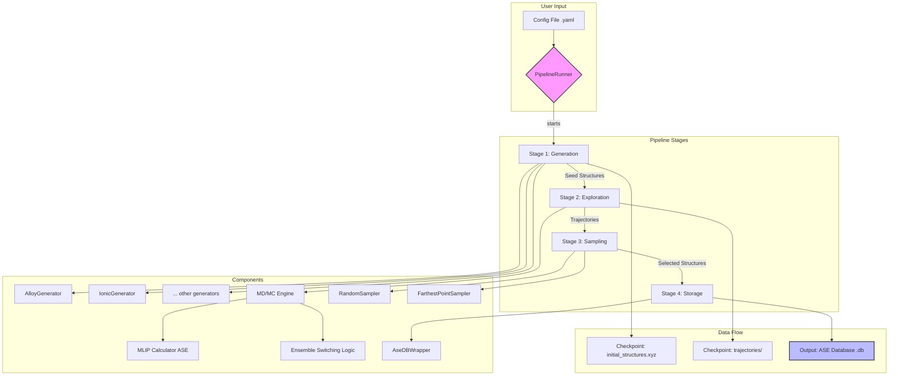

# SYSTEM_ARCHITECTURE.md

## 1. Summary

This document outlines the system architecture for the **MLIP-AutoPipe** project, a sophisticated, automated framework for generating high-quality training data for Machine Learning Interatomic Potentials (MLIPs) such as MACE and SevenNet. The core philosophy of this project is to move beyond simple, randomised atomic structure generation and instead produce physically valid and diverse datasets that are representative of the thermodynamic phase space a material can explore. By automating the complex workflow of structure generation, simulation-based exploration, and intelligent sampling, MLIP-AutoPipe aims to significantly reduce the human effort and expertise required to develop robust and accurate MLIPs. The system is designed to be a modular, extensible, and user-friendly tool for materials scientists and computational chemists.

The fundamental problem MLIP-AutoPipe addresses is the "data bottleneck" in MLIP development. High-quality MLIPs require training data that covers a wide range of atomic configurations, including not just stable, low-energy structures but also high-energy configurations, transition states, and defect structures. Manually creating such datasets is a laborious and often incomplete process. This tool automates this process through a robust pipeline architecture. The pipeline begins by generating initial "seed" structures based on user-defined physical systems (e.g., alloys, ionic crystals, interfaces). These seed structures are then subjected to an "exploration" phase, where molecular dynamics (MD) and/or Monte Carlo (MC) simulations are employed to sample a vast configuration space. This exploration is designed to uncover "hard" or "failure-prone" configurations that are crucial for improving the robustness of the MLIP.

Following the exploration phase, a "sampling" module intelligently selects a subset of the generated structures for the final training set. This is not a simple random selection; instead, it can employ advanced techniques like Farthest Point Sampling (FPS) based on structural descriptors (e.g., SOAP) to ensure maximum diversity within the dataset. Finally, the selected structures, along with their associated metadata, are stored in a structured and queryable format using an ASE (Atomic Simulation Environment) database. The entire process is orchestrated by a central pipeline runner and is highly configurable through a clear and flexible configuration system. The project will provide both a command-line interface (CLI) for automated, batch-oriented workflows and a graphical user interface (GUI) for interactive exploration and visualisation, making it accessible to a broad range of users. The final output is a ready-to-use, high-quality database of atomic structures that can be directly fed into MLIP training frameworks.

## 2. System Design Objectives

The design of MLIP-AutoPipe is guided by several key objectives to ensure it is a powerful, reliable, and practical tool for the materials science community.

**1. Physical Realism and Validity:** The primary objective is to generate structures that are physically meaningful. The system will incorporate rigorous validation checks at every stage. This includes ensuring reasonable interatomic distances, maintaining charge neutrality in ionic systems, and using simulation techniques (MD/MC) that honour the principles of statistical mechanics. The integration of physics-based constraints, such as preventing atomic overlap and ensuring appropriate cell sizes for periodic boundary conditions, is paramount. This focus on physical validity ensures that the resulting training data is not just noise, but a true representation of the material's potential energy surface.

**2. Diversity and Comprehensiveness:** The framework must be capable of generating a highly diverse set of structures that thoroughly samples the relevant configuration space. This objective will be achieved through a multi-pronged approach: supporting a wide variety of initial structure generation methods, employing a hybrid MD/MC exploration engine to overcome energy barriers, and implementing intelligent sampling algorithms like FPS. The goal is to produce datasets that include not only ground-state configurations but also amorphous phases, defected structures, and high-energy states, which are critical for training robust MLIPs that can handle a wide range of simulation conditions.

**3. Modularity and Extensibility:** The system architecture will be highly modular to facilitate easy extension and customisation. Each stage of the pipeline (Generation, Exploration, Sampling, Storage) will be implemented as a distinct component with well-defined interfaces. This will allow users or developers to easily add new structure generators, swap out exploration algorithms, or implement novel sampling techniques without needing to overhaul the entire system. This modularity is key to the long-term viability and adaptability of the project, allowing it to incorporate new scientific methods as they emerge.

**4. Automation and User-Friendliness:** A core goal is to automate the entire data generation workflow, minimising the need for manual intervention. The system will be controlled through a simple yet powerful configuration file, allowing users to define complex workflows with ease. To cater to different user needs, both a CLI for power users and automated scripting, and a Web UI for interactive use and visualisation will be developed. This dual-interface approach will lower the barrier to entry and make the tool accessible to both computational experts and experimental scientists.

**5. Robustness and Reproducibility:** The framework must be robust to failures and ensure reproducibility of results. This will be achieved through features like progressive saving of simulation trajectories to prevent data loss, robust error handling to gracefully manage issues like simulation crashes ("Coulomb explosions"), and the use of version-controlled databases for storing generated data. By associating every structure with a complete set of metadata (e.g., simulation parameters, source), the system will ensure that the entire data generation process is transparent and reproducible.

## 3. System Architecture

The MLIP-AutoPipe system is designed as a sequential pipeline composed of four main stages: Generation, Exploration, Sampling, and Storage. A central `PipelineRunner` orchestrates the flow of data between these stages, managed by a user-defined configuration.



**Component Descriptions:**

1.  **PipelineRunner:** The central orchestrator. It reads the user's configuration file, initialises the components for each stage, and manages the data flow from one stage to the next. It is responsible for setting up the execution environment, including parallel processing.

2.  **Stage 1: Generation:**
    *   **Generators (`BaseGenerator`, `AlloyGenerator`, etc.):** A factory pattern is used to select the appropriate generator based on the configuration. Each generator is responsible for creating a set of initial "seed" structures. They incorporate physical validation logic, such as checking for atomic overlaps and ensuring the simulation cell is sufficiently large.

3.  **Stage 2: Exploration:**
    *   **MD/MC Engine:** This is the core of the exploration stage. It takes the seed structures and runs simulations to generate diverse atomic configurations. It leverages the ASE library to interface with MLIP models (e.g., MACE). Key features include:
        *   **Hybrid MD/MC:** Allows for combining standard MD steps with Monte Carlo moves (e.g., atom swaps) to more effectively explore the configuration space.
        *   **Auto Ensemble Switching:** Intelligently determines whether to use an NVT or NPT ensemble based on the presence of a vacuum in the simulation cell, preventing simulation artifacts.
        *   **Parallel Execution:** Uses a process pool to run multiple simulations in parallel, significantly speeding up the exploration process.

4.  **Stage 3: Sampling:**
    *   **Samplers (`RandomSampler`, `FarthestPointSampler`):** After exploration, this stage selects a representative subset of structures from the generated trajectories. The `FarthestPointSampler` uses structural descriptors to pick a maximally diverse set, which is more efficient for training MLIPs.

5.  **Stage 4: Storage:**
    *   **AseDBWrapper:** A dedicated module to handle all interactions with the output database. It abstracts the underlying ASE DB, providing a clean interface for writing the final selected structures and their associated metadata (energy, forces, configuration parameters). This ensures that data is stored in a structured, consistent, and queryable manner.

## 4. Design Architecture

The project will be structured into a Python package named `mlip_autopipec`. The design emphasizes separation of concerns, with distinct modules for data structures, business logic, and user interfaces.

**File Structure:**

```
.
├── pyproject.toml
├── src
│   └── mlip_autopipec
│       ├── __init__.py
│       ├── cli.py                # Command-Line Interface (Typer)
│       ├── config.py             # Pydantic models for configuration
│       ├── db.py                 # Database interaction (AseDBWrapper)
│       ├── domain               # Core data models and exceptions
│       │   ├── __init__.py
│       │   ├── models.py         # Pydantic models for internal data
│       │   └── exceptions.py
│       ├── generators           # Stage 1: Structure Generation
│       │   ├── __init__.py
│       │   ├── base.py
│       │   ├── alloy.py
│       │   └── ...
│       ├── exploration          # Stage 2: MD/MC Exploration
│       │   ├── __init__.py
│       │   └── engine.py
│       ├── sampling             # Stage 3: Sampling
│       │   ├── __init__.py
│       │   ├── base.py
│       │   ├── random_sampler.py
│       │   └── fps.py
│       ├── pipeline.py           # Main PipelineRunner orchestrator
│       └── services             # Business logic services
│           ├── __init__.py
│           └── workflow.py       # Orchestrates the pipeline stages
└── tests
    ├── conftest.py
    ├── integration
    │   └── test_pipeline.py
    └── unit
        ├── test_config.py
        ├── test_generators.py
        └── test_db.py
```

**Data Models (`config.py`, `domain/models.py`):**
Pydantic will be used extensively to define all configuration and internal data structures. This provides strong data validation, a clear schema, and excellent editor support. `config.py` will define the models that map directly to the user's YAML configuration file, covering everything from system definition to exploration parameters. `domain/models.py` will define the data structures used internally to pass data between components, such as a `DFTResult` object to encapsulate calculation outputs.

**Class/Function Overview:**

*   **`mlip_autopipec.cli:app`**: The Typer application entry point. It will parse command-line arguments and delegate to the `WorkflowOrchestrator`.
*   **`mlip_autopipec.pipeline:PipelineRunner`**: The main class that orchestrates the four stages of the workflow.
*   **`mlip_autopipec.services.workflow:WorkflowOrchestrator`**: A service layer that encapsulates the business logic of running the pipeline, separating it from the CLI. It will handle the setup, execution, and teardown of the `PipelineRunner`.
*   **`mlip_autopipec.db:AseDBWrapper`**: A class dedicated to managing the connection and transactions with the ASE SQLite database, providing methods like `write_atoms` and `get_metadata`.
*   **`mlip_autopipec.generators.base:BaseGenerator`**: An abstract base class defining the interface for all structure generators.
*   **`mlip_autopipec.exploration.engine:ExplorationEngine`**: The class responsible for running the parallel MD/MC simulations.
*   **`mlip_autopipec.sampling.base:BaseSampler`**: An abstract base class defining the interface for all sampling algorithms.

This layered architecture ensures that the core logic is decoupled from the user interface and data persistence, making the system easier to test, maintain, and extend.

## 5. Implementation Plan

The project will be developed over two sequential cycles.

**CYCLE 01: Core Framework and Basic Structure Generation**

This foundational cycle focuses on establishing the core architecture, data models, and a basic, end-to-end pipeline that can generate initial structures and store them in a database. The goal is to have a functioning, albeit simple, workflow.

*   **Project Scaffolding:** Set up the directory structure, `pyproject.toml` with initial dependencies (Typer, Pydantic, ASE), and basic test configuration.
*   **Configuration Models:** Implement the initial Pydantic models in `config.py` to define the structure for user configuration files. This will cover the system definition (elements, composition) and database settings.
*   **Database Wrapper:** Develop the `AseDBWrapper` in `db.py`. It will handle connecting to, creating, and writing `ase.Atoms` objects to an SQLite database. This ensures a stable foundation for data persistence from the very beginning.
*   **Generator Framework:** Create the `BaseGenerator` abstract class and a simple concrete implementation, `AlloyGenerator`, that can create random alloy structures based on a given composition. This includes implementing essential physical validation checks like minimum atomic distances.
*   **Basic Pipeline:** Implement a simplified `PipelineRunner` and `WorkflowOrchestrator`. In this cycle, the pipeline will only consist of two stages: **Generation** and **Storage**. The Exploration and Sampling stages will be stubbed out or omitted.
*   **CLI Entry Point:** Create a basic CLI using Typer in `cli.py` that can take a configuration file and a database path as input, run the simple Generation->Storage pipeline, and report success or failure.

**CYCLE 02: Advanced Exploration, Sampling, and UI**

This cycle builds upon the foundation of Cycle 01 by implementing the complex, simulation-heavy parts of the pipeline and fleshing out the user interfaces.

*   **Exploration Engine:** Develop the `ExplorationEngine` in `exploration/engine.py`. This is the most complex part of the project. It will involve:
    *   Integrating with ASE to use MLIP calculators (e.g., MACE).
    *   Implementing the logic for running MD simulations.
    *   Adding support for hybrid MD/MC moves, such as atom swapping.
    *   Developing the "Auto Ensemble Switching" logic to correctly handle bulk vs. slab systems.
    *   Implementing robust parallel execution using `ProcessPoolExecutor`.
*   **Advanced Sampling:** Implement the `FarthestPointSampler` in `sampling/fps.py`. This will require integrating a SOAP descriptor library to calculate structural fingerprints and implement the FPS algorithm. The `BaseSampler` interface will also be created.
*   **Full Pipeline Integration:** Extend the `PipelineRunner` to incorporate the new Exploration and Sampling stages, creating the full four-stage pipeline.
*   **Expanded CLI:** Enhance the CLI with more options to control the exploration and sampling parameters, providing users with full control over the workflow.
*   **Web UI (Optional/Bonus):** If time permits, a simple Web UI could be developed using a framework like Streamlit or Gradio. This would allow users to upload a configuration, run the pipeline, and view the generated structures, making the tool more accessible.

## 6. Test Strategy

Testing will be a critical part of the development process, with a combination of unit and integration tests to ensure correctness and robustness.

**CYCLE 01 Test Strategy:**

*   **Unit Tests:**
    *   **Configuration:** Test the Pydantic models in `config.py` to ensure they correctly parse valid configuration files and raise errors for invalid ones (e.g., missing required fields, incorrect types).
    *   **Database:** Unit test the `AseDBWrapper`. This will involve using an in-memory SQLite database to test that `ase.Atoms` objects are written and read correctly, and that metadata is stored and retrieved as expected. Mocks will be used to isolate the wrapper from the actual filesystem.
    *   **Generators:** Test the `AlloyGenerator` to verify that it produces the correct number of structures, with the specified composition, and that all generated structures pass the physical validation checks (e.g., no overlapping atoms).
*   **Integration Tests:**
    *   A single integration test will cover the entire Cycle 01 pipeline. It will use a temporary directory and a sample configuration file. The test will invoke the CLI, which will run the Generation->Storage pipeline. Assertions will be made on the final database, checking that it has been created and contains the correct number of structures with the expected properties. This validates that all components work together correctly.

**CYCLE 02 Test Strategy:**

*   **Unit Tests:**
    *   **Exploration Engine:** This will be the most challenging component to test. Unit tests will focus on individual functions within the engine. For example, the "Auto Ensemble Switching" logic will be tested by creating mock `ase.Atoms` objects with and without a vacuum and asserting that the correct simulation ensemble is chosen. The core MD simulation loop will not be unit tested directly, as this would be too complex. Instead, we will rely on integration tests. External dependencies like the MLIP calculator will be heavily mocked.
    *   **Samplers:** Test the `RandomSampler` to ensure it selects the correct number of frames. Test the `FarthestPointSampler` with a small, deterministic set of pre-calculated descriptors to verify that the algorithm selects the expected "farthest" points.
*   **Integration Tests:**
    *   The main integration test will be expanded to cover the full four-stage pipeline. It will run a very short MD simulation on a simple system using a fast, classical potential like EMT (Effective Medium Theory) instead of a slow MLIP. This will allow the test to run quickly in a CI environment. The test will assert that:
        1.  Initial structures are generated.
        2.  Trajectory files are created during exploration.
        3.  The sampling step reduces the number of structures.
        4.  The final database contains the sampled structures.
    *   CLI functionality will be tested to ensure all new options are parsed and handled correctly. This ensures the user-facing part of the application works as intended.
