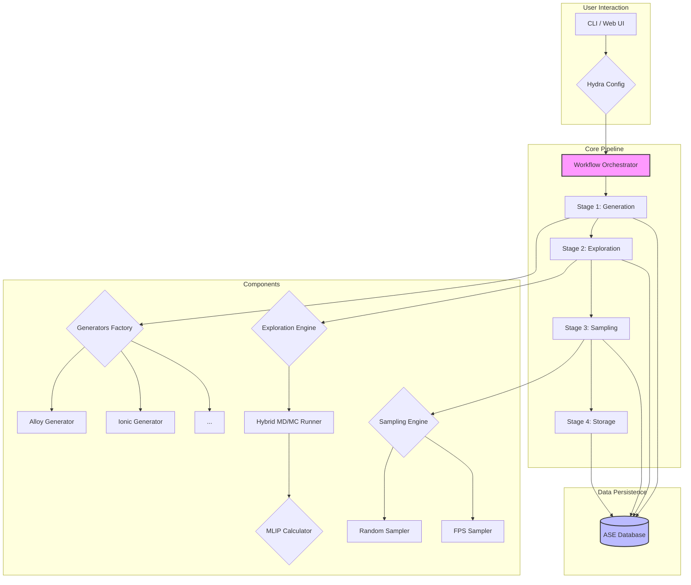

# System Architecture: MLIP-AutoPipe

## 1. Summary

The MLIP-AutoPipe (Machine Learning Interatomic Potential - Automated Pipeline) is a sophisticated, command-line-driven software framework designed to automate the generation of high-quality, physically diverse training datasets for modern machine learning interatomic potentials (MLIPs) such as MACE and SevenNet. The core philosophy of the project is to "remove the human expert from the loop" by creating a fully automated, robust, and intelligent pipeline that can explore the thermodynamic phase space of a given material system and identify atomic configurations that are most valuable for training a resilient and accurate MLIP.

The system addresses a critical bottleneck in computational materials science: the manual, often intuition-driven, and time-consuming process of curating training data. Traditional methods often rely on generating simple, idealised structures (e.g., perfect crystals with applied strain) which fail to capture the complexity of real-world materials, especially at elevated temperatures or under stress. These models, trained on limited data, often fail spectacularly when used in simulations that venture into unexplored regions of the potential energy surface (PES), leading to unphysical behaviour like "Coulomb explosions" or incorrect phase transitions.

MLIP-AutoPipe solves this problem by adopting a dynamic, exploration-centric approach. Instead of static structure generation, it leverages powerful simulation techniques, primarily molecular dynamics (MD) and hybrid Monte Carlo (MC) methods, to actively explore the vast landscape of possible atomic arrangements. By simulating the system under user-defined conditions (e.g., high temperature), the pipeline naturally discovers high-energy configurations, transition states, and defect structures that are precisely the "difficult cases" an MLIP needs to learn to become robust.

The architecture is modular and highly configurable, built around a four-stage pipeline: Generation, Exploration, Sampling, and Storage. Initially, a set of seed structures is generated based on physical rules and user-defined parameters for various material types, including alloys, ionic crystals, and interfaces. These seeds are then subjected to an intensive exploration phase where MD simulations, enhanced with MC moves for efficient phase-space sampling, generate extensive trajectory data. To make the final dataset manageable and information-rich, a sophisticated sampling stage employs techniques like Farthest Point Sampling (FPS) to select a structurally diverse subset of configurations. Finally, these curated structures, along with their associated metadata, are systematically stored in a queryable ASE (Atomic Simulation Environment) database, ready for use in MLIP training workflows. The entire process is orchestrated via a powerful command-line interface (CLI) and configured using the Hydra framework, ensuring reproducibility and ease of integration into larger computational workflows.

## 2. System Design Objectives

The primary objective of MLIP-AutoPipe is to provide a reliable, automated, and efficient tool for generating optimal training datasets for MLIPs. The design is guided by the following key goals, constraints, and success criteria.

**Goals:**

1.  **Automation:** To create a "fire-and-forget" pipeline that requires only an initial configuration file to execute the entire workflow, from initial structure generation to final database storage, without manual intervention.
2.  **Physical Realism:** To ensure that all generated structures are physically plausible. This involves enforcing constraints like minimum interatomic distances, ensuring correct charge neutrality in ionic systems, and using simulation methods that respect thermodynamic principles.
3.  **Diversity and Robustness:** The system must generate a wide variety of atomic configurations, explicitly targeting high-energy and transition states that are critical for MLIP robustness. The goal is to produce datasets that train MLIPs capable of handling simulations beyond simple equilibrium conditions.
4.  **Modularity and Extensibility:** The architecture must be modular, allowing for the easy addition of new structure generators, exploration algorithms, sampling methods, or support for different MLIP calculators. This ensures the tool can evolve with the field.
5.  **Performance and Scalability:** The pipeline must be performant, leveraging parallel processing to efficiently run multiple simulations simultaneously. It should be designed to scale from a single workstation to a multi-core server environment.
6.  **Usability and Reproducibility:** The system will be primarily operated via a CLI, with clear and comprehensive configuration options managed by Hydra. This ensures that experiments are easy to define, execute, and reproduce. A secondary Web UI will provide an intuitive way for users to interact with the system.

**Constraints:**

1.  **Dependencies:** The system will be built upon a well-defined stack of open-source Python libraries, including ASE, Pydantic, Hydra, and Typer. It must be installable and runnable within a standard Conda or venv environment.
2.  **Computational Resources:** While designed to be scalable, the tool must be capable of running meaningful calculations on a typical research-grade workstation (e.g., 8-16 cores, 32-64 GB RAM). GPU acceleration (via CUDA) is a key consideration, but the system must also function in a CPU-only environment.
3.  **Input/Output Formats:** The system will primarily use standard file formats from the materials science community (e.g., XYZ, CIF for structures) and will produce an ASE-compatible SQLite database as its final output.

**Success Criteria:**

1.  **Successful Pipeline Execution:** The system will be considered successful if it can complete the full Generation -> Exploration -> Sampling -> Storage pipeline for a representative set of material systems (e.g., a binary alloy, an ionic oxide) without crashing and producing a valid, non-empty database.
2.  **Dataset Quality:** The quality of the generated dataset will be the ultimate measure of success. A dataset produced by MLIP-AutoPipe should, when used to train a standard MLIP model, result in a potential that is demonstrably more stable in high-temperature MD simulations compared to a model trained on a naively generated dataset of equivalent size.
3.  **Performance Benchmark:** The parallel exploration engine should demonstrate a near-linear speed-up with an increasing number of processor cores for a typical batch of 16-32 independent simulations.
4.  **User Adoption:** The clarity of the documentation, the ease of installation, and the intuitive nature of the CLI will lead to adoption by researchers in the MLIP development community.

## 3. System Architecture

The MLIP-AutoPipe is designed as a modular, pipeline-driven system. The architecture separates distinct concerns into four main stages, which are orchestrated by a central `WorkflowOrchestrator`. Data flows sequentially through these stages, with each stage's output being saved to a database, ensuring state isolation and crash recovery.



**Component Breakdown:**

1.  **User Interaction Layer (CLI / Web UI):** This is the entry point for the user. The primary interface is a Command-Line Interface (CLI) built with Typer, which allows for batch processing and integration into automated scripts. A secondary Web UI will provide a graphical way to configure and run the pipeline.
2.  **Configuration (Hydra):** All aspects of the pipeline are controlled by a set of YAML configuration files managed by Hydra. This provides a powerful and flexible way to define the material system, simulation parameters, and choice of algorithms for each stage.
3.  **Workflow Orchestrator:** This is the central component that drives the entire process. It reads the configuration, initialises the necessary components, and executes the four stages of the pipeline in sequence. It is responsible for managing data flow between stages, handling errors, and interacting with the database.
4.  **Stage 1: Generation:** This stage creates the initial set of "seed" structures. A `GeneratorsFactory` selects the appropriate generator (e.g., `AlloyGenerator`, `IonicGenerator`) based on the configuration. These generators apply physical rules and constraints to create a set of valid starting points for the exploration phase. The generated structures are immediately saved to the database.
5.  **Stage 2: Exploration:** This is the computational core of the pipeline. The `ExplorationEngine` takes the seed structures and runs simulations to generate diverse atomic configurations. It uses a `ProcessPoolExecutor` to run multiple MD simulations in parallel. The core logic resides in the `HybridMDMC_Runner`, which can perform standard MD, or interleave it with Monte Carlo moves (e.g., atom swaps) to explore the configuration space more effectively. It interfaces with an `MLIPCalculator` (e.g., MACE) to compute forces and energies. Trajectories are progressively saved to disk and then logged in the database.
6.  **Stage 3: Sampling:** After exploration, a vast number of structures have been generated. The `SamplingEngine` is responsible for selecting a small, information-rich subset from this large pool. It can use simple methods like random sampling or more advanced techniques like Farthest Point Sampling (FPS), which uses SOAP descriptors to maximize structural diversity.
7.  **Stage 4: Storage:** This final stage takes the sampled structures and performs a final validation and cleaning step. It then saves the curated dataset, along with all relevant metadata (energy, forces, configuration source, etc.), into the main ASE database, marking them as ready for training.
8.  **Data Persistence (ASE Database):** A central SQLite database managed via the ASE DB interface acts as the single source of truth for the pipeline's state. It stores initial structures, pointers to trajectory files, sampled structures, and metadata. This design allows the pipeline to be stopped and resumed at any stage.

## 4. Design Architecture

The software design emphasizes modularity, dependency inversion, and clear separation of concerns, following a schema-first, Pydantic-driven approach.

**File Structure:**

The project will reside within a `src/mlip_autopipec/` directory.

```
src/mlip_autopipec/
├── __init__.py
├── cli.py                  # Typer-based command-line interface
├── config.py               # Pydantic models for Hydra configuration
├── main_gui.py             # Web UI entry point
├── database/
│   ├── __init__.py
│   └── ase_db_wrapper.py   # Wrapper for ASE DB interactions
├── domain/
│   ├── __init__.py
│   ├── models.py           # Core Pydantic data models (e.g., Atoms, DFTResult)
│   └──- interfaces.py       # Abstract interfaces (e.g., IGenerator, IExplorer)
├── engines/
│   ├── __init__.py
│   ├── generation_engine.py  # Orchestrates structure generation
│   ├── exploration_engine.py # Orchestrates MD/MC exploration
│   ├── sampling_engine.py    # Orchestrates data sampling
│   └── storage_engine.py     # Orchestrates final database storage
├── generators/
│   ├── __init__.py
│   ├── base_generator.py     # Base class for all generators
│   ├── alloy_generator.py    # Implementation for alloys
│   └── ionic_generator.py    # Implementation for ionic crystals
├── explorers/
│   ├── __init__.py
│   └── md_mc_explorer.py     # Hybrid MD/MC simulation logic
├── samplers/
│   ├── __init__.py
│   ├── base_sampler.py       # Base class for all samplers
│   ├── random_sampler.py     # Implementation for random sampling
│   └── fps_sampler.py        # Implementation for FPS
├── utils/
│   ├── __init__.py
│   ├── physics.py            # Physics validation functions
│   └── parallel.py           # Parallel execution utilities
└── workflow_orchestrator.py  # Main orchestrator class
```

**Class/Function Definitions Overview:**

*   **`cli.py`**: Contains a `typer.Typer` application. A main function decorated with `@app.command()` will take the path to a Hydra configuration file. It will instantiate and run the `WorkflowOrchestrator`.
*   **`config.py`**: Defines a series of Pydantic `BaseModel` classes that mirror the structure of the YAML configuration files. This provides static type checking and auto-completion for configuration parameters.
*   **`workflow_orchestrator.py::WorkflowOrchestrator`**: The main class. Its `run()` method will execute the four pipeline stages in order, calling the respective engines.
*   **`domain/interfaces.py`**: Defines abstract base classes (ABCs) or Protocols for key components like `IStructureGenerator`, `IExplorationEngine`, `ISamplingStrategy`. This allows for dependency injection and makes the system easily testable and extensible.
*   **`engines/*.py`**: Each engine class (`GenerationEngine`, `ExplorationEngine`, etc.) will implement the logic for its respective stage. They will depend on interfaces, not concrete implementations. For example, `GenerationEngine` will be given an `IStructureGenerator` instance.
*   **`generators/*.py`**: Concrete implementations of the `IStructureGenerator` interface. For example, `AlloyGenerator` will contain the logic for creating alloy structures.
*   **`database/ase_db_wrapper.py::AseDBWrapper`**: This class will encapsulate all interactions with the SQLite database via ASE. It will provide methods like `add_initial_structures()`, `get_structures_to_explore()`, `save_final_dataset()`, abstracting the underlying database operations.

**Data Models (`domain/models.py`):**

All key data structures will be defined as Pydantic models to ensure type safety and clear validation rules.

*   `AtomsModel`: A Pydantic model that represents an `ase.Atoms` object, including positions, symbols, cell, and PBC flags. It will include validators to ensure physical constraints (e.g., no overlapping atoms).
*   `SimulationConfig`: A model capturing all parameters for an exploration run, such as temperature, pressure, thermostat, and MLIP calculator settings.
*   `PipelineResult`: A model to hold the final output, containing a list of `AtomsModel` objects, associated energies, forces, and metadata about their origin.

This schema-first approach ensures that data passed between different components is always valid and well-defined, significantly reducing runtime errors and making the codebase easier to understand and maintain.

## 5. Implementation Plan

The project will be developed over five distinct cycles, each building upon the previous one. This iterative approach allows for gradual feature implementation, testing, and refinement.

**Cycle 1: Core Pipeline and Basic Generation/Storage**
*   **Features:**
    *   Set up the project structure, dependencies (`pyproject.toml`), and version control.
    *   Implement the main `WorkflowOrchestrator` skeleton.
    *   Develop the Typer-based CLI entry point.
    *   Implement the `AseDBWrapper` for basic database interactions (creating DB, adding atoms).
    *   Create a simple `AlloyGenerator` that can produce a random binary alloy in a bulk configuration.
    *   Implement the `GenerationEngine` to call the generator and the `StorageEngine` to save the generated structures to the database.
    *   The Exploration and Sampling stages will be stubbed out (i.e., they will do nothing but pass the data through).
*   **Goal:** Have a functioning end-to-end pipeline that can generate a simple set of structures and save them to a database via a CLI command.

**Cycle 2: Foundational Exploration Engine**
*   **Features:**
    *   Implement the `ExplorationEngine` to manage parallel simulation runs using `ProcessPoolExecutor`.
    *   Develop a basic version of the `md_mc_explorer.py` that can run a standard NVT molecular dynamics simulation using an ASE-compatible calculator (e.g., EMT as a placeholder).
    *   Integrate a real MLIP calculator like MACE.
    *   The engine will save the full trajectory of each simulation to an `.xyz` file.
    *   Update the database wrapper to store metadata about the exploration runs (e.g., path to trajectory file, temperature).
*   **Goal:** Be able to take the structures from Cycle 1 and run MD simulations on them in parallel, generating trajectory data.

**Cycle 3: Advanced Sampling and Hybrid Exploration**
*   **Features:**
    *   Implement the `SamplingEngine`.
    *   Add a `RandomSampler` as a baseline strategy.
    *   Implement the `FPSSampler`, including the calculation of SOAP descriptors for atoms objects.
    *   Enhance the `md_mc_explorer.py` to support hybrid MD/MC simulations, specifically implementing an atom `swap` move.
    *   Add configuration options to control the frequency and type of MC moves.
*   **Goal:** Enable intelligent selection of diverse structures from the MD trajectories and enhance exploration efficiency with MC methods.

**Cycle 4: Robustness, Advanced Generators, and Physics-Based Intelligence**
*   **Features:**
    *   Implement advanced physics-based validation and intelligence.
    *   Add robust error handling to the exploration engine to detect and dump crashed simulations (e.g., due to "Coulomb explosions").
    *   Implement the ZBL potential mixing for accurate short-range repulsion.
    *   Develop the `IonicGenerator` with charge neutrality checks.
    *   Implement the "Auto Ensemble Switching" logic (`detect_vacuum` function) to intelligently select between NVT and NPT ensembles.
*   **Goal:** Make the pipeline robust, production-ready, and capable of handling more complex physical systems with intelligent, automated decision-making.

**Cycle 5: Web UI and User Experience**
*   **Features:**
    *   Develop a web-based user interface using a framework like Streamlit or FastAPI with a simple frontend.
    *   The UI will allow users to:
        *   Build a configuration file through a graphical interface.
        *   Start, stop, and monitor the status of the pipeline.
        *   View the generated structures and key results (e.g., energy distribution) directly in the browser.
    *   Integrate a 3D structure viewer (e.g., using `py3Dmol`) into the UI.
*   **Goal:** Provide an intuitive, interactive alternative to the CLI for users who prefer a graphical interface, lowering the barrier to entry for the tool.

## 6. Test Strategy

Testing will be a continuous process throughout the development cycles, with a focus on unit, integration, and user acceptance testing.

**Cycle 1: Core Pipeline and Basic Generation/Storage**
*   **Unit Tests:**
    *   Test the `AseDBWrapper` methods using an in-memory SQLite database. Verify that atoms can be added and retrieved correctly.
    *   Test the `AlloyGenerator`, ensuring it produces structures that meet the specified constraints (e.g., correct composition, no overlapping atoms).
    *   Test the CLI parser to ensure it correctly handles arguments and configuration files.
*   **Integration Tests:**
    *   Run the full pipeline with a simple configuration. Assert that the final database is created and contains the expected number of structures.

**Cycle 2: Foundational Exploration Engine**
*   **Unit Tests:**
    *   Test the `ExplorationEngine`'s parallel execution logic by mocking the MD simulation function. Verify that it correctly distributes tasks to workers.
    *   Test the MD runner with a simple, fast calculator (like EMT) to ensure it runs for a few steps without errors.
*   **Integration Tests:**
    *   Run the pipeline up to the exploration stage. Verify that trajectory files are created and that the database is updated with the correct metadata.

**Cycle 3: Advanced Sampling and Hybrid Exploration**
*   **Unit Tests:**
    *   Test the `RandomSampler` and `FPSSampler` with a predefined set of structures. Verify that they select the correct number of structures and, for FPS, that the selected structures are indeed diverse.
    *   Test the hybrid MD/MC logic, ensuring that swap moves are correctly attempted and accepted/rejected according to the Metropolis criterion.
*   **Integration Tests:**
    *   Run the full pipeline with FPS sampling enabled. Analyze the final dataset to confirm that the energy distribution is wider and more diverse than with random sampling.

**Cycle 4: Robustness, Advanced Generators, and Physics-Based Intelligence**
*   **Unit Tests:**
    *   Test the `IonicGenerator` to ensure it creates charge-neutral structures.
    *   Test the `detect_vacuum` function with known bulk and slab structures to verify that it correctly identifies the system type.
    *   Test the error handling by creating a simulation that is designed to fail and asserting that it is caught and handled gracefully.
*   **Integration Tests:**
    *   Run a high-temperature simulation of an ionic system and verify that the ZBL mixing prevents crashes and that the pipeline completes successfully.

**Cycle 5: Web UI and User Experience**
*   **Unit Tests:**
    *   Test the API endpoints of the backend (if using FastAPI) to ensure they correctly parse requests and return the expected data.
*   **Integration Tests:**
    *   Use a tool like Playwright or Selenium to automate interactions with the Web UI.
    *   A full end-to-end test: build a configuration using the UI, run the pipeline, and verify that the results displayed in the UI match the contents of the final database. This will serve as the primary User Acceptance Test (UAT).
