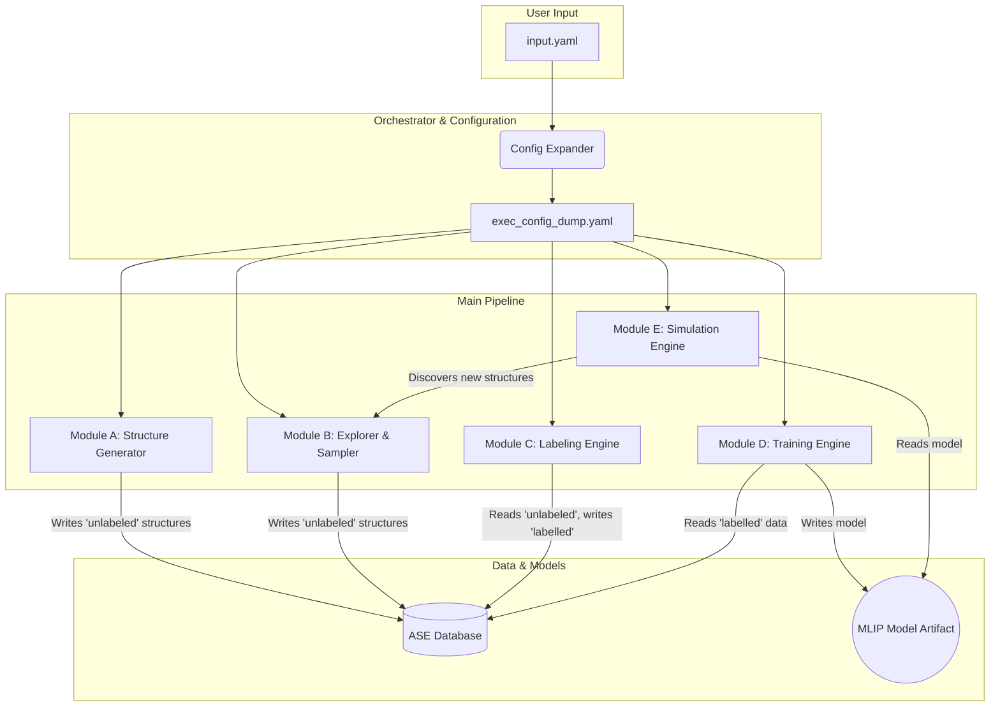

# System Architecture: MLIP-AutoPipe

## 1. Summary

The "Machine Learning Interatomic Potential Automated Generation and Analysis Pipeline" (MLIP-AutoPipe) is a next-generation computational materials science platform designed to automate the entire workflow of creating and utilising high-fidelity interatomic potentials. The core philosophy of this system is to "remove the human expert from the loop," addressing the most significant bottleneck in modern materials simulation. Traditional methods, particularly those reliant on Density Functional Theory (DFT) or Ab Initio Molecular Dynamics (AIMD), require profound domain expertise and substantial computational resources. The critical decisions—such as determining the appropriate temperature and pressure conditions or selecting specific atomic configurations for data generation—have historically depended on the intuition and tacit knowledge of experienced researchers. This reliance on human expertise has severely limited the scalability and accessibility of MLIP development.

MLIP-AutoPipe systematically dismantles this bottleneck by integrating physics-based heuristics with advanced machine learning techniques. By codifying expert knowledge into automated algorithms and leveraging Uncertainty Quantification (UQ), the system can autonomously navigate the complex parameter space of materials simulation. The pipeline provides an end-to-end, fully automated solution that starts from initial structure generation and extends through active learning cycles to long-timescale kinetic Monte Carlo (kMC) or Molecular Dynamics (MD) simulations. This empowers users to simply input a material's name and composition to obtain a bespoke potential with first-principles accuracy. Consequently, researchers can redirect their focus from the laborious process of potential development to the scientific discovery of complex phenomena, such as phase transformations, reaction dynamics, and material degradation. The system's scope is comprehensive, aiming to replace inefficient, AIMD-centric learning strategies with a more cost-effective and intelligent approach. It includes modules for generating physically plausible initial structures for various material types (alloys, molecules, ionic/covalent crystals) without resorting to expensive AIMD. It also incorporates the state-of-the-art MACE (Materials ACE) universal potential to perform rapid, large-scale explorations of the phase space without any DFT calculations, ensuring that precious computational resources are reserved for only the most informative atomic configurations. The integration with Quantum Espresso for automated labelling, a delta learning training engine for robustness, and an on-the-fly simulation engine with uncertainty feedback loops completes the autonomous ecosystem.

## 2. System Design Objectives

The primary objective of MLIP-AutoPipe is to democratise the creation of high-quality machine learning interatomic potentials, making them accessible to a broader range of scientists and engineers. To achieve this, the system is built upon several key design goals. The foremost objective is complete automation. The system must handle every stage of the MLIP development pipeline, from initial input to final potential, without requiring manual intervention. This involves automating structure generation, DFT parameterisation, convergence checks, hyperparameter optimisation, and active learning cycles. Success in this area will be measured by the ability of a non-expert user to generate a production-quality potential for a common material system like FePt or NiTi by only providing its chemical composition and a target temperature range.

A second critical objective is computational efficiency. The system must drastically reduce the computational cost associated with MLIP generation compared to traditional AIMD-based methods. This will be achieved through a multi-pronged strategy: minimising expensive DFT calculations via intelligent sampling, leveraging fast surrogate models like MACE for broad exploration, and optimising numerical computations using modern tools like Numba and JAX. The success criterion here is a quantifiable reduction—aiming for at least an order of magnitude—in the total DFT compute hours required to achieve a target accuracy for a benchmark system.

Thirdly, the system must ensure the physical realism and robustness of the generated potentials. This objective moves beyond simple error metrics and focuses on the potential's ability to accurately describe a wide range of physical phenomena. The design incorporates delta learning against physics-based baseline potentials (e.g., Lennard-Jones) to enforce correct short-range repulsive behaviour. It also includes sophisticated boundary condition treatments and periodic embedding to avoid artefacts in training data extracted from bulk simulations. Success will be validated by the potential's ability to accurately predict key material properties, such as elastic constants, formation energies, and phonon spectra, and to reproduce known phase diagrams.

Finally, the system is designed for modularity and extensibility. The field of materials modelling is rapidly evolving, with new algorithms and models emerging continuously. The architecture, therefore, decouples its core components—the Structure Generator, Explorer, Labelling Engine, Training Engine, and Simulation Engine—into distinct, interchangeable modules. This allows for the future integration of new DFT codes, MLIP frameworks (e.g., NequIP, Allegro), or sampling algorithms without requiring a complete system overhaul. The success of this objective will be demonstrated by the ease with which a new module, for instance, a different DFT engine like VASP, can be integrated into the pipeline by writing a simple adapter interface.

## 3. System Architecture

The MLIP-AutoPipe system is architected as a modular, five-component pipeline orchestrated by a central workflow manager. This design promotes separation of concerns and facilitates future extensibility. Data persistence and traceability are managed through a modern database interface, utilising the ASE (Atomic Simulation Environment) Database, which can be backed by SQLite for simplicity or PostgreSQL for scalability.

The five core modules are:
1.  **Module A: Structure Generator (Initial Seeding):** This module is responsible for creating a diverse and physically relevant set of initial atomic structures without relying on computationally expensive DFT calculations. It analyses the input composition to determine the bond type and applies the appropriate generation heuristic (SQS for alloys, NMS for molecules, AIRSS for ionic solids, and rattling/melt-quench for covalent materials).
2.  **Module B: Explorer & Sampler (DIRECT & Active Learning):** This module performs a broad search of the material's phase space using a pre-trained, universal surrogate model (MACE). It generates large-scale MD trajectories and then uses a descriptor-based clustering and stratified sampling approach (DIRECT) to select a compact, yet representative, set of structures for expensive DFT labelling.
3.  **Module C: Labeling Engine (Automated DFT):** This module serves as a robust, automated interface to the Quantum Espresso DFT engine. It handles the automatic configuration of calculation parameters (k-points, cutoffs, smearing) based on established high-precision protocols like SSSP, performs static calculations to obtain energies, forces, and stresses, and implements sophisticated error recovery logic to handle SCF convergence failures.
4.  **Module D: Training Engine (Delta Learning):** This module trains the MLIP using the data collected by the Labeling Engine. It implements a delta learning strategy, training the model on the residual between a physical baseline potential and the true DFT values. It also includes logic for automated hyperparameter optimisation of the MLIP model (e.g., ACE).
5.  **Module E: Simulation Engine (OTF MD/kMC):** This module uses the trained MLIP to run large-scale, long-timescale simulations. It incorporates an On-the-Fly (OTF) active learning loop, which monitors the simulation for excursions into unexplored regions of phase space using uncertainty quantification. When high uncertainty is detected, it extracts the local structure and sends it back to the Labeling Engine for re-training, continuously improving the model.

**Data Flow:**
The workflow begins with the user providing a minimal `input.yaml` file. The **Workflow Orchestrator** invokes the **Config Expander**, which generates a complete `exec_config_dump.yaml`. This full configuration then drives the pipeline. **Module A** generates initial structures and stores them in the ASE Database with a status of 'unlabeled'. **Module B** takes these structures, explores their neighbourhoods using the MACE surrogate, and samples the most informative configurations, also adding them to the database as 'unlabeled'. The **Orchestrator** then directs **Module C** to process all 'unlabeled' structures, performing DFT calculations and updating the database entries with the resulting labels (energy, forces, stress) and a status of 'labelled'. Next, **Module D** is triggered, which queries the database for all 'labelled' data, trains a new version of the MLIP, and saves the model artifact. Finally, **Module E** uses this new potential to start or continue a simulation. If the OTF loop detects uncertainty, it generates new structures and adds them to the database as 'unlabeled', restarting the cycle.



## 4. Design Architecture

The software architecture is designed to be modular, scalable, and maintainable, following modern Python best practices. The project will be structured as an installable Python package using `pyproject.toml` and the `uv` package manager.

**File Structure:**

```
mlip-autopipec/
├── pyproject.toml
├── uv.lock
├── src/
│   └── mlip_autopipec/
│       ├── __init__.py
│       ├── cli.py              # Main entry point (using Click)
│       ├── workflow.py         # Workflow Orchestrator
│       ├── config.py           # Pydantic models for configuration
│       ├── database.py         # ASE Database wrapper
│       └── modules/
│           ├── __init__.py
│           ├── structure_generator.py # Module A
│           ├── explorer_sampler.py    # Module B
│           ├── labeling_engine.py     # Module C
│           ├── training_engine.py     # Module D
│           └── simulation_engine.py   # Module E
└── tests/
    ├── conftest.py
    ├── unit/
    └── integration/
```

**Core Components & Data Models:**

*   **`config.py`:** This file will define all configuration parameters using Pydantic models. This provides strict type checking, validation, and a clear, self-documenting schema for both the minimal `input.yaml` and the fully expanded `exec_config_dump.yaml`. Key models will include `SystemConfig`, `SimulationConfig`, `DFTComputeConfig`, and `MLIPTrainingConfig`. The `ConfigExpander` logic will be implemented here, taking a minimal config object and returning a fully populated one with heuristic-driven defaults.
*   **`database.py`:** A dedicated wrapper class around the ASE database (`ase.db`). This class will abstract away the direct database connection details and provide high-level methods like `add_unlabeled_structure(atoms)`, `get_next_unlabeled()`, `update_to_labeled(id, results)`, and `get_all_labeled_data()`. This isolates database logic and allows for easier testing and potential future backend changes.
*   **`cli.py`:** The command-line interface will be built using the `click` library. The main command `mlip-pipe` will take the `input.yaml` as an argument. It will be responsible for parsing the config, initializing the `WorkflowOrchestrator`, and kicking off the main pipeline execution.
*   **`workflow.py`:** The `WorkflowOrchestrator` class will reside here. It will be initialized with the full configuration object. Its primary method, `run()`, will execute the main control loop of the pipeline, calling the different modules in the correct sequence (e.g., generate structures, explore, label, train, simulate). It will manage the state of the system and decide when to proceed to the next stage or when to loop for active learning.
*   **`modules/*.py`:** Each module will be implemented as a class within its respective file (e.g., `StructureGenerator` in `structure_generator.py`). Each class will be initialized with its relevant configuration section and a reference to the database wrapper. They will expose a primary method (e.g., `generate()`, `label()`, `train()`) that the orchestrator can call. This class-based approach ensures that module logic is self-contained and easily testable in isolation.

## 5. Implementation Plan

The project will be developed over eight sequential cycles, ensuring a gradual build-up of functionality and allowing for testing and refinement at each stage.

*   **CYCLE01: Core Engine & Workflow Foundation:** This foundational cycle focuses on establishing the project structure and the core components of the labelling and training workflow. It involves setting up the `pyproject.toml`, creating the Pydantic configuration models, and implementing the ASE database wrapper. The centerpiece will be a simplified `LabelingEngine` that can run a single Quantum Espresso calculation and a basic `TrainingEngine` that can train an ACE model from a small, manually prepared dataset. This cycle ensures the fundamental connection between DFT and MLIP training is working before adding complexity.
*   **CYCLE02: Configuration & Heuristics:** Building on the core engine, this cycle introduces the "Two-Tier Configuration" strategy. The `ConfigExpander` will be developed to take a minimal user `input.yaml` and generate the full `exec_config_dump.yaml`. This involves implementing the physics-based heuristics for determining DFT parameters (e.g., cutoffs from SSSP), MD temperatures, and other simulation settings. This cycle automates the tedious setup process for the user.
*   **CYCLE03: Initial Structure Generation:** This cycle implements `Module A: Structure Generator`. Logic for automatically detecting the material type (alloy, molecular, etc.) will be created. The different heuristic methods—SQS for alloys, Normal Mode Sampling for molecules, AIRSS for ionic, and rattling for covalent—will be implemented to generate a diverse set of initial structures and populate the database.
*   **CYCLE04: Surrogate-Based Exploration (MACE Integration):** This cycle focuses on `Module B`, integrating the MACE universal potential as a surrogate model. The `Explorer & Sampler` module will be built to take the initial structures, run large-scale MD simulations using MACE for fast exploration, and generate vast amounts of trajectory data. This establishes the "fast exploration" part of the pipeline.
*   **CYCLE05: Advanced Sampling (DIRECT):** This cycle completes `Module B` by implementing the DIRECT sampling algorithm. This involves adding functionality to calculate descriptors (e.g., SOAP) for the MACE-generated trajectories, performing clustering on this descriptor space, and applying stratified sampling to select the most informative structures to be passed to the DFT labelling engine. This ensures that the expensive DFT calculations are focused on the most valuable data points.
*   **CYCLE06: On-the-Fly Simulation & Active Learning:** This cycle implements the core of `Module E: Simulation Engine`. The on-the-fly (OTF) MD simulation loop will be developed. This includes integrating the trained MLIP with a simulation engine like LAMMPS, monitoring the simulation using uncertainty quantification provided by the ACE model, and implementing the logic to detect high-uncertainty configurations.
*   **CYCLE07: Advanced Active Learning & Boundary Treatment:** This cycle enhances the active learning loop with more sophisticated techniques. It will implement the dynamic uncertainty threshold logic and the advanced periodic embedding and boundary treatment methods (buffer regions, force masking, passivation). This ensures that the data fed back into the training loop from OTF simulations is of high quality and free from boundary artefacts.
*   **CYCLE08: Advanced Simulation (kMC) & UI/UX:** The final cycle completes `Module E` by integrating advanced simulation methods like kinetic Monte Carlo (kMC), including the tiered-rate calculation for efficiency. It also focuses on user interface refinement in the CLI, improving logging, output, and adding final documentation to ensure the system is user-friendly and robust.

## 6. Test Strategy

The testing strategy will be comprehensive, encompassing unit, integration, and end-to-end tests to ensure the reliability and correctness of the MLIP-AutoPipe system across all cycles.

*   **CYCLE01: Core Engine & Workflow Foundation:** Unit tests will focus on the Pydantic models in `config.py`, ensuring validation rules work correctly. The `AseDBWrapper` will be unit-tested with a mock database (e.g., an in-memory SQLite DB) to verify all CRUD operations. Integration tests will cover the simple workflow of the `LabelingEngine` calling a mock `subprocess.run` for Quantum Espresso and the `TrainingEngine` training a model from mock data, ensuring the data flows correctly between the modules and the database.
*   **CYCLE02: Configuration & Heuristics:** Unit tests will be written for the `ConfigExpander`'s heuristic logic. For example, a test will provide the composition "FePt" and assert that the generated full config correctly identifies it as an "alloy" and selects appropriate magnetic parameters. Another test will provide element symbols and verify that the SSSP-derived cutoffs are calculated correctly.
*   **CYCLE03: Initial Structure Generation:** Each structure generation method in `Module A` will have its own set of unit tests. For SQS, tests will verify that the generated structures have the correct composition and fall within the target atom count. For NMS, tests will ensure that a molecule is correctly displaced along its normal modes. Integration tests will confirm that the `StructureGenerator` module correctly writes the generated structures to the database with the 'unlabeled' status.
*   **CYCLE04: Surrogate-Based Exploration (MACE Integration):** Unit tests for `Module B` will involve mocking the MACE model. Tests will verify that the MD simulation runner correctly initializes the model and runs for the specified number of steps. Integration tests will focus on the data pipeline, ensuring that structures read from the database are correctly used to seed the MACE-driven MD simulations.
*   **CYCLE05: Advanced Sampling (DIRECT):** Unit tests will cover the descriptor calculation and clustering algorithms in isolation, using pre-computed data. For example, a small set of atomic configurations and their pre-calculated SOAP vectors will be used to test the clustering logic. An integration test will verify the full workflow of `Module B`: reading structures, running MACE MD, calculating descriptors, sampling, and writing the final selected structures back to the database.
*   **CYCLE06: On-the-Fly Simulation & Active Learning:** Testing `Module E` will involve significant mocking. The MLIP potential will be mocked to control its uncertainty predictions. Unit tests will verify that the uncertainty monitoring logic correctly identifies "high uncertainty" frames based on a mock output. An integration test will simulate a small OTF loop: the `SimulationEngine` runs a mock MD, detects a mock high-uncertainty frame, and correctly passes it back to the database to be labeled.
*   **CYCLE07: Advanced Active Learning & Boundary Treatment:** Unit tests will be created for the boundary treatment algorithms. For example, a test will create a covalent structure with a dangling bond and assert that the passivation logic correctly adds a hydrogen atom. Another test will verify that the force masking logic correctly sets forces in the buffer region to zero. The dynamic uncertainty threshold will be tested by providing a mock distribution of uncertainties and asserting that the new threshold is calculated at the correct percentile.
*   **CYCLE08: Advanced Simulation (kMC) & UI/UX:** The kMC tiered-rate logic will be unit-tested by mocking the Hessian calculation and verifying that it is only called for high-probability events. End-to-end tests will be developed for the entire CLI. Using the `click.testing.CliRunner`, a test will invoke `mlip-pipe` with a minimal `input.yaml` for a simple system (e.g., Argon) and mock all external calls (QE, LAMMPS). The test will assert that the pipeline runs to completion without errors and that a final MLIP model file is created.
