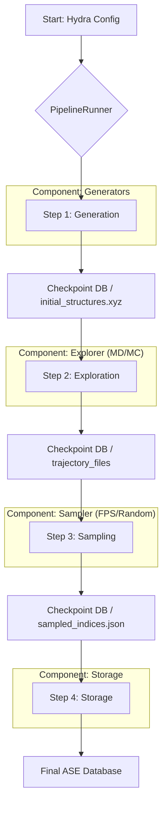

# System Architecture: MLIP-AutoPipe

## 1. Summary

The MLIP-AutoPipe project represents a paradigm shift in the generation of training data for Machine Learning Interatomic Potentials (MLIPs). Its core philosophy, to "remove the human expert from the loop," addresses a fundamental bottleneck in modern computational materials science. The development of robust potentials like MACE and SevenNet is critically dependent on the quality and diversity of the underlying training data. Historically, this data has been generated through methods that are either labour-intensive, such as manual selection of structures from computationally expensive *ab initio* simulations, or physically naive, like simple random placement of atoms. These traditional approaches often fail to explore the vast and complex potential energy surface (PES) adequately. They tend to oversample low-energy, equilibrium configurations while missing the high-energy "edge cases"—such as strained lattices, grain boundaries, defect complexes, and transition states—that are crucial for teaching an MLIP how to behave correctly under a wide range of conditions, especially during dynamic simulations where such states are frequently encountered.

MLIP-AutoPipe is engineered to overcome these limitations through a fully autonomous, multi-stage computational pipeline that intelligently navigates the chemical and structural phase space. The framework is designed to handle a wide variety of physical systems, each with unique challenges: creating realistic multi-component alloys requires exploring chemical ordering, ionic crystals demand strict charge neutrality, and modeling surfaces or interfaces involves managing complex periodic boundary conditions and vacuum slabs. The pipeline begins with a "Generation" stage, where physically plausible seed structures are created according to rules specific to the system type. The pivotal "Exploration" stage then subjects these seeds to a sophisticated hybrid Molecular Dynamics (MD) and Monte Carlo (MC) simulation. This is not a simple MD run; it is an active exploration designed to push the system into thermodynamically accessible but infrequently observed states. By incorporating MC moves like atomic swaps or vacancy hops, the engine can overcome energy barriers and discover novel configurations that a standard MD simulation might take an impractical amount of time to find. Following this, an intelligent "Sampling" stage employs techniques like Farthest Point Sampling (FPS) on structural descriptors to curate a final dataset that is maximally diverse and non-redundant. The final "Storage" stage archives these structures and their associated metadata in a queryable database. This systematic, physics-aware, and automated approach ensures the production of comprehensive datasets that are rich in the very configurations needed to build next-generation, highly accurate, and transferable MLIPs. The entire system is built on a modern, robust technology stack, including the Hydra framework for configuration, the Atomic Simulation Environment (ASE) for data structures, and Pydantic for data validation, ensuring maintainability, reproducibility, and extensibility for future scientific research.

## 2. System Design Objectives

The primary objective of MLIP-AutoPipe is to provide a robust, automated, and efficient platform for generating MLIP training data. The design is guided by the following key goals, constraints, and success criteria, which collectively define the project's scope and measures of quality.

**Goals:**

*   **Automation:** The ultimate goal is to create a "fire-and-forget" pipeline. An ideal user workflow involves defining the target physical system (elements, composition, etc.) in a high-level configuration file and executing a single command. The system should then proceed autonomously through all stages of generation, exploration, sampling, and storage, requiring no further human intervention. This minimizes the potential for human error and dramatically increases user productivity.
*   **Physical Realism:** Every structure generated or processed by the pipeline must be physically plausible. This is enforced through a series of validation checks. Key constraints include minimum interatomic distances to prevent unphysical atomic overlaps, strict charge neutrality for ionic systems, and the maintenance of valid crystal lattice vectors that are compatible with periodic boundary conditions. The system must automatically manage cell sizes to be larger than the MLIP's cutoff radius to prevent self-interaction artifacts.
*   **Structural Diversity:** The system must move beyond simple equilibrium structures and actively explore a wide region of the potential energy surface. This involves generating not just perfect crystals, but also configurations with defects (vacancies, interstitials), amorphous phases, strained cells, and complex interfaces. The goal is to produce a dataset that represents a rich tapestry of local atomic environments, which is essential for training a truly general-purpose MLIP.
*   **Efficiency and Active Learning:** The pipeline must intelligently sample the vast configuration space. Instead of brute-force generation, it should focus on creating structures that provide the most new information for the MLIP. This aligns with the principles of active learning. By prioritising high-energy configurations and using FPS to select structurally unique arrangements, the system avoids generating redundant, low-energy data points and focuses computational effort where it is most needed, leading to smaller but more effective training sets.
*   **Modularity and Extensibility:** The architecture must be designed as a set of loosely coupled components. It should be straightforward for a developer to integrate a new structure generation algorithm (e.g., a new `CovalentBondGenerator`), a different exploration technique (e.g., a simulated annealing explorer), or a new sampling method without requiring a major rewrite of the core architecture. This "plug-in" model is vital for the long-term viability and adaptability of the project.
*   **Reproducibility:** Scientific rigour demands reproducibility. For a given input configuration file and random seed, the pipeline must produce the exact same output dataset every time. This is achieved through careful control of random number generation and by leveraging a containerised environment to ensure consistent dependencies.

**Constraints:**

*   **Computational Resources:** The system is intended for use in HPC environments. It must be a good citizen on shared resources, capable of utilising parallel processing (e.g., via `ProcessPoolExecutor`) to accelerate the exploration phase while also respecting process limits. It must be mindful of memory usage, especially during the "late-binding" of large PyTorch-based MLIP models within worker processes.
*   **Dependencies:** The project relies on a stack of powerful open-source libraries (ASE, PyTorch, Hydra, Pydantic, etc.). The architecture must be robust to changes in these dependencies, and the use of a Docker container for deployment is a key strategy to lock down a stable, tested environment.
- **User Experience:** The system must cater to two distinct user personas. For computational scientists running large-scale batches, the CLI must be robust, scriptable, and provide clear logging. For students or experimentalists exploring the system, the GUI must be intuitive, providing a visual way to build configurations and understand the pipeline's output without requiring deep command-line expertise.

**Success Criteria:**

*   **SC-1:** The system can successfully generate a database of at least 10,000 unique and physically valid structures for a complex ternary alloy system (e.g., Ni-Cr-Al) from a single, complete configuration file, running end-to-end without crashing.
*   **SC-2:** An MLIP trained on a dataset generated by MLIP-AutoPipe (using FPS and hybrid MD/MC) demonstrates a statistically significant (e.g., 10% or greater) reduction in prediction error for a set of high-energy "challenge structures" (e.g., grain boundaries, vacancy clusters) compared to an MLIP trained on a dataset of the same size generated by simple high-temperature MD.
*   **SC-3:** A developer can add a new `MyCustomGenerator` to the system. This involves creating a new file in the `generators` module, inheriting from `BaseGenerator`, and implementing the `generate` method. The developer must be able to integrate this new generator and use it from the configuration file by writing less than 100 lines of code (excluding the core scientific logic and unit tests).
*   **SC-4:** The Web UI and the CLI must demonstrate full feature parity. Every configuration parameter and pipeline option available in the YAML file for the CLI must also be configurable through the GUI.

## 3. System Architecture

The MLIP-AutoPipe system is architected as a sequential, four-stage pipeline orchestrated by a central `PipelineRunner`. This design promotes a clear and linear flow of data. Crucially, the orchestrator persists the output of each major stage to a checkpoint database or file. This ensures fault tolerance—if a run fails during the computationally expensive exploration phase, it can be resumed from the last successful checkpoint—and state isolation, allowing each component to be developed and tested independently.



**Component Breakdown:**

1.  **PipelineRunner:** This is the brain of the operation. It is responsible for parsing the Hydra configuration object, instantiating the necessary components (like the specific generator requested by the user), and executing the pipeline stages in the correct order. It manages the data flow between stages, handling both in-memory Python objects for efficiency and on-disk serialization for checkpointing. Its logic will include robust error handling to gracefully manage failures within any stage of the pipeline.
2.  **Generators:** This module is a collection of classes responsible for creating the initial seed structures. A `GeneratorFactory` acts as a dispatcher, selecting the appropriate concrete generator (e.g., `AlloyGenerator`, `IonicGenerator`) based on the user's configuration. This factory pattern makes the system extensible. Each generator inherits from an abstract `BaseGenerator` class, which enforces a common interface and provides shared validation logic, such as a robust `overlap_check` method that ensures no two atoms in a generated structure are unphysically close.
3.  **Explorer:** This is the computational heart of the pipeline. It takes the seed structures and performs hybrid MD/MC simulations to generate vast trajectories of diverse configurations. This component is designed for massive parallelism, distributing the simulation of each seed structure to a separate process in a `ProcessPoolExecutor`. It will feature a "late-binding" mechanism for the MLIP calculator to minimize memory overhead and avoid pickling issues with large PyTorch models. The core logic includes sophisticated features like automatic ensemble switching (between NVT and NPT) based on vacuum detection and the mixing of the primary MLIP with a classical ZBL potential to correctly handle short-range atomic repulsion and prevent simulation crashes.
4.  **Sampler:** After exploration, the Sampler's role is to intelligently select a representative subset of structures from the enormous number of configurations present in the trajectories. In Cycle 1, a simple `RandomSampler` will be implemented. Cycle 2 will introduce a more advanced `FarthestPointSampler` (FPS). This sampler works by first converting each atomic structure into a high-dimensional feature vector using SOAP descriptors. It then iteratively selects structures that are farthest away from the already selected ones in this feature space, guaranteeing a structurally diverse final dataset.
5.  **Storage:** The final component takes the curated list of sampled structures and writes them to a persistent, queryable database. This will be an ASE database, which is a standard SQLite file with a specific schema. This component will be responsible for storing not only the atomic positions and species but also critical metadata, including the calculated potential energy, atomic forces, and system stress tensor for each configuration, which are all required for training an MLIP.

## 4. Design Architecture

The project's design is founded on the principles of modularity, separation of concerns, and a schema-first approach to ensure robustness and maintainability. The core logic is encapsulated within the `mlip_autopipec` Python package, with distinct sub-modules for each major component of the pipeline.

**File Structure:**

```
.
├── src/
│   └── mlip_autopipec/
│       ├── __init__.py
│       ├── main_cli.py         # Entry point for the command-line interface
│       ├── main_gui.py         # Entry point for the web user interface
│       ├── pipeline/
│       │   └── runner.py       # Contains the main PipelineRunner orchestrator
│       ├── generators/
│       │   ├── base.py         # Abstract BaseGenerator
│       │   └── ...             # Concrete generator implementations
│       ├── explorers/
│       │   └── md_engine.py    # The hybrid MD/MC exploration engine
│       ├── samplers/
│       │   ├── base.py         # Abstract BaseSampler
│       │   └── ...             # Concrete sampler implementations
│       ├── storage/
│       │   └── db_writer.py    # Logic for writing to the ASE Database
│       ├── common/
│       │   ├── config.py       # Central repository for all Pydantic models
│       │   └── atoms_utils.py  # Helper functions for ASE Atoms objects
│       └── ui/
│           └── app.py          # Main application logic for the Web UI
└── tests/
    ├── test_generators.py
    └── ...
```

**Data Models (Pydantic):**

A "schema-first" philosophy is central to the design. Before any implementation, the entire configuration structure is defined using Pydantic models in `common/config.py`. This creates a strong, statically-typed "contract" for the whole application. This approach provides several key benefits:
*   **Robust Validation:** Pydantic automatically provides clear, user-friendly error messages if the user's YAML configuration file is invalid (e.g., a string is provided where an integer is expected, or a value is outside a defined range like `gt=0`). This catches errors early and avoids hard-to-debug runtime failures.
*   **IDE Support:** Using typed models provides excellent auto-completion and type-checking in modern IDEs, improving developer productivity and reducing bugs.
*   **Single Source of Truth:** The Pydantic models serve as the definitive, unambiguous documentation for all possible configuration options.

This configuration schema will be consumed by Hydra, a powerful library that instantiates the Pydantic models from YAML files and allows for easy overriding of parameters from the command line, which is invaluable for scripting and experimentation. The `MainConfig` Pydantic object will be the primary data structure passed through the application, with each component receiving its relevant sub-configuration.

```python
# Example of a more detailed Pydantic model in common/config.py
class SystemConfig(BaseModel):
    elements: List[str] = Field(..., description="List of element symbols.")
    composition: Dict[str, float] = Field(..., description="Composition fractions.")
    generator_type: Literal["alloy", "ionic"]
    # Pydantic's validation can enforce complex rules, e.g., composition sums to 1.0
    # ...

class ExplorationConfig(BaseModel):
    temperature_k: float = Field(..., gt=0, description="MD temperature in Kelvin.")
    pressure_gpa: Optional[float] = Field(None, description="MD pressure in GPa for NPT.")
    # ...

class MainConfig(BaseModel):
    system: SystemConfig
    exploration: ExplorationConfig
    # ...
```

## 5. Implementation Plan

The project will be developed over two distinct, sequential cycles, allowing for iterative delivery and testing of functionality.

**Cycle 1: Core CLI Pipeline and Foundational Components**

This cycle is about building the bedrock of the application. The goal is a functional, end-to-end command-line tool that proves the viability of the core architecture. It will deliver genuine value early by providing a working, albeit simplified, data generation pipeline.

*   **Features & Tasks:**
    *   **Configuration:** Implement the complete Pydantic schema in `common/config.py`.
    *   **Generators:** Implement the `BaseGenerator` abstract class with validation logic. Create two concrete implementations, `AlloyGenerator` and `IonicGenerator`. Implement the `GeneratorFactory` to select between them.
    *   **Explorer:** Implement a simplified `Explorer` using a standard, fast ASE calculator like `ase.calculators.emt.EMT`. This acts as a placeholder, allowing the pipeline's data flow and parallel processing logic to be built and tested without the complexity of a real MLIP.
    *   **Sampler:** Implement a basic `RandomSampler` that selects a user-defined number of structures from the exploration trajectories.
    *   **Storage:** Implement the `DBWriter` to save the final list of `ase.Atoms` objects and their metadata into an `ase.db` SQLite file.
    *   **Orchestration:** Implement the `PipelineRunner`, which will wire all the above components together, manage checkpointing, and execute the four stages in sequence.
    *   **CLI:** Implement the command-line interface in `main_cli.py` using Typer. The interface will accept a path to the Hydra configuration file (e.g., `mlip-autopipec --config-path ./my_config.yaml`).
*   **Outcome:** A robust command-line tool capable of executing the full, simplified pipeline. This deliverable is a valuable tool in its own right and serves as a stable foundation for Cycle 2.

**Cycle 2: Advanced Exploration Engine and Web UI**

This cycle layers the advanced scientific intelligence and user-friendly interface on top of the foundation from Cycle 1, transforming the tool from a basic utility into a powerful research platform.

*   **Features & Tasks:**
    *   **Advanced Explorer:** Overhaul the `MDExplorer` to become a hybrid MD/MC engine. This involves several sub-tasks:
        1.  Integrate a real MLIP model (e.g., MACE) as the calculator.
        2.  Implement the logic for mixing the MLIP with a ZBL potential for robust short-range interactions.
        3.  Implement the automatic NVT/NPT ensemble switching based on vacuum detection.
        4.  Implement the Monte Carlo atomic swap move, including the Metropolis acceptance criterion and safety checks.
    *   **Advanced Sampler:** Implement the `FarthestPointSampler` in `samplers/fps.py`. This requires integrating a library to compute SOAP descriptors and then implementing the iterative FPS algorithm.
    *   **Web UI:** Develop a graphical user interface using Streamlit in `ui/app.py` and `main_gui.py`. The UI will provide:
        1.  An interactive form for building the run configuration, dynamically showing/hiding fields based on user selections.
        2.  A "Run" button to launch the pipeline in a background process.
        3.  Real-time progress monitoring (e.g., a progress bar and log output).
        4.  A results viewer to load the final database and visualize the generated atomic structures.
*   **Outcome:** A feature-complete, user-friendly application with both a powerful CLI and an intuitive GUI, fulfilling all the project's ambitious design objectives.

## 6. Test Strategy

A comprehensive, multi-layered testing strategy is essential to ensure both the software's correctness and the scientific validity of its output.

**Cycle 1 Test Strategy:**

*   **Unit Testing:** Each module will be tested in isolation using `pytest`. Mocks will be heavily used to isolate components. For instance, when testing the `PipelineRunner`, the `Generator` and `Explorer` will be replaced with mock objects to assert that their `generate` and `run` methods are called in the correct order with the correct data, without performing any real computation. The Pydantic models will be tested to ensure they raise `ValidationError` for malformed input. The generators will be tested to confirm they produce the correct number of atoms with the specified composition.
*   **Integration Testing:** A small-scale, end-to-end test of the CLI will be the cornerstone of Cycle 1 testing. This test will use `Typer.testing.CliRunner` to invoke the CLI from within a temporary directory. It will use a minimal `config.yaml` to generate a small number of structures. Assertions will verify that the process exits successfully, that the expected `final_dataset.db` file is created, and that this database contains the correct number of structures. This test ensures that all the components are wired together correctly.
*   **Acceptance Criteria:** The CLI must execute a standard run without errors. The output database must be readable by ASE. All generated structures must pass physical validation checks (e.g., no atomic overlaps).

**Cycle 2 Test Strategy:**

*   **Unit Testing:** New unit tests will be created for the advanced components. The logic for the hybrid MD/MC engine will be tested carefully. For example, a specific atomic configuration and random seed will be used to test that an MC swap is correctly accepted or rejected based on the Metropolis criterion. The `FarthestPointSampler` will be tested with a simple, known set of 2D vectors to verify that the core algorithm is implemented correctly before applying it to complex SOAP descriptors.
*   **Integration Testing:** The end-to-end test from Cycle 1 will be extended. A new configuration will be used that enables the advanced features. Assertions will become more sophisticated, potentially checking that the structural diversity (e.g., variance of SOAP fingerprints) of the dataset generated with FPS is statistically higher than that from a random sample.
*   **End-to-End (E2E) UI Testing:** The Web UI will be tested using a browser automation framework like Playwright. Test scripts will simulate a user's workflow: launching the app, filling the configuration form with both valid and invalid data (to test UI validation), clicking the "Run" button, and verifying that the UI updates correctly to show progress and, ultimately, success.
*   **Scientific Validation:** This is the highest level of testing. The final output of the tool must be scientifically useful. A benchmark test will be performed: an MLIP will be trained on a dataset generated by MLIP-AutoPipe. The resulting model's accuracy (RMSE of energy and forces) will be evaluated on a standard, external test set and compared against the accuracy of a model trained on a dataset of equivalent size generated by more traditional means. This critical test validates that the entire complex pipeline is not just running without software errors, but is achieving its ultimate scientific objective.
*   **Acceptance Criteria:** All Web UI features must be functional. The hybrid MD/MC engine must run stably. An MLIP trained on a generated dataset must meet a predefined accuracy target.
