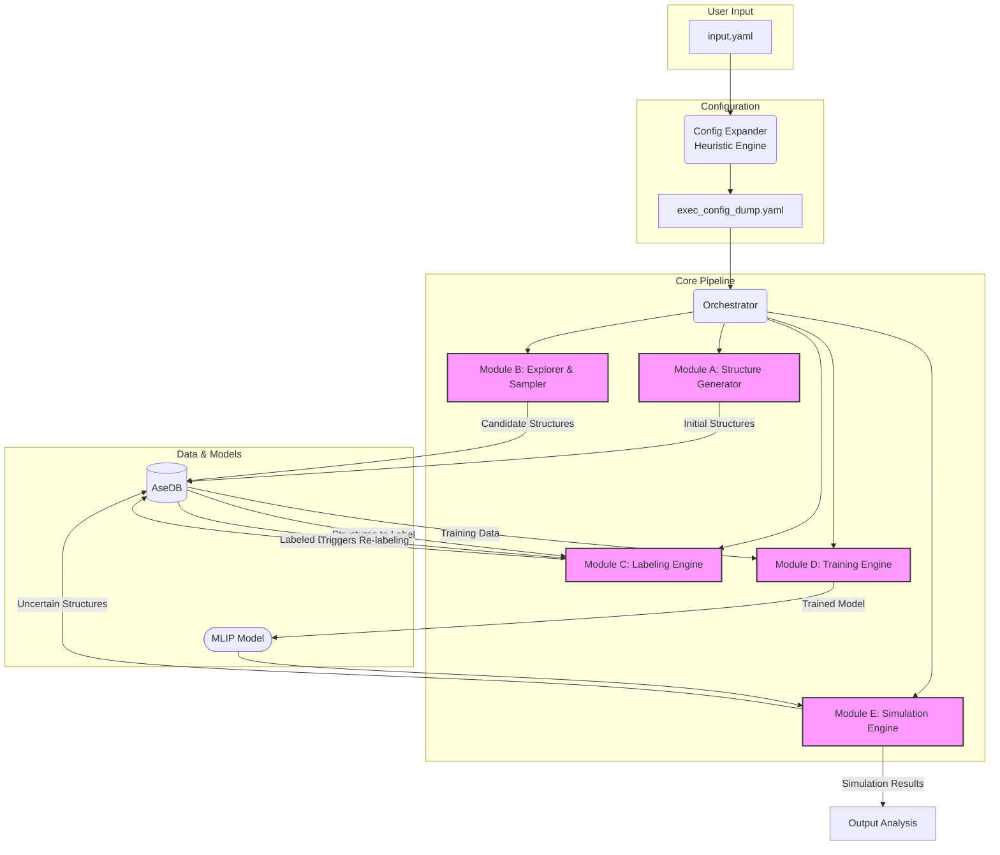

# SYSTEM_ARCHITECTURE.md

## 1. Summary

The Machine Learning Interatomic Potential Automated Pipeline (MLIP-AutoPipe) is a next-generation computational materials science platform designed to automate the entire workflow of creating and utilising high-fidelity Machine Learning Interatomic Potentials (MLIPs). The core philosophy underpinning this system is the principle of "removing the human expert from the loop." Historically, the development of MLIPs has been a craft, heavily reliant on the intuition and deep domain knowledge of experienced researchers to select appropriate training data, configure complex simulations, and validate the resulting models. This reliance on manual expertise creates a significant bottleneck, slowing down the pace of materials discovery and analysis. MLIP-AutoPipe directly addresses this challenge by orchestrating a sophisticated, fully autonomous pipeline that intelligently navigates the vast configuration space of atomic structures to train potentials with the accuracy of first-principles calculations (like Density Functional Theory, DFT) but at a fraction of the computational cost.

The system is engineered to take minimal user input—typically just the chemical elements and composition of a material—and autonomously execute a complex sequence of tasks. This sequence begins with the intelligent generation of a diverse and physically plausible set of initial atomic structures, bypassing the need for computationally expensive Ab Initio Molecular Dynamics (AIMD) for initial data sourcing. It then employs a pre-trained, universal surrogate model (specifically, the MACE-MP foundation model) to rapidly explore the potential energy surface, identifying unique and informative atomic configurations that are most critical for training a robust MLIP. These selected configurations are then passed to a fully automated "Labeling Engine," which uses Quantum Espresso, a state-of-the-art DFT code, to calculate the precise forces, stresses, and energies. These DFT labels serve as the ground truth for training the final, highly accurate MLIP. A key innovation of the pipeline is the adoption of a "delta learning" strategy, where the model learns the residual between a computationally cheap, physics-based reference potential and the high-accuracy DFT data. This approach ensures physical behaviour at close interatomic distances and significantly improves sample efficiency. Finally, the system integrates an "on-the-fly" active learning loop, where the newly trained MLIP is used in large-scale simulations, its predictive uncertainty is continuously monitored, and any novel configurations encountered are automatically fed back into the DFT and training engines for iterative refinement. This closed-loop design ensures that the potential becomes progressively more robust and accurate as it explores new physics. By automating this entire process, MLIP-AutoPipe will dramatically accelerate materials research, enabling scientists to focus on high-level scientific questions rather than the laborious mechanics of potential development.

## 2. System Design Objectives

The primary objective of the MLIP-AutoPipe system is to democratise and accelerate the creation of bespoke, high-accuracy MLIPs for any given material system. To achieve this, several key design goals, constraints, and success criteria have been established.

**Goals:**
1.  **Full Automation:** The system must be capable of running end-to-end without human intervention, from initial structure generation to active learning and final potential deployment. The user interaction should be limited to providing a minimal input file specifying the material and the desired simulation conditions.
2.  **High Physical Fidelity:** The generated potentials must achieve accuracy comparable to the underlying DFT calculations. This implies robust handling of complex physical phenomena, including magnetism, spin-orbit coupling, and correct repulsive behaviour at short interatomic distances.
3.  **Computational Efficiency:** The pipeline must be significantly more efficient than traditional AIMD-based data generation methods. This will be achieved through intelligent sampling, the use of a surrogate model for exploration, and optimised execution of DFT and training tasks.
4.  **Modularity and Extensibility:** The system's architecture must be modular, allowing for individual components (like the DFT engine, the MLIP training framework, or the structure generation algorithms) to be updated or replaced with minimal disruption to the overall pipeline. This ensures the system can easily incorporate future advances in the field.
5.  **Robustness and Error Recovery:** The pipeline must be resilient to common failures in scientific computing workflows, such as DFT convergence errors. It must implement sophisticated, automated error detection and recovery strategies to ensure reliable operation.

**Constraints:**
1.  **Dependency on External Codes:** The system relies on external, well-established scientific software, primarily Quantum Espresso for DFT calculations and potentially LAMMPS for large-scale simulations. The design must accommodate integration with these command-line-driven tools.
2.  **High-Performance Computing (HPC) Environment:** The target deployment environment is a Linux-based HPC cluster or a powerful workstation with multi-core CPUs and ideally GPU acceleration for the machine learning components.
3.  **Modern Python Ecosystem:** The entire framework will be built using modern Python standards, leveraging `pyproject.toml` for dependency management and `uv` for a fast and reproducible environment setup. The codebase must adhere to strict typing and quality standards.

**Success Criteria:**
1.  **Turnaround Time:** The system will be considered successful if it can generate a validated, high-quality MLIP for a binary alloy system (e.g., FePt) within a 24-hour period on a standard HPC node.
2.  **Predictive Accuracy:** The final MLIP's predictions for forces and energies on an independent test set should have a Root Mean Square Error (RMSE) that is within 10% of the values reported for similar systems in peer-reviewed literature.
3.  **Scalability:** The system must demonstrate the ability to handle increasingly complex chemistries, scaling from simple binary systems to ternary and quaternary alloys without fundamental changes to the architecture.
4.  **Usability:** The success of the "removing the human expert from the loop" philosophy will be measured by the ability of a non-expert user (e.g., a graduate student with basic materials science knowledge) to successfully generate a potential by only editing the minimal `input.yaml` file.

## 3. System Architecture

The MLIP-AutoPipe system is designed as a modular, workflow-driven application orchestrated by a central controller. The architecture is composed of five core functional modules that manage distinct stages of the pipeline, a shared database for data persistence, and a configuration management system that translates high-level user input into detailed execution parameters.

**Core Modules:**

*   **Module A: Structure Generator:** The entry point of the pipeline. It interprets the user's input to determine the material type (e.g., alloy, ionic, covalent) and employs the appropriate physics-based heuristic (e.g., SQS, AIRSS, NMS) to generate a diverse set of initial, static atomic structures. This module's primary role is to create a physically meaningful starting point for the workflow without resorting to DFT calculations.
*   **Module B: Explorer & Sampler:** This performance-critical module uses a pre-trained universal surrogate model (MACE-MP) to perform large-scale, rapid explorations of the material's potential energy surface. It takes the initial structures and subjects them to simulated annealing or high-temperature molecular dynamics to discover new, low-energy configurations and transition states. It then uses a sophisticated clustering and sampling algorithm (DIRECT) to select a compact, information-rich subset of these structures for expensive DFT labeling.
*   **Module C: Labeling Engine:** This module acts as a robust, automated wrapper around the Quantum Espresso DFT code. It receives structures from the Explorer, automatically generates the necessary QE input files with optimised parameters (determined by the Heuristic Engine), executes the DFT calculations, and parses the outputs to extract the ground-truth energies, forces, and stresses. It includes an advanced error recovery mechanism to handle common DFT convergence issues.
*   **Module D: Training Engine:** This module takes the DFT-labeled data and trains the bespoke MLIP. It implements the delta learning strategy by fitting the model to the residual between the DFT results and a baseline physics potential (e.g., Lennard-Jones). It also includes logic for automated hyperparameter optimisation to ensure the final model is as accurate as possible.
*   **Module E: Simulation Engine:** This is the application and active learning module. It uses the trained MLIP to run large-scale, long-duration simulations (MD or kMC) to explore material properties. Crucially, it incorporates an on-the-fly uncertainty quantification mechanism. When the simulation enters a region where the MLIP's prediction is uncertain, this module automatically flags the corresponding atomic structure and sends it back to the Labeling Engine for DFT calculation and subsequent retraining, closing the active learning loop.

**Data Flow and Orchestration:**

The entire process is orchestrated by a central workflow manager that directs the flow of data between the modules. The `AseDB` (Atomic Simulation Environment Database) serves as the central data repository, storing all generated structures, their calculated DFT properties, and metadata about their origin. This ensures data provenance and traceability throughout the pipeline.

The process flow is as follows:
1.  The user provides a minimal `input.yaml`.
2.  The **Orchestrator** invokes the **Config Expander**, which generates a complete `exec_config_dump.yaml`.
3.  The **Orchestrator** starts the pipeline, calling **Module A** to generate initial structures, which are saved to the `AseDB`.
4.  **Module B** is called to explore and sample from these structures, creating a new, refined set of candidate structures also saved to the `AseDB`.
5.  **Module C** labels the candidate structures with DFT, updating their records in the `AseDB`.
6.  **Module D** reads the labeled data from the `AseDB`, trains a new MLIP model, and saves the model artifact.
7.  **Module E** uses the new model to run simulations. If it detects an uncertain structure, it saves it to the `AseDB` and triggers the **Orchestrator** to loop back to step 5, initiating a new active learning cycle.



## 4. Design Architecture

The software design of MLIP-AutoPipe emphasizes modularity, testability, and adherence to modern Python best practices. The project will be structured as an installable Python package, managed by `uv` and defined in `pyproject.toml`.

**File Structure:**

The project repository will be organized as follows, separating the core application logic (`src/mlip_autopipec`) from tests, configuration, and documentation.

```
.
├── dev_documents/
│   ├── ALL_SPEC.md
│   └── system_prompts/
│       ├── SYSTEM_ARCHITECTURE.md
│       └── ... (CYCLE specs, UATs)
├── src/
│   └── mlip_autopipec/
│       ├── __init__.py
│       ├── cli.py          # Main entry point (Click-based CLI)
│       ├── configs/        # Default configuration files
│       ├── data/
│       │   ├── __init__.py
│       │   ├── database.py   # AseDB wrapper class
│       │   └── models.py     # Pydantic data models
│       ├── modules/
│       │   ├── __init__.py
│       │   ├── a_structure_generator.py
│       │   ├── b_explorer_sampler.py
│       │   ├── c_labeling_engine.py
│       │   ├── d_training_engine.py
│       │   └── e_simulation_engine.py
│       ├── orchestrator.py # Main workflow controller
│       └── utils/
│           ├── __init__.py
│           └── dft_utils.py  # Helpers for QE integration
├── tests/
│   ├── unit/
│   └── e2e/
├── input.yaml              # User's minimal input
├── exec_config_dump.yaml   # Auto-generated full config
└── pyproject.toml          # Project definition and dependencies
```

**Class/Function Definitions Overview:**

*   **`cli.py`**: Will use the `click` library to define the main command-line interface, `mlip-pipe`, which will take `input.yaml` as an argument.
*   **`orchestrator.py`**: The `Orchestrator` class will be the heart of the application. It will be responsible for parsing the full configuration, initializing the `AseDB` connection, and calling the various modules in the correct sequence. It will manage the state of the workflow, including the active learning loop.
*   **`data/database.py`**: The `AseDBWrapper` class will provide a high-level API for interacting with the ASE database, encapsulating all database connection and transaction logic. It will include methods like `add_structures`, `get_unlabeled_structures`, and `update_with_dft_results`.
*   **`data/models.py`**: This file will contain all `Pydantic` models used for configuration management and data validation. For instance, `DFTConfig`, `TrainingConfig`, and `FullSystemConfig` will be defined here to provide type safety and clear structure to the complex settings.
*   **`modules/*.py`**: Each module will be implemented as a class (e.g., `StructureGenerator`, `LabelingEngine`). Each class will have a primary public method, e.g., `execute()`, which the `Orchestrator` will call. The classes will be initialized with the relevant configuration and a reference to the `AseDBWrapper`, ensuring they are stateless and testable.
*   **`utils/dft_utils.py`**: Will contain helper functions for interacting with Quantum Espresso, such as functions to generate input files from ASE `Atoms` objects and functions to parse forces, energies, and stresses from QE output files.

This separation of concerns ensures that the core logic of each pipeline stage is isolated within its respective module, the data layer is managed independently, and the overall workflow is controlled by a single orchestrator. This makes the system easier to understand, maintain, and test.

## 5. Implementation Plan

The development of MLIP-AutoPipe is divided into five sequential cycles, each building upon the last to deliver a progressively more capable system.

**CYCLE 1: The Core Engine (DFT & Training)**
This foundational cycle focuses on creating the essential backbone of the pipeline: the ability to perform automated DFT calculations and train an MLIP from the resulting data. The goal is to establish a robust, modern project structure and prove the viability of the core components.
*   **Features:**
    *   Set up the `pyproject.toml`-based project with `uv`.
    *   Implement the `AseDBWrapper` for data persistence.
    *   Develop **Module C (Labeling Engine)** to automatically run Quantum Espresso calculations on a given set of atomic structures. This includes input generation, process execution, and output parsing.
    *   Develop **Module D (Training Engine)** to take the labeled data from the database and train a baseline ACE model using delta learning.
    *   Create the initial `Orchestrator` to execute the simple workflow: `Label -> Train`.
*   **Outcome:** A command-line tool that can take a pre-existing database of structures, label them with DFT, and train a valid MLIP.

**CYCLE 2: Intelligent Structure Generation**
This cycle focuses on the entry point of the pipeline, removing the need for users to provide their own starting structures.
*   **Features:**
    *   Implement **Module A (Structure Generator)** with algorithms for different material types (SQS for alloys, NMS for molecules, etc.).
    *   Develop the "Config Expander" heuristic engine, which takes the minimal `input.yaml` and generates the full `exec_config_dump.yaml` by inferring parameters like DFT settings and module choices.
    *   Integrate Module A into the `Orchestrator` for the workflow: `Generate -> Label -> Train`.
*   **Outcome:** A user can now provide just a chemical formula (e.g., "FePt"), and the system will automatically generate initial structures, label them, and train a first-pass MLIP.

**CYCLE 3: Efficient Exploration & Sampling**
This cycle introduces the performance-critical exploration phase, ensuring that DFT calculations are only spent on the most valuable atomic configurations.
*   **Features:**
    *   Integrate the MACE-MP universal potential as a surrogate model.
    *   Implement **Module B (Explorer & Sampler)** to perform large-scale MD simulations with MACE.
    *   Develop and optimise the DIRECT sampling algorithm (potentially using `Numba` for performance) to select a diverse subset of structures from the MD trajectory.
    *   Update the `Orchestrator` workflow to: `Generate -> Explore & Sample -> Label -> Train`.
*   **Outcome:** The pipeline becomes significantly more efficient, capable of exploring a vast phase space cheaply before committing to expensive DFT calculations.

**CYCLE 4: Active Learning & Simulation**
This cycle closes the loop, transforming the linear pipeline into a self-improving, autonomous system.
*   **Features:**
    *   Implement **Module E (Simulation Engine)**.
    *   Integrate the on-the-fly uncertainty quantification metric for the trained MLIP.
    *   Implement the active learning logic in the `Orchestrator`, allowing it to loop back and re-label uncertain structures found during simulation.
    *   Implement advanced boundary treatment and passivation for structures extracted from periodic simulations.
*   **Outcome:** The system can now iteratively refine its own potential, improving its accuracy and robustness by seeking out and learning from its own areas of ignorance.

**CYCLE 5: Advanced Features & User Interface**
The final cycle focuses on hardening the system, implementing advanced physics, and improving usability.
*   **Features:**
    *   Implement advanced kMC and adaptive MD methods in **Module E**.
    *   Incorporate more sophisticated physics handling in **Module C**, such as automated magnetism and SOC treatment.
    *   Develop a user-friendly wrapper or simple UI to manage and visualise the results.
    *   Comprehensive documentation, tutorials, and final packaging.
*   **Outcome:** A polished, feature-complete, and robust platform ready for use by the wider materials science community.

## 6. Test Strategy

The testing strategy for MLIP-AutoPipe is comprehensive, covering all levels of the software stack to ensure correctness, robustness, and physical accuracy. It is designed to be automated and integrated into the development workflow.

**Unit Testing:**
*   **Scope:** Each class and function within the modules and utilities will have dedicated unit tests.
*   **Methodology:** The `pytest` framework will be used. External dependencies, especially file system operations and subprocess calls to codes like Quantum Espresso, will be heavily mocked using `unittest.mock` and `pytest-mock`.
*   **Cycle 1:** Tests will verify that the `LabelingEngine` correctly generates QE input files and parses output files. The `TrainingEngine` will be tested to ensure it correctly interfaces with the ACE library and handles data as expected. `AseDBWrapper` methods will be tested against a temporary, in-memory SQLite database.
*   **Cycle 2:** Tests will confirm that the `StructureGenerator` produces the correct number and type of structures for given inputs. The `ConfigExpander` will be tested to ensure its heuristics produce sensible and complete configuration files.
*   **Cycle 3:** Tests for the `Explorer & Sampler` will mock the MACE model and verify that the sampling algorithm selects a deterministic and correct subset of structures from a dummy trajectory. Performance-critical `Numba`-optimised functions will have dedicated tests to prevent regressions.
*   **Cycle 4:** Unit tests will verify the uncertainty calculation logic and the correct extraction and passivation of sub-structures from periodic boundaries.
*   **Cycle 5:** Tests will cover the logic for advanced kMC rate calculations and magnetic initialisation strategies.

**Integration Testing:**
*   **Scope:** These tests will verify the interactions between the different modules and the `Orchestrator`.
*   **Methodology:** Integration tests will use a small, controlled set of real (but fast-running) calculations where possible. For instance, a DFT calculation on a tiny 2-atom system. VCRpy or similar tools might be used to record and replay interactions with external services if any were to be added.
*   **Cycle 1:** An integration test will run the minimal `Label -> Train` pipeline on a 2-atom system, using a real (but quick) QE calculation and a real (but minimal) ACE training run to ensure the data flows correctly through the `AseDB`.
*   **Cycle 2:** A test will verify the `Generate -> Label -> Train` workflow, ensuring the output of the `StructureGenerator` is correctly consumed by the `LabelingEngine`.
*   **Cycle 3:** The full `Generate -> Explore -> Label -> Train` workflow will be tested. This will use a very short "exploration" run with a mocked surrogate model to ensure the data pipeline is sound.
*   **Cycle 4 & 5:** End-to-end tests (described below) will serve as the primary integration tests for the active learning loop and other advanced features.

**End-to-End (E2E) / User Acceptance Testing (UAT):**
*   **Scope:** These tests will validate the entire pipeline from the user's perspective, running the `mlip-pipe` CLI command with a minimal `input.yaml` and asserting on the final outputs.
*   **Methodology:** E2E tests will be designed around the UAT scenarios for each cycle. They will be slower and more comprehensive. The primary goal is to simulate a real user's experience and validate that the final generated potential is physically meaningful. This will involve using the potential to calculate known physical properties (e.g., lattice constant, elastic constants) and comparing them against expected values.
*   **Per-Cycle UAT:** Each cycle will culminate in a specific E2E test that validates its newly introduced functionality. For example, the UAT for Cycle 4 will involve running a full active learning loop for a few iterations on a simple system and verifying that the MLIP's error on a holdout set decreases with each iteration. Jupyter notebooks will be used as the primary medium for demonstrating and executing these UATs, providing a clear, narrative-driven validation of the system's capabilities at each stage of development.
